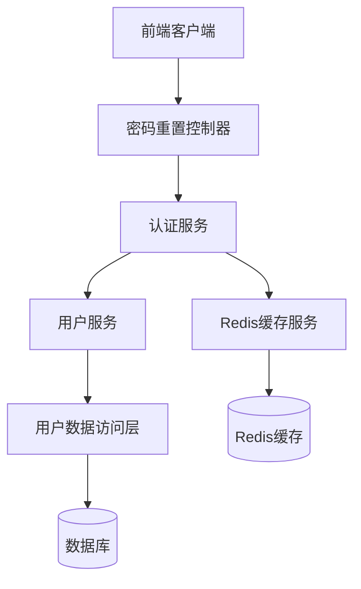
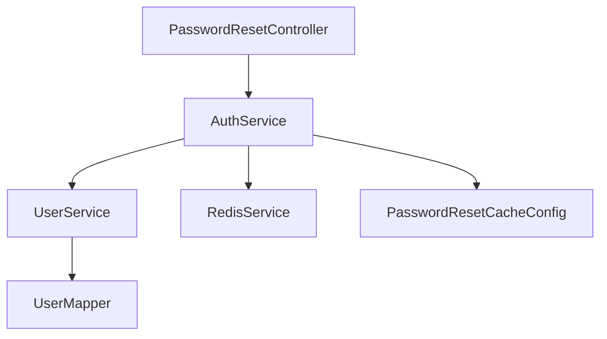
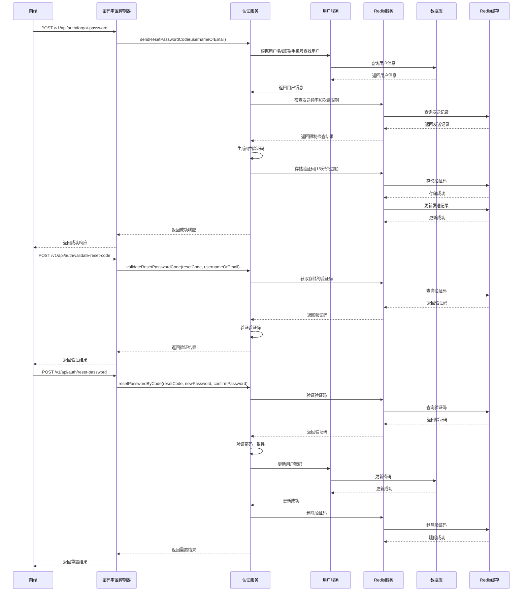

# 密码重置功能设计文档

## 1. 整体架构图



## 2. 分层设计和核心组件

### 2.1 控制器层 (Controller)
- **PasswordResetController**：处理密码重置相关的HTTP请求
  - 接收用户忘记密码请求
  - 验证重置验证码
  - 处理密码重置请求

### 2.2 服务层 (Service)
- **AuthService**：提供密码重置相关的业务逻辑
  - 生成和发送重置验证码
  - 验证重置验证码
  - 通过验证码重置密码
- **UserService**：提供用户相关的服务
  - 根据用户名/邮箱/手机号查找用户
  - 更新用户密码
- **RedisService**：提供缓存服务
  - 存储和获取验证码
  - 设置缓存过期时间
  - 管理发送频率和次数限制

### 2.3 数据访问层 (Mapper)
- **UserMapper**：用户数据访问接口

### 2.4 数据传输对象 (DTO)
- **ForgotPasswordRequest**：忘记密码请求DTO
- **ResetPasswordByCodeRequest**：通过验证码重置密码请求DTO
- **PasswordResetRequest**：密码重置请求DTO（已有）

### 2.5 配置类
- **PasswordResetCacheConfig**：密码重置缓存配置类

## 3. 模块依赖关系图



## 4. 接口契约定义

### 4.1 REST API接口

| 接口路径 | 方法 | 描述 | 请求体 | 成功响应 |
|---------|------|------|--------|----------|
| `/v1/api/auth/forgot-password` | POST | 请求忘记密码（发送验证码） | `{"usernameOrEmail": "..."}` | `{"code": 200, "message": "验证码发送成功", "data": null}` |
| `/v1/api/auth/validate-reset-code` | POST | 验证重置验证码 | `{"resetCode": "...", "usernameOrEmail": "..."}` | `{"code": 200, "message": "验证码验证成功", "data": null}` |
| `/v1/api/auth/reset-password` | POST | 通过验证码重置密码 | `{"resetCode": "...", "newPassword": "...", "confirmPassword": "..."}` | `{"code": 200, "message": "密码重置成功", "data": null}` |

### 4.2 服务层接口

```java
public interface AuthService {
    // 发送重置密码验证码
    Result sendResetPasswordCode(String usernameOrEmail);
    
    // 验证重置密码验证码
    Result validateResetPasswordCode(String resetCode, String usernameOrEmail);
    
    // 通过验证码重置密码
    Result resetPasswordByCode(String resetCode, String newPassword, String confirmPassword);
}
```

## 5. 数据流向图



## 6. 异常处理策略

### 6.1 常见异常情况
- 用户不存在：返回错误码和提示信息
- 验证码错误：返回错误码和提示信息
- 验证码过期：返回错误码和提示信息
- 发送频率过高：返回错误码和提示信息
- 发送次数超限：返回错误码和提示信息
- 密码不一致：返回错误码和提示信息
- 密码格式不符合要求：返回错误码和提示信息

### 6.2 异常处理机制
- 使用全局异常处理器捕获和处理异常
- 返回统一格式的错误响应
- 记录详细的错误日志
- 提供友好的错误提示信息