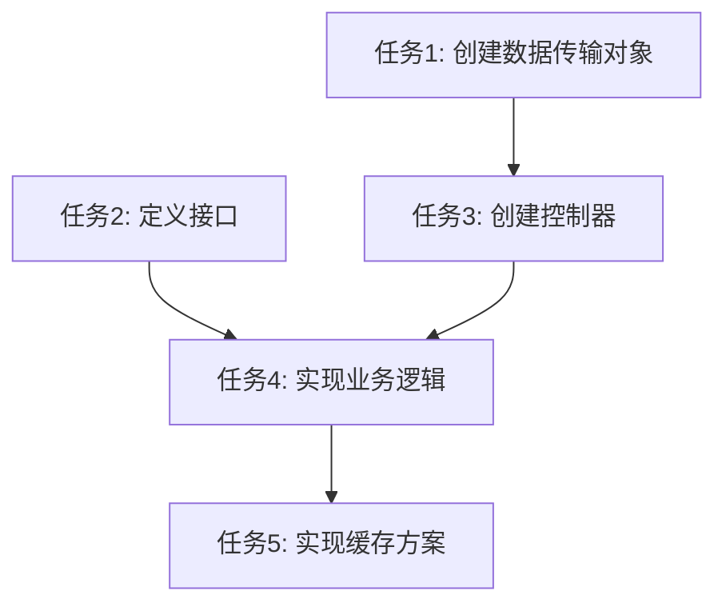

# 密码重置功能任务拆分文档

## 1. 子任务列表

### 任务1: 创建密码重置相关数据传输对象
- **输入契约**：
  - 无前置依赖
  - 环境依赖：项目已有的Spring Validation框架
- **输出契约**：
  - 创建ForgotPasswordRequest.java
  - 创建ResetPasswordByCodeRequest.java
- **实现约束**：
  - 使用Spring Validation注解进行参数校验
  - 遵循项目现有的DTO命名和结构规范
- **依赖关系**：
  - 前置任务：无
  - 后置任务：任务3（实现控制器）

### 任务2: 定义密码重置相关接口
- **输入契约**：
  - 无前置依赖
  - 环境依赖：项目已有的Service接口规范
- **输出契约**：
  - 更新AuthService接口，添加密码重置相关方法
- **实现约束**：
  - 遵循RESTful API设计规范
  - 使用项目统一的Result返回类型
- **依赖关系**：
  - 前置任务：无
  - 后置任务：任务4（实现业务逻辑）

### 任务3: 创建密码重置控制器
- **输入契约**：
  - 前置依赖：任务1（创建DTO）
  - 环境依赖：项目已有的Controller配置
- **输出契约**：
  - 创建PasswordResetController.java
  - 实现三个REST API接口
- **实现约束**：
  - 使用@RestController注解
  - 使用@Validated注解进行参数校验
  - 遵循/v1/api/前缀规范
- **依赖关系**：
  - 前置任务：任务1
  - 后置任务：任务4（实现业务逻辑）

### 任务4: 实现密码重置业务逻辑
- **输入契约**：
  - 前置依赖：任务2（定义接口）
  - 环境依赖：项目已有的UserService和RedisService
- **输出契约**：
  - 更新AuthServiceImpl，实现密码重置相关方法
- **实现约束**：
  - 实现用户查找、验证码生成、验证和密码重置逻辑
  - 处理各种异常情况
- **依赖关系**：
  - 前置任务：任务2
  - 后置任务：任务5（实现缓存方案）

### 任务5: 设计并实现密码重置缓存方案
- **输入契约**：
  - 前置依赖：任务4（实现业务逻辑）
  - 环境依赖：项目已有的Redis配置
- **输出契约**：
  - 创建PasswordResetCacheConfig.java
  - 优化AuthServiceImpl中的缓存使用
- **实现约束**：
  - 实现发送频率限制
  - 实现发送次数限制
  - 设置合理的缓存过期时间
- **依赖关系**：
  - 前置任务：任务4
  - 后置任务：无

## 2. 任务依赖图

## 3. 任务执行顺序

1. 任务1: 创建密码重置相关数据传输对象
2. 任务2: 定义密码重置相关接口
3. 任务3: 创建密码重置控制器
4. 任务4: 实现密码重置业务逻辑
5. 任务5: 设计并实现密码重置缓存方案

## 4. 验收标准

### 任务1验收标准
- ForgotPasswordRequest.java包含必要字段和校验注解
- ResetPasswordByCodeRequest.java包含必要字段和校验注解
- 编译通过，无语法错误

### 任务2验收标准
- AuthService接口包含三个密码重置相关方法
- 方法签名符合设计文档要求
- 编译通过，无语法错误

### 任务3验收标准
- PasswordResetController.java实现三个REST API接口
- 接口路径和方法符合设计文档要求
- 参数校验配置正确
- 编译通过，无语法错误

### 任务4验收标准
- AuthServiceImpl实现AuthService接口中的所有密码重置方法
- 业务逻辑符合设计要求
- 异常处理完善
- 编译通过，无语法错误

### 任务5验收标准
- PasswordResetCacheConfig.java定义了必要的缓存配置
- AuthServiceImpl使用配置类进行缓存操作
- 发送频率限制功能正常
- 发送次数限制功能正常
- 编译通过，无语法错误