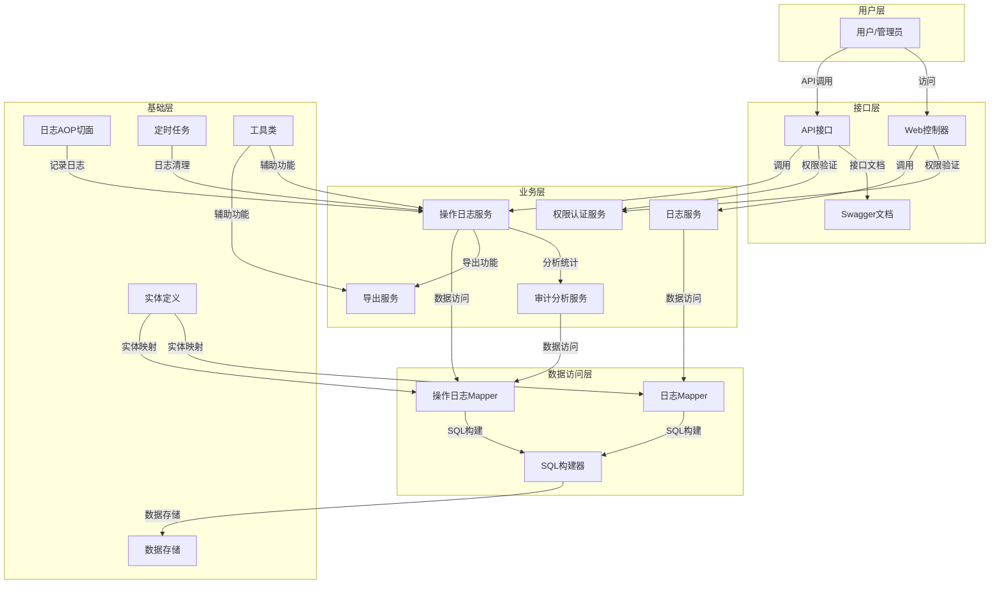
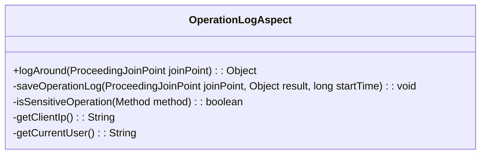
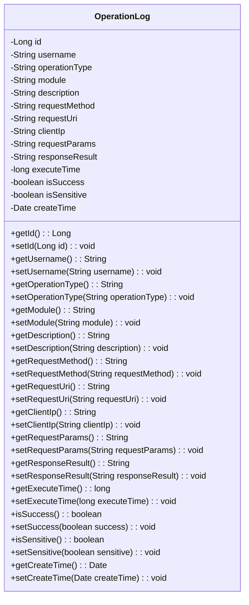
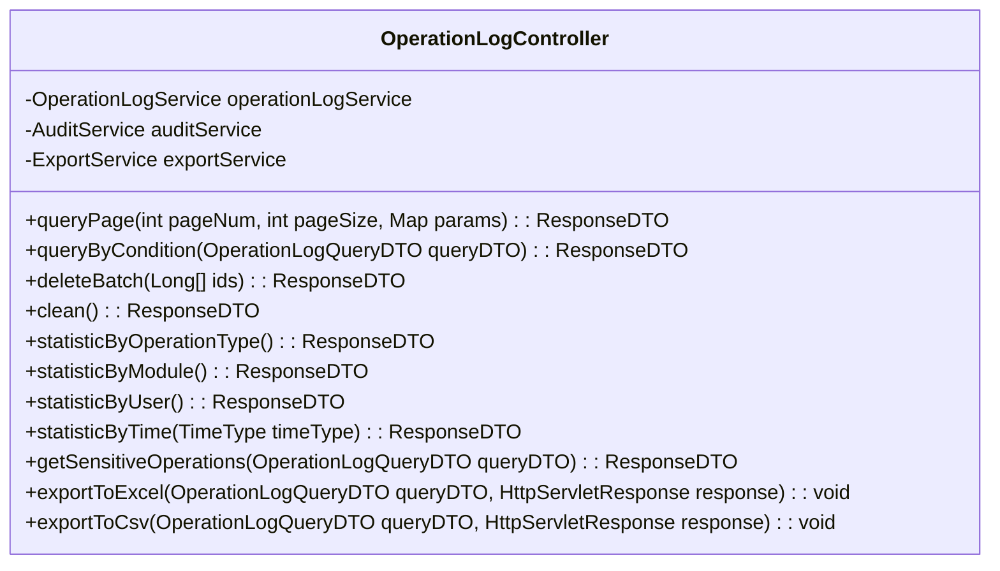
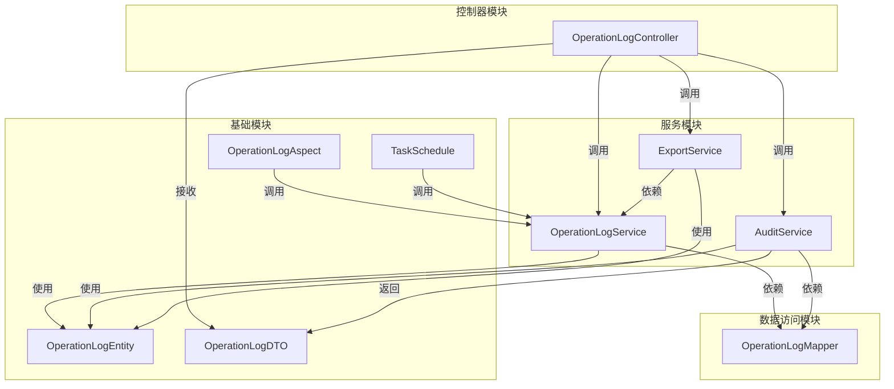
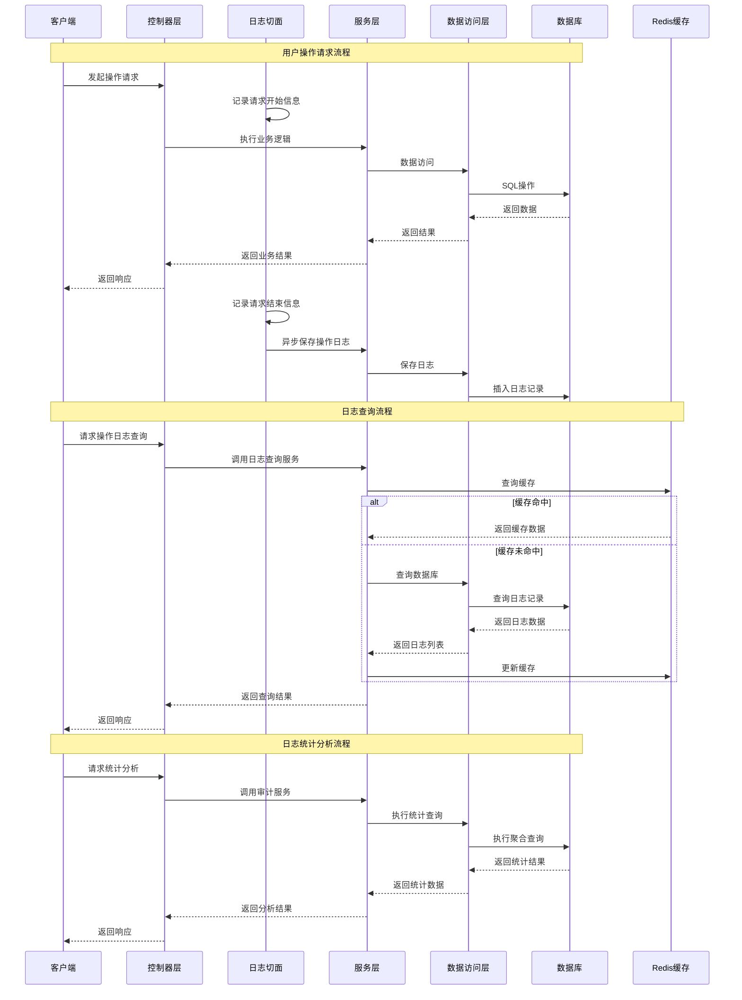

# 操作日志审计功能设计文档

## 1. 整体架构图



## 2. 分层设计和核心组件

### 2.1 基础层组件

#### 2.1.1 日志AOP切面 (OperationLogAspect)

**功能**：自动拦截所有Controller层方法调用，记录操作日志

**核心实现**：
- 使用`@Around`注解拦截方法执行
- 记录方法执行前后的信息
- 异步保存日志，避免影响主业务流程
- 识别敏感操作并特殊标记

**类图**：


#### 2.1.2 实体定义 (Entity)

**功能**：定义操作日志的数据结构

**核心实体**：
- OperationLog：操作日志实体
- OperationLogDTO：操作日志数据传输对象
- OperationLogQueryDTO：操作日志查询条件
- OperationLogStatisticDTO：操作日志统计数据

**类图**：


### 2.2 数据访问层组件

#### 2.2.1 操作日志Mapper (OperationLogMapper)

**功能**：定义操作日志的数据访问接口

**核心方法**：
- 分页查询操作日志
- 按条件查询操作日志
- 批量删除操作日志
- 清空操作日志
- 统计分析操作日志

**类图**：
```mermaid
classDiagram
    interface OperationLogMapper {
        +selectPage(Page page, Wrapper wrapper): IPage
        +selectByUsername(Page page, String username): IPage
        +selectByOperationType(Page page, String operationType): IPage
        +selectByTimeRange(Page page, Date startTime, Date endTime): IPage
        +deleteBatchIds(List ids): boolean
        +deleteAll(): boolean
        +statisticByOperationType(): List<Map<String, Object>>
        +statisticByModule(): List<Map<String, Object>>
        +statisticByUser(): List<Map<String, Object>>
        +statisticByTime(TimeType timeType): List<Map<String, Object>>
    }
```

### 2.3 业务层组件

#### 2.3.1 操作日志服务 (OperationLogService)

**功能**：实现操作日志的业务逻辑

**核心方法**：
- 分页查询操作日志
- 按多条件查询操作日志
- 批量删除操作日志
- 清空操作日志
- 保存操作日志

**类图**：
```mermaid
classDiagram
    interface OperationLogService {
        +queryPage(int pageNum, int pageSize, Map<String, Object> params): IPage
        +queryByCondition(OperationLogQueryDTO queryDTO): IPage
        +saveOperationLog(OperationLog operationLog): boolean
        +deleteBatch(Long[] ids): boolean
        +cleanOperationLogs(): boolean
    }

    class OperationLogServiceImpl {
        -OperationLogMapper operationLogMapper
        +queryPage(int pageNum, int pageSize, Map<String, Object> params): IPage
        +queryByCondition(OperationLogQueryDTO queryDTO): IPage
        +saveOperationLog(OperationLog operationLog): boolean
        +deleteBatch(Long[] ids): boolean
        +cleanOperationLogs(): boolean
    }

    OperationLogService <|-- OperationLogServiceImpl
```

#### 2.3.2 审计分析服务 (AuditService)

**功能**：提供操作日志的统计分析功能

**核心方法**：
- 按操作类型统计
- 按模块统计
- 按用户统计
- 按时间统计
- 敏感操作分析

**类图**：
```mermaid
classDiagram
    interface AuditService {
        +statisticByOperationType(): List<OperationLogStatisticDTO>
        +statisticByModule(): List<OperationLogStatisticDTO>
        +statisticByUser(): List<OperationLogStatisticDTO>
        +statisticByTime(TimeType timeType): List<OperationLogStatisticDTO>
        +getSensitiveOperations(OperationLogQueryDTO queryDTO): IPage
        +getUserActivityReport(String username, Date startTime, Date endTime): List<OperationLog>
    }

    class AuditServiceImpl {
        -OperationLogMapper operationLogMapper
        +statisticByOperationType(): List<OperationLogStatisticDTO>
        +statisticByModule(): List<OperationLogStatisticDTO>
        +statisticByUser(): List<OperationLogStatisticDTO>
        +statisticByTime(TimeType timeType): List<OperationLogStatisticDTO>
        +getSensitiveOperations(OperationLogQueryDTO queryDTO): IPage
        +getUserActivityReport(String username, Date startTime, Date endTime): List<OperationLog>
    }

    AuditService <|-- AuditServiceImpl
```

#### 2.3.3 导出服务 (ExportService)

**功能**：提供操作日志的导出功能

**核心方法**：
- 导出操作日志为Excel
- 导出操作日志为CSV
- 导出操作日志为PDF

**类图**：
```mermaid
classDiagram
    interface ExportService {
        +exportToExcel(List<OperationLog> logs, OutputStream outputStream): void
        +exportToCsv(List<OperationLog> logs, OutputStream outputStream): void
        +exportToPdf(List<OperationLog> logs, OutputStream outputStream): void
    }

    class ExportServiceImpl {
        +exportToExcel(List<OperationLog> logs, OutputStream outputStream): void
        +exportToCsv(List<OperationLog> logs, OutputStream outputStream): void
        +exportToPdf(List<OperationLog> logs, OutputStream outputStream): void
        -generateExcelTitle(Row row): void
        -generateExcelContent(Row row, OperationLog log, int rowNum): void
    }

    ExportService <|-- ExportServiceImpl
```

### 2.4 接口层组件

#### 2.4.1 操作日志控制器 (OperationLogController)

**功能**：处理操作日志相关的HTTP请求

**核心方法**：
- 分页查询操作日志
- 多条件查询操作日志
- 批量删除操作日志
- 清空操作日志
- 日志统计分析
- 日志导出

**类图**：


## 3. 模块依赖关系图



## 4. 接口契约定义

### 4.1 查询接口

#### 4.1.1 分页查询操作日志

**URL**: `/v1/api/log/operation/page`

**Method**: `GET`

**参数**:
| 参数名 | 类型 | 必填 | 描述 |
| :--- | :--- | :--- | :--- |
| pageNum | Integer | 是 | 页码 |
| pageSize | Integer | 是 | 每页大小 |
| username | String | 否 | 用户名 |
| operationType | String | 否 | 操作类型 |
| startTime | String | 否 | 开始时间 (yyyy-MM-dd HH:mm:ss) |
| endTime | String | 否 | 结束时间 (yyyy-MM-dd HH:mm:ss) |
| module | String | 否 | 模块名称 |
| isSensitive | Boolean | 否 | 是否敏感操作 |
| isSuccess | Boolean | 否 | 是否成功 |

**响应**:
```json
{
  "code": 200,
  "msg": "操作成功",
  "data": {
    "records": [
      {
        "id": 1,
        "username": "admin",
        "operationType": "ADD",
        "module": "user",
        "description": "创建用户",
        "requestMethod": "POST",
        "requestUri": "/v1/api/user",
        "clientIp": "127.0.0.1",
        "requestParams": "{\"username\":\"test\",\"password\":\"123456\"}",
        "responseResult": "{\"code\":200,\"msg\":\"操作成功\"}",
        "executeTime": 100,
        "isSuccess": true,
        "isSensitive": true,
        "createTime": "2023-01-01 12:00:00"
      }
    ],
    "total": 1,
    "size": 10,
    "current": 1,
    "pages": 1
  }
}
```

### 4.2 统计分析接口

#### 4.2.1 按操作类型统计

**URL**: `/v1/api/log/operation/statistic/type`

**Method**: `GET`

**响应**:
```json
{
  "code": 200,
  "msg": "操作成功",
  "data": [
    {
      "name": "ADD",
      "count": 100
    },
    {
      "name": "UPDATE",
      "count": 200
    },
    {
      "name": "DELETE",
      "count": 50
    },
    {
      "name": "QUERY",
      "count": 500
    }
  ]
}
```

#### 4.2.2 按模块统计

**URL**: `/v1/api/log/operation/statistic/module`

**Method**: `GET`

**响应**:
```json
{
  "code": 200,
  "msg": "操作成功",
  "data": [
    {
      "name": "user",
      "count": 150
    },
    {
      "name": "role",
      "count": 80
    },
    {
      "name": "permission",
      "count": 120
    }
  ]
}
```

#### 4.2.3 按用户统计

**URL**: `/v1/api/log/operation/statistic/user`

**Method**: `GET`

**响应**:
```json
{
  "code": 200,
  "msg": "操作成功",
  "data": [
    {
      "name": "admin",
      "count": 300
    },
    {
      "name": "user1",
      "count": 150
    },
    {
      "name": "user2",
      "count": 100
    }
  ]
}
```

#### 4.2.4 按时间统计

**URL**: `/v1/api/log/operation/statistic/time`

**Method**: `GET`

**参数**:
| 参数名 | 类型 | 必填 | 描述 |
| :--- | :--- | :--- | :--- |
| type | String | 是 | 时间类型：day/week/month |
| startTime | String | 否 | 开始时间 |
| endTime | String | 否 | 结束时间 |

**响应**:
```json
{
  "code": 200,
  "msg": "操作成功",
  "data": [
    {
      "name": "2023-01-01",
      "count": 100
    },
    {
      "name": "2023-01-02",
      "count": 120
    },
    {
      "name": "2023-01-03",
      "count": 80
    }
  ]
}
```

#### 4.2.5 查询敏感操作

**URL**: `/v1/api/log/operation/sensitive`

**Method**: `GET`

**参数**:
| 参数名 | 类型 | 必填 | 描述 |
| :--- | :--- | :--- | :--- |
| pageNum | Integer | 是 | 页码 |
| pageSize | Integer | 是 | 每页大小 |
| username | String | 否 | 用户名 |
| startTime | String | 否 | 开始时间 |
| endTime | String | 否 | 结束时间 |

**响应**:
```json
{
  "code": 200,
  "msg": "操作成功",
  "data": {
    "records": [
      {
        "id": 1,
        "username": "admin",
        "operationType": "ADD",
        "module": "user",
        "description": "创建用户",
        "requestMethod": "POST",
        "requestUri": "/v1/api/user",
        "clientIp": "127.0.0.1",
        "requestParams": "{\"username\":\"test\",\"password\":\"123456\"}",
        "responseResult": "{\"code\":200,\"msg\":\"操作成功\"}",
        "executeTime": 100,
        "isSuccess": true,
        "isSensitive": true,
        "createTime": "2023-01-01 12:00:00"
      }
    ],
    "total": 1,
    "size": 10,
    "current": 1,
    "pages": 1
  }
}
```

### 4.3 导出接口

#### 4.3.1 导出为Excel

**URL**: `/v1/api/log/operation/export/excel`

**Method**: `GET`

**参数**:
| 参数名 | 类型 | 必填 | 描述 |
| :--- | :--- | :--- | :--- |
| username | String | 否 | 用户名 |
| operationType | String | 否 | 操作类型 |
| startTime | String | 否 | 开始时间 |
| endTime | String | 否 | 结束时间 |
| module | String | 否 | 模块名称 |
| isSensitive | Boolean | 否 | 是否敏感操作 |
| isSuccess | Boolean | 否 | 是否成功 |

**响应**:
- 响应类型: application/vnd.openxmlformats-officedocument.spreadsheetml.sheet
- 文件下载

#### 4.3.2 导出为CSV

**URL**: `/v1/api/log/operation/export/csv`

**Method**: `GET`

**参数**:
与Excel导出相同

**响应**:
- 响应类型: text/csv
- 文件下载

### 4.4 删除接口

#### 4.4.1 批量删除操作日志

**URL**: `/v1/api/log/operation/batch`

**Method**: `DELETE`

**参数**:
| 参数名 | 类型 | 必填 | 描述 |
| :--- | :--- | :--- | :--- |
| ids | Long[] | 是 | 日志ID数组 |

**请求体**:
```json
[1, 2, 3]
```

**响应**:
```json
{
  "code": 200,
  "msg": "删除成功",
  "data": null
}
```

#### 4.4.2 清空操作日志

**URL**: `/v1/api/log/operation/clean`

**Method**: `DELETE`

**响应**:
```json
{
  "code": 200,
  "msg": "清空成功",
  "data": null
}
```

## 5. 数据流向图



## 6. 异常处理策略

### 6.1 统一异常处理

**全局异常处理器**：
- 使用`@ControllerAdvice`和`@ExceptionHandler`统一处理异常
- 捕获并处理操作日志相关的各类异常
- 返回统一格式的错误响应

**异常类型**：
- `LogSaveException`：日志保存失败异常
- `LogQueryException`：日志查询失败异常
- `LogDeleteException`：日志删除失败异常
- `ExportException`：导出失败异常

### 6.2 降级机制

- 当日志服务不可用时，采用降级策略，不影响主业务流程
- 日志保存失败时，将日志写入本地文件或消息队列，稍后重试
- 日志查询失败时，返回友好提示，不影响用户正常使用系统

### 6.3 重试机制

- 对日志保存操作实现自动重试机制
- 采用指数退避策略进行重试
- 重试失败后记录到备用存储，避免日志丢失