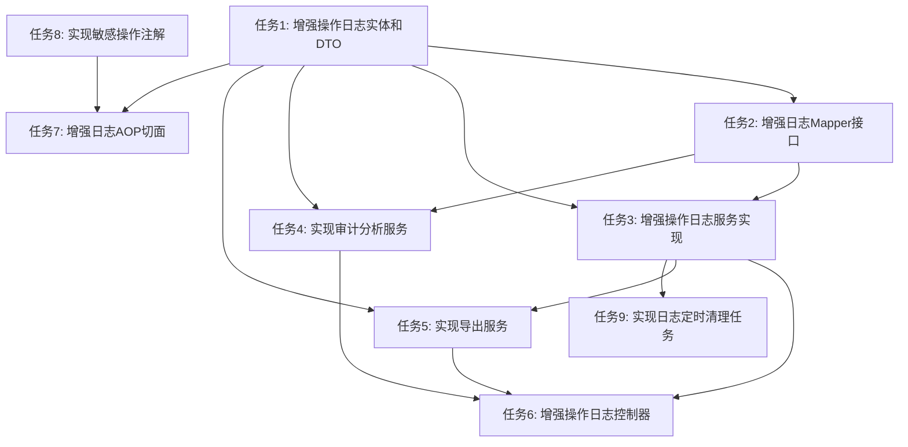

# 操作日志审计功能任务拆分文档

## 1. 原子任务列表

### 1.1 任务1: 增强操作日志实体和DTO

**任务描述**：扩展现有OperationLog实体类，增加敏感操作标记字段；创建相关的数据传输对象(DTO)。

**输入契约**：
- 现有OperationLog.java文件
- 设计文档中定义的字段要求

**输出契约**：
- 更新后的OperationLog.java文件，增加isSensitive字段
- OperationLogDTO.java
- OperationLogQueryDTO.java
- OperationLogStatisticDTO.java

**实现约束**：
- 保持与现有实体类命名和风格一致
- 所有DTO需要包含适当的注释
- 确保字段类型合理，避免使用过长的字符串字段

**验收标准**：
- 实体类编译通过
- DTO类编译通过
- 字段定义符合设计文档要求
- 包含必要的getter/setter方法

### 1.2 任务2: 增强日志Mapper接口

**任务描述**：扩展OperationLogMapper接口，增加多条件查询和统计分析相关的方法。

**输入契约**：
- 现有OperationLogMapper.java文件
- 设计文档中定义的查询需求

**输出契约**：
- 更新后的OperationLogMapper.java文件，包含：
  - 按时间范围查询方法
  - 多条件组合查询方法
  - 各类统计分析方法

**实现约束**：
- 使用MyBatis Plus的查询构建器
- 方法命名遵循项目规范
- 确保SQL查询效率

**验收标准**：
- Mapper接口编译通过
- 包含所有设计文档中定义的查询方法
- 方法参数和返回值类型正确

### 1.3 任务3: 增强操作日志服务实现

**任务描述**：更新OperationLogServiceImpl类，实现新增的查询和管理功能。

**输入契约**：
- 现有OperationLogServiceImpl.java文件
- 更新后的OperationLogMapper接口

**输出契约**：
- 更新后的OperationLogServiceImpl.java文件
- 实现多条件查询、时间范围查询等方法

**实现约束**：
- 保持与现有代码风格一致
- 使用PageHelper进行分页
- 异常处理符合项目规范

**验收标准**：
- 服务实现编译通过
- 所有新增方法正确实现
- 方法返回值符合预期

### 1.4 任务4: 实现审计分析服务

**任务描述**：创建AuditService接口和实现类，提供操作日志的统计分析功能。

**输入契约**：
- OperationLogMapper接口
- OperationLogStatisticDTO

**输出契约**：
- AuditService.java接口
- AuditServiceImpl.java实现类

**实现约束**：
- 实现按操作类型、模块、用户、时间统计的方法
- 敏感操作识别和分析方法
- 统计结果格式化方法

**验收标准**：
- 服务接口和实现类编译通过
- 所有统计方法返回正确的格式
- 统计结果计算准确

### 1.5 任务5: 实现导出服务

**任务描述**：创建ExportService接口和实现类，提供操作日志的导出功能。

**输入契约**：
- 操作日志列表数据
- 项目依赖配置（Apache POI等）

**输出契约**：
- ExportService.java接口
- ExportServiceImpl.java实现类

**实现约束**：
- 支持Excel和CSV格式导出
- 导出内容包含所有关键字段
- 考虑大数据量导出的性能问题

**验收标准**：
- 服务接口和实现类编译通过
- 能成功导出Excel格式日志
- 能成功导出CSV格式日志
- 导出文件格式正确，内容完整

### 1.6 任务6: 增强操作日志控制器

**任务描述**：更新OperationLogController，增加统计分析和导出相关的接口。

**输入契约**：
- 现有OperationLogController.java文件
- 更新后的OperationLogService
- AuditService实现
- ExportService实现

**输出契约**：
- 更新后的OperationLogController.java文件
- 新增统计分析和导出相关接口

**实现约束**：
- 符合RESTful API设计规范
- 使用Swagger注解进行接口文档
- 正确处理HTTP响应头
- 异常处理符合项目规范

**验收标准**：
- 控制器编译通过
- 所有新增接口符合设计文档定义
- Swagger文档正确生成
- 接口返回格式统一

### 1.7 任务7: 增强日志AOP切面

**任务描述**：更新OperationLogAspect，增加敏感操作识别和标记功能。

**输入契约**：
- 现有OperationLogAspect.java文件
- 敏感操作定义规则

**输出契约**：
- 更新后的OperationLogAspect.java文件
- 敏感操作识别逻辑
- 优化的日志记录逻辑

**实现约束**：
- 使用自定义注解标记敏感操作
- 保持异步记录日志的性能优化
- 增加操作耗时统计

**验收标准**：
- 切面类编译通过
- 能正确识别敏感操作并标记
- 日志记录性能良好
- 不影响主业务流程

### 1.8 任务8: 实现敏感操作注解

**任务描述**：创建@SensitiveOperation自定义注解，用于标记敏感操作。

**输入契约**：
- 项目注解规范

**输出契约**：
- SensitiveOperation.java注解类
- 相关使用说明文档

**实现约束**：
- 注解属性设计合理
- 包含操作类型、描述等属性
- 与AOP切面配合使用

**验收标准**：
- 注解类编译通过
- 能正确应用于Controller方法
- 能被AOP切面正确识别

### 1.9 任务9: 实现日志定时清理任务

**任务描述**：创建定时清理过期日志的任务。

**输入契约**：
- Spring Task配置
- 日志保留策略配置

**输出契约**：
- LogCleanTask.java定时任务类
- 相关配置文件更新

**实现约束**：
- 使用Spring Task实现定时执行
- 支持配置日志保留天数
- 执行过程中不影响系统性能

**验收标准**：
- 定时任务编译通过
- 能按配置定期执行
- 能正确清理过期日志
- 执行过程中系统性能稳定

## 2. 任务依赖关系图

## 3. 执行顺序

根据任务依赖关系，建议按以下顺序执行：

1. **任务1**: 增强操作日志实体和DTO
   - 前置条件：无
   - 输出：实体类和DTO类

2. **任务8**: 实现敏感操作注解
   - 前置条件：无
   - 输出：SensitiveOperation注解

3. **任务2**: 增强日志Mapper接口
   - 前置条件：任务1完成
   - 输出：更新后的Mapper接口

4. **任务3**: 增强操作日志服务实现
   - 前置条件：任务1、任务2完成
   - 输出：更新后的服务实现

5. **任务4**: 实现审计分析服务
   - 前置条件：任务1、任务2完成
   - 输出：审计分析服务

6. **任务5**: 实现导出服务
   - 前置条件：任务1、任务3完成
   - 输出：导出服务

7. **任务6**: 增强操作日志控制器
   - 前置条件：任务3、任务4、任务5完成
   - 输出：更新后的控制器

8. **任务7**: 增强日志AOP切面
   - 前置条件：任务1、任务8完成
   - 输出：更新后的AOP切面

9. **任务9**: 实现日志定时清理任务
   - 前置条件：任务3完成
   - 输出：定时清理任务

## 4. 各任务验收标准

### 4.1 任务1验收标准

✅ **实体类增强**
- [ ] OperationLog.java文件增加isSensitive字段
- [ ] 所有字段都有对应的getter/setter方法
- [ ] 包含必要的注释说明

✅ **DTO创建**
- [ ] 创建OperationLogDTO.java
- [ ] 创建OperationLogQueryDTO.java
- [ ] 创建OperationLogStatisticDTO.java
- [ ] 所有DTO字段定义合理

✅ **编译检查**
- [ ] 实体类编译通过
- [ ] 所有DTO编译通过

### 4.2 任务2验收标准

✅ **Mapper接口增强**
- [ ] 增加按时间范围查询方法
- [ ] 增加多条件组合查询方法
- [ ] 增加按操作类型统计方法
- [ ] 增加按模块统计方法
- [ ] 增加按用户统计方法
- [ ] 增加按时间统计方法

✅ **方法定义**
- [ ] 方法参数类型正确
- [ ] 返回值类型正确
- [ ] 方法命名符合规范

✅ **编译检查**
- [ ] Mapper接口编译通过

### 4.3 任务3验收标准

✅ **服务实现增强**
- [ ] 实现多条件查询方法
- [ ] 实现时间范围查询方法
- [ ] 异常处理符合规范

✅ **性能优化**
- [ ] 使用合理的查询条件构建
- [ ] 避免N+1查询问题

✅ **测试验证**
- [ ] 查询方法返回正确结果
- [ ] 分页功能正常

### 4.4 任务4验收标准

✅ **审计服务实现**
- [ ] 实现按操作类型统计
- [ ] 实现按模块统计
- [ ] 实现按用户统计
- [ ] 实现按时间统计
- [ ] 实现敏感操作查询

✅ **数据格式化**
- [ ] 统计结果格式正确
- [ ] 数据聚合计算准确

✅ **测试验证**
- [ ] 统计方法返回预期结果
- [ ] 边界条件处理正确

### 4.5 任务5验收标准

✅ **导出服务实现**
- [ ] 实现Excel格式导出
- [ ] 实现CSV格式导出

✅ **文件格式**
- [ ] Excel文件格式正确
- [ ] CSV文件格式正确
- [ ] 包含所有关键字段

✅ **性能测试**
- [ ] 大数据量导出性能良好
- [ ] 内存使用合理

### 4.6 任务6验收标准

✅ **控制器增强**
- [ ] 增加统计分析接口
- [ ] 增加导出接口
- [ ] 增加敏感操作查询接口

✅ **API文档**
- [ ] Swagger注解完整
- [ ] 接口描述清晰
- [ ] 参数说明详细

✅ **响应格式**
- [ ] 符合项目统一响应格式
- [ ] 错误处理符合规范

### 4.7 任务7验收标准

✅ **AOP切面增强**
- [ ] 能正确识别敏感操作
- [ ] 能标记敏感操作
- [ ] 异步记录日志性能良好

✅ **性能影响**
- [ ] 不影响主业务流程
- [ ] 日志记录耗时合理

✅ **日志内容**
- [ ] 记录内容完整
- [ ] 包含必要的上下文信息

### 4.8 任务8验收标准

✅ **注解实现**
- [ ] 创建SensitiveOperation注解
- [ ] 包含必要的属性
- [ ] 注解说明清晰

✅ **注解使用**
- [ ] 能正确应用于Controller方法
- [ ] 能被AOP切面识别

✅ **编译检查**
- [ ] 注解类编译通过

### 4.9 任务9验收标准

✅ **定时任务实现**
- [ ] 创建LogCleanTask类
- [ ] 配置合理的执行周期
- [ ] 支持配置保留天数

✅ **执行验证**
- [ ] 能按计划执行
- [ ] 能正确清理过期日志
- [ ] 执行过程稳定

✅ **性能影响**
- [ ] 执行过程中系统性能稳定
- [ ] 资源占用合理

## 5. 任务完成确认清单

### 5.1 功能完整性

- [ ] 所有设计文档中定义的功能点都已实现
- [ ] 所有接口都已按设计文档实现
- [ ] 所有统计分析功能都已实现
- [ ] 所有导出功能都已实现

### 5.2 代码质量

- [ ] 代码风格与项目保持一致
- [ ] 包含必要的注释
- [ ] 异常处理完善
- [ ] 性能优化合理

### 5.3 测试验证

- [ ] 功能测试通过
- [ ] 边界条件处理正确
- [ ] 异常情况处理正确
- [ ] 性能测试通过

### 5.4 文档更新

- [ ] 接口文档更新
- [ ] 代码注释更新
- [ ] 使用说明文档更新