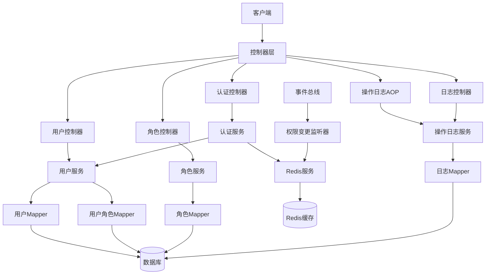
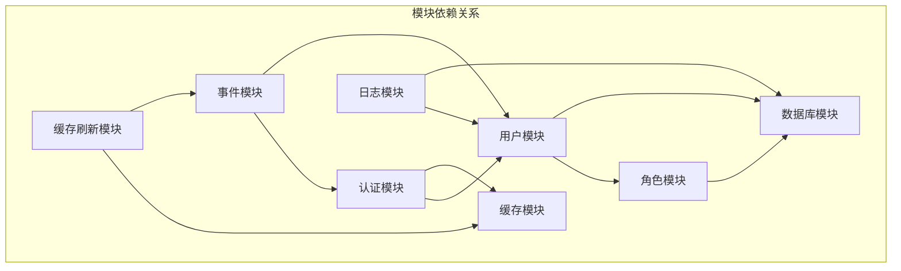
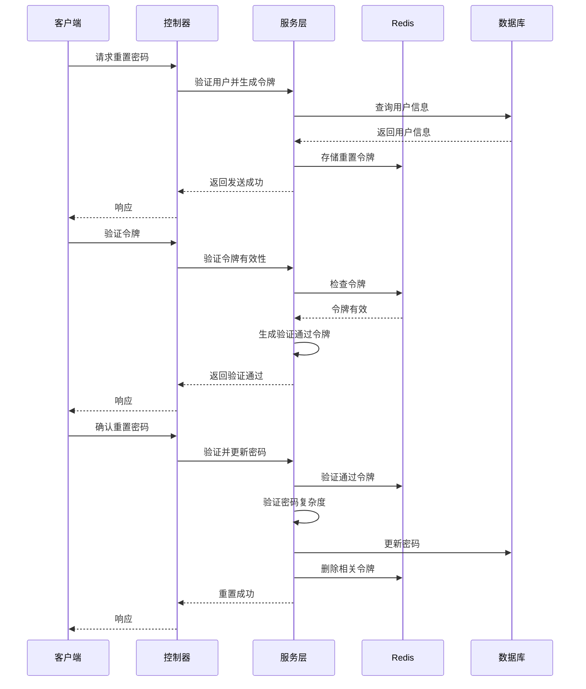
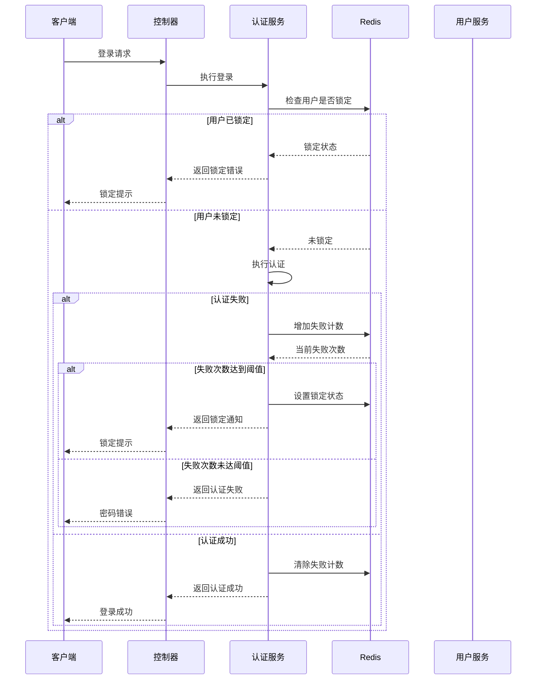

# 6A工作流：权限管理模块功能增强设计文档

## 1. 整体架构图



## 2. 分层设计和核心组件

### 2.1 控制器层
- **AuthController**：处理认证相关请求，新增密码重置接口
- **UserController**：用户管理接口，增强用户状态管理
- **RoleController**：角色管理接口，不变
- **OperationLogController**：新增操作日志查询接口

### 2.2 服务层
- **AuthService**：增强现有服务，添加密码重置和登录失败处理
- **UserService**：增强现有服务，添加用户锁定相关功能
- **OperationLogService**：新增服务，处理操作日志的增删改查
- **RedisService**：使用现有服务，扩展键设计

### 2.3 数据访问层
- **UserMapper**：增强现有Mapper，添加状态相关查询
- **OperationLogMapper**：新增Mapper，处理日志数据

### 2.4 核心组件
- **OperationLogAspect**：AOP切面，拦截并记录操作日志
- **PermissionChangeListener**：事件监听器，处理权限变更事件
- **PasswordEncoder**：使用现有BCryptPasswordEncoder
- **JwtTokenProvider**：使用现有JWT工具

## 3. 模块依赖关系图



## 4. 接口契约定义

### 4.1 密码重置接口

**1. 请求重置密码**
```
POST /v1/api/auth/reset-password/request
Content-Type: application/json

{
  "username": "string",  // 用户名、邮箱或手机号
  "type": "email"       // email或phone
}

Response:
{
  "code": 200,
  "message": "验证码已发送",
  "data": null
}
```

**2. 验证令牌/验证码**
```
POST /v1/api/auth/reset-password/verify
Content-Type: application/json

{
  "username": "string",
  "token": "string",     // 重置令牌或验证码
  "type": "email"
}

Response:
{
  "code": 200,
  "message": "验证成功",
  "data": {
    "verificationToken": "string" // 用于确认重置的临时令牌
  }
}
```

**3. 确认重置密码**
```
POST /v1/api/auth/reset-password/confirm
Content-Type: application/json

{
  "verificationToken": "string",
  "newPassword": "string"
}

Response:
{
  "code": 200,
  "message": "密码重置成功",
  "data": null
}
```

### 4.2 用户锁定相关接口

**1. 管理员解锁用户**
```
PUT /v1/api/users/{userId}/unlock

Response:
{
  "code": 200,
  "message": "用户解锁成功",
  "data": null
}
```

### 4.3 操作日志接口

**1. 获取操作日志列表**
```
GET /v1/api/operation-logs?page=1&pageSize=10&username=&operationType=&startTime=&endTime=

Response:
{
  "code": 200,
  "message": "查询成功",
  "data": {
    "total": 100,
    "pages": 10,
    "current": 1,
    "size": 10,
    "records": [
      {
        "id": 1,
        "username": "admin",
        "userId": 1,
        "ip": "192.168.1.1",
        "operationType": "UPDATE_USER",
        "operationDesc": "更新用户信息",
        "operationContent": "{\"id\":1,\"username\":\"admin\"}",
        "result": "SUCCESS",
        "createTime": "2024-01-01 10:00:00"
      }
    ]
  }
}
```

### 4.4 权限缓存刷新接口

**1. 刷新指定用户权限缓存**
```
POST /v1/api/admin/refresh-permission-cache/user/{userId}

Response:
{
  "code": 200,
  "message": "缓存刷新成功",
  "data": null
}
```

**2. 刷新所有用户权限缓存**
```
POST /v1/api/admin/refresh-permission-cache/all

Response:
{
  "code": 200,
  "message": "所有缓存刷新成功",
  "data": null
}
```

## 5. 数据流向图

### 5.1 密码重置流程



### 5.2 用户锁定流程



## 6. 异常处理策略

### 6.1 统一响应格式
所有API响应遵循统一格式：
```json
{
  "code": 200,          // 状态码
  "message": "成功",   // 消息描述
  "data": null          // 响应数据
}
```

### 6.2 状态码定义
- `200`：成功
- `400`：参数错误
- `401`：未授权
- `403`：权限不足
- `404`：资源不存在
- `409`：冲突
- `429`：请求过多（登录失败锁定）
- `500`：服务器内部错误

### 6.3 自定义异常
- `PasswordComplexityException`：密码复杂度不足
- `TokenExpiredException`：令牌过期
- `UserLockedException`：用户被锁定
- `InvalidVerificationException`：验证信息无效

### 6.4 全局异常处理
创建全局异常处理器，统一捕获和处理异常：
- 转换为统一响应格式
- 记录异常日志
- 针对不同异常类型返回不同状态码和提示信息