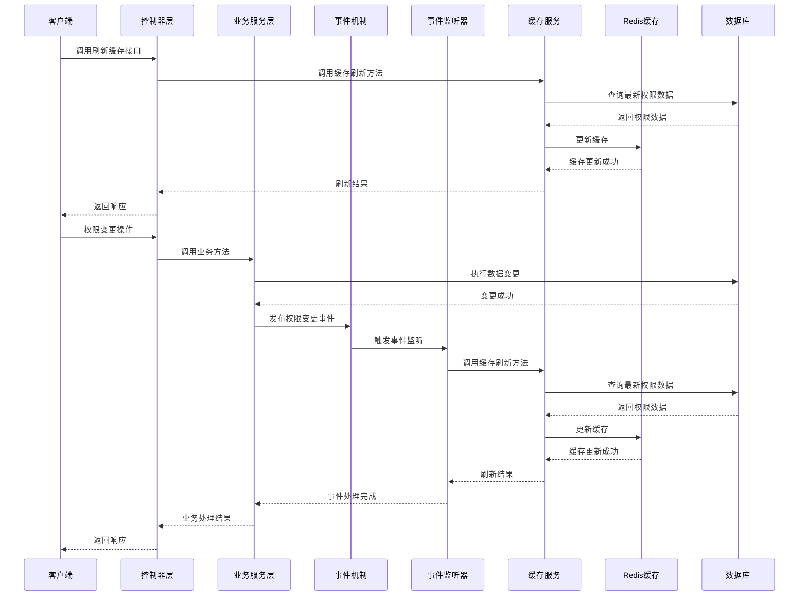
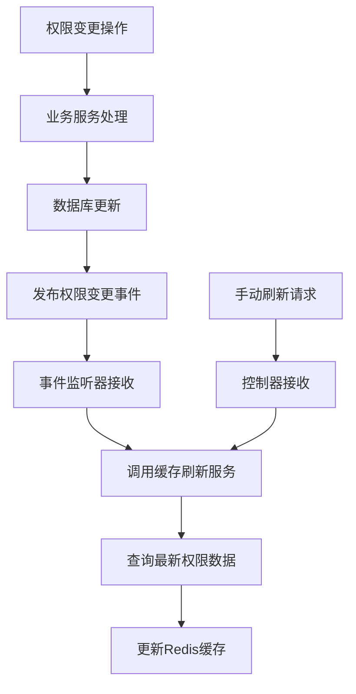
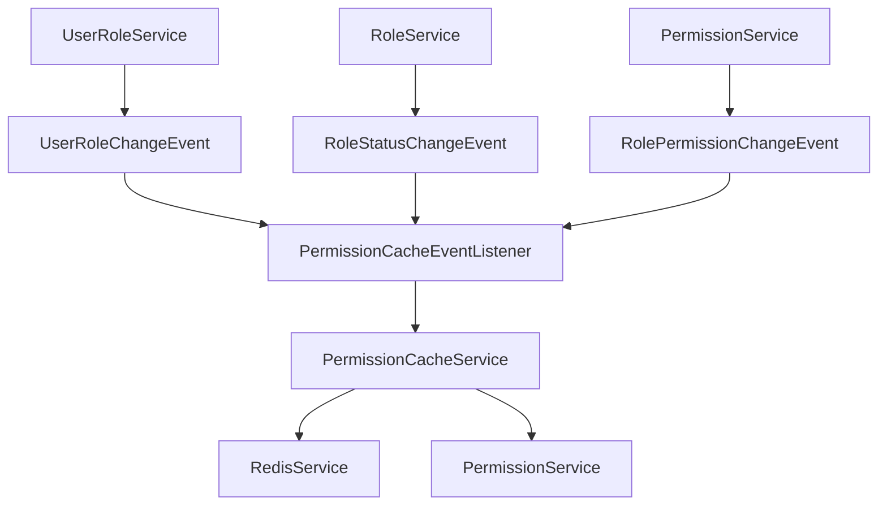

# 权限缓存刷新机制设计文档

## 1. 整体架构设计

### 1.1 架构图



## 2. 核心组件设计

### 2.1 事件类设计

| 类名 | 描述 | 关键字段 | 包路径 |
|-----|-----|---------|-------|
| PermissionChangeEvent | 权限变更基类事件 | - | com.mold.digitalization.event |
| UserRoleChangeEvent | 用户角色变更事件 | userId, roleId, operationType | com.mold.digitalization.event |
| RolePermissionChangeEvent | 角色权限变更事件 | roleId, permissionIds | com.mold.digitalization.event |
| RoleStatusChangeEvent | 角色状态变更事件 | roleId, oldStatus, newStatus | com.mold.digitalization.event |

### 2.2 事件监听器设计

| 类名 | 描述 | 主要方法 | 包路径 |
|-----|-----|---------|-------|
| PermissionCacheEventListener | 权限缓存刷新事件监听器 | onUserRoleChange, onRolePermissionChange, onRoleStatusChange | com.mold.digitalization.listener |

### 2.3 服务类设计

| 类名 | 描述 | 主要方法 | 包路径 |
|-----|-----|---------|-------|
| PermissionCacheService | 权限缓存服务 | refreshUserPermissions, refreshAllUsersPermissions, clearUserPermissions, clearAllUsersPermissions | com.mold.digitalization.service |
| PermissionCacheServiceImpl | 权限缓存服务实现 | refreshUserPermissions, refreshAllUsersPermissions, clearUserPermissions, clearAllUsersPermissions | com.mold.digitalization.service.impl |

## 3. 数据流向图



## 4. 接口契约定义

### 4.1 事件类接口

```java
// PermissionChangeEvent.java
public abstract class PermissionChangeEvent extends ApplicationEvent {
    public PermissionChangeEvent(Object source) {
        super(source);
    }
}

// UserRoleChangeEvent.java
public class UserRoleChangeEvent extends PermissionChangeEvent {
    private Long userId;
    private Long roleId;
    private String operationType; // "ASSIGN" or "REMOVE"
    
    // 构造方法、getter和setter
}

// RolePermissionChangeEvent.java
public class RolePermissionChangeEvent extends PermissionChangeEvent {
    private Long roleId;
    private List<Long> permissionIds;
    
    // 构造方法、getter和setter
}

// RoleStatusChangeEvent.java
public class RoleStatusChangeEvent extends PermissionChangeEvent {
    private Long roleId;
    private Integer oldStatus;
    private Integer newStatus;
    
    // 构造方法、getter和setter
}
```

### 4.2 事件监听器接口

```java
// PermissionCacheEventListener.java
@Component
public class PermissionCacheEventListener {
    @Autowired
    private PermissionCacheService permissionCacheService;
    @Autowired
    private UserRoleService userRoleService;
    
    @EventListener
    public void onUserRoleChange(UserRoleChangeEvent event) {
        // 刷新单个用户权限缓存
    }
    
    @EventListener
    public void onRolePermissionChange(RolePermissionChangeEvent event) {
        // 刷新拥有该角色的所有用户权限缓存
    }
    
    @EventListener
    public void onRoleStatusChange(RoleStatusChangeEvent event) {
        // 刷新拥有该角色的所有用户权限缓存
    }
}
```

## 5. 异常处理策略

### 5.1 事件处理异常
- 事件处理异常不应影响原业务操作
- 使用try-catch捕获异常并记录日志
- 考虑实现重试机制

### 5.2 缓存操作异常
- 缓存更新失败时记录日志并返回失败状态
- 不抛出异常，避免影响主业务流程
- 提供手动刷新机制作为备选方案

## 6. 模块依赖关系



## 7. 技术实现细节

### 7.1 事件发布实现
- 使用Spring的ApplicationEventPublisher发布事件
- 在事务提交后发布事件，确保数据一致性
- 事件发布代码嵌入到现有的业务方法中

### 7.2 缓存刷新实现
- 单个用户缓存刷新：直接调用refreshUserPermissions方法
- 多个用户缓存刷新：先获取受影响的用户列表，然后批量调用refreshUserPermissions方法
- 考虑使用异步处理优化批量刷新性能

### 7.3 权限变更点
- UserRoleServiceImpl: assignRoleToUser, removeRoleFromUser, batchAssignRolesToUser
- RoleServiceImpl: updateRoleStatus
- PermissionServiceImpl: assignPermissionsToRole

## 8. 性能优化考虑

### 8.1 批量处理
- 对于多个用户的缓存刷新，使用批量处理机制
- 考虑使用线程池并行处理

### 8.2 异步处理
- 对于不紧急的缓存刷新操作，使用异步处理
- 使用@Async注解或自定义线程池

### 8.3 缓存策略优化
- 考虑使用缓存过期机制作为备选方案
- 优化缓存键的设计，便于快速定位和更新

## 9. 安全考虑

### 9.1 权限控制
- 确保事件监听和处理逻辑不会绕过权限控制
- 验证用户操作的权限范围

### 9.2 数据安全
- 确保缓存中的敏感信息得到适当保护
- 实现缓存的安全访问机制

## 10. 部署和配置

### 10.1 配置项
- Redis连接配置
- 事件处理线程池配置
- 缓存刷新批处理大小配置

### 10.2 日志配置
- 配置详细的操作日志，便于问题排查
- 记录关键操作的审计日志

## 11. 测试策略

### 11.1 单元测试
- 测试事件发布和监听逻辑
- 测试缓存刷新方法
- 测试异常处理机制

### 11.2 集成测试
- 测试端到端的权限变更和缓存刷新流程
- 测试各种边界情况和异常情况

### 11.3 性能测试
- 测试单个用户缓存刷新性能
- 测试多个用户缓存批量刷新性能