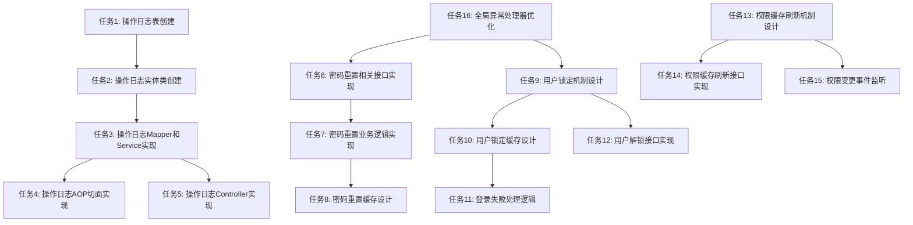

# 6A工作流：权限管理模块功能增强任务分解

## 1. 任务依赖关系图

## 2. 原子任务详情

### 任务1: 操作日志表创建

**输入契约:**
- 数据库连接信息
- 项目技术规范

**输出契约:**
- 操作日志表创建SQL脚本
- 表结构文档

**实现约束:**
- 表名: `operation_log`
- 包含字段: id, username, user_id, ip, operation_type, operation_desc, operation_content, result, create_time
- 使用MyBatis Plus注解

**依赖关系:**
- 前置任务: 无
- 后置任务: 任务2

### 任务2: 操作日志实体类创建

**输入契约:**
- 操作日志表结构
- 项目实体类规范

**输出契约:**
- OperationLog.java实体类

**实现约束:**
- 位于`com.mold.digitalization.entity.system`包
- 使用Lombok注解
- 实现Serializable接口

**依赖关系:**
- 前置任务: 任务1
- 后置任务: 任务3

### 任务3: 操作日志Mapper和Service实现

**输入契约:**
- OperationLog实体类
- 项目Mapper和Service规范
- MyBatis Plus分页插件配置

**输出契约:**
- OperationLogMapper接口
- OperationLogService接口及实现类

**实现约束:**
- 使用MyBatis Plus CRUD接口
- 支持分页查询
- 包含按用户、时间、操作类型等条件查询方法

**依赖关系:**
- 前置任务: 任务2
- 后置任务: 任务4, 任务5

### 任务4: 操作日志AOP切面实现

**输入契约:**
- OperationLogService
- Spring AOP配置
- 项目包路径

**输出契约:**
- OperationLogAspect.java切面类

**实现约束:**
- 拦截Controller层请求
- 记录请求参数、响应结果、执行时间
- 异常情况下记录错误信息
- 支持自定义操作描述注解

**依赖关系:**
- 前置任务: 任务3

### 任务5: 操作日志Controller实现

**输入契约:**
- OperationLogService
- 项目Controller规范
- Swagger/Knife4j配置

**输出契约:**
- OperationLogController.java

**实现约束:**
- RESTful风格接口
- 支持分页查询
- 添加Swagger文档注解
- 包含权限控制

**依赖关系:**
- 前置任务: 任务3

### 任务6: 密码重置相关接口实现

**输入契约:**
- Spring MVC配置
- 全局异常处理器
- 项目Controller规范

**输出契约:**
- 密码重置相关接口方法

**实现约束:**
- RESTful风格
- 包含请求重置、验证、确认三个步骤
- 支持邮箱和手机号两种方式
- 防止CSRF攻击

**依赖关系:**
- 前置任务: 任务16
- 后置任务: 任务7

### 任务7: 密码重置业务逻辑实现

**输入契约:**
- AuthService接口
- UserService接口
- 密码加密规范

**输出契约:**
- 密码重置业务逻辑
- 密码复杂度验证逻辑

**实现约束:**
- 密码强度校验（至少8位，包含大小写字母、数字和特殊字符）
- 防止密码重用
- 令牌有效期15分钟

**依赖关系:**
- 前置任务: 任务6
- 后置任务: 任务8

### 任务8: 密码重置缓存设计

**输入契约:**
- RedisService
- 项目缓存规范

**输出契约:**
- 密码重置缓存实现

**实现约束:**
- 使用Redis存储重置令牌
- 设计合理的键名规则
- 设置过期时间

**依赖关系:**
- 前置任务: 任务7

### 任务9: 用户锁定机制设计

**输入契约:**
- Spring Security配置
- 项目安全规范

**输出契约:**
- 用户锁定配置类

**实现约束:**
- 5分钟内5次失败登录尝试后锁定
- 锁定时间30分钟
- 支持管理员手动解锁

**依赖关系:**
- 前置任务: 任务16
- 后置任务: 任务10, 任务12

### 任务10: 用户锁定缓存设计

**输入契约:**
- RedisService
- 用户锁定配置

**输出契约:**
- 用户锁定缓存实现

**实现约束:**
- 缓存登录失败次数
- 缓存锁定状态和时间
- 设计合理的键名规则

**依赖关系:**
- 前置任务: 任务9
- 后置任务: 任务11

### 任务11: 登录失败处理逻辑

**输入契约:**
- AuthServiceImpl
- 用户锁定缓存

**输出契约:**
- 登录失败处理方法

**实现约束:**
- 记录失败次数
- 达到阈值时锁定用户
- 返回适当的错误信息

**依赖关系:**
- 前置任务: 任务10

### 任务12: 用户解锁接口实现

**输入契约:**
- UserController
- UserService

**输出契约:**
- 用户解锁接口

**实现约束:**
- 管理员权限验证
- 清除锁定状态
- 重置失败计数

**依赖关系:**
- 前置任务: 任务9

### 任务13: 权限缓存刷新机制设计

**输入契约:**
- Spring Cache配置
- Redis配置
- 项目缓存规范

**输出契约:**
- 权限缓存刷新配置

**实现约束:**
- 缓存键命名规范
- 缓存过期策略
- 刷新触发方式

**依赖关系:**
- 前置任务: 无
- 后置任务: 任务14, 任务15

### 任务14: 权限缓存刷新接口实现

**输入契约:**
- AdminController
- RedisService

**输出契约:**
- 权限缓存刷新接口

**实现约束:**
- 单个用户缓存刷新
- 全部用户缓存刷新
- 管理员权限验证

**依赖关系:**
- 前置任务: 任务13

### 任务15: 权限变更事件监听

**输入契约:**
- Spring Event配置
- RedisService

**输出契约:**
- 权限变更事件监听器

**实现约束:**
- 监听用户角色变更事件
- 监听角色权限变更事件
- 自动刷新相关缓存

**依赖关系:**
- 前置任务: 任务13

### 任务16: 全局异常处理器优化

**输入契约:**
- 项目异常处理规范
- Spring Boot配置

**输出契约:**
- 全局异常处理器

**实现约束:**
- 统一响应格式
- 自定义异常处理
- 异常日志记录
- 安全敏感信息过滤

**依赖关系:**
- 前置任务: 无
- 后置任务: 任务6, 任务9

## 3. 任务验收标准

### 3.1 操作日志审计功能

**功能验收:**
- 系统自动记录所有用户操作
- 操作日志包含用户信息、操作类型、操作内容、IP地址、时间等
- 支持按多种条件查询和分页
- AOP切面正常工作，不影响业务功能

**技术验收:**
- 数据库表结构符合设计
- 代码符合项目规范
- 单元测试覆盖率>80%
- 无性能影响（记录操作日志耗时<100ms）

### 3.2 密码重置功能

**功能验收:**
- 支持邮箱/手机号请求重置密码
- 验证流程安全可靠
- 密码强度验证有效
- 令牌过期机制正常工作

**技术验收:**
- Redis缓存使用合理
- 密码加密使用BCrypt
- 接口文档完整
- 无安全漏洞

### 3.3 用户锁定机制

**功能验收:**
- 登录失败5次后自动锁定
- 锁定时间30分钟后自动解锁
- 管理员可手动解锁用户
- 锁定状态下登录返回明确提示

**技术验收:**
- 缓存设计合理
- 锁定逻辑正确
- 解锁功能有效
- 性能影响最小化

### 3.4 权限缓存刷新机制

**功能验收:**
- 角色权限变更后自动刷新缓存
- 提供手动刷新接口
- 支持单个用户和全部用户缓存刷新

**技术验收:**
- 事件监听机制正常
- 缓存清理彻底
- 接口权限控制有效
- 无内存泄漏