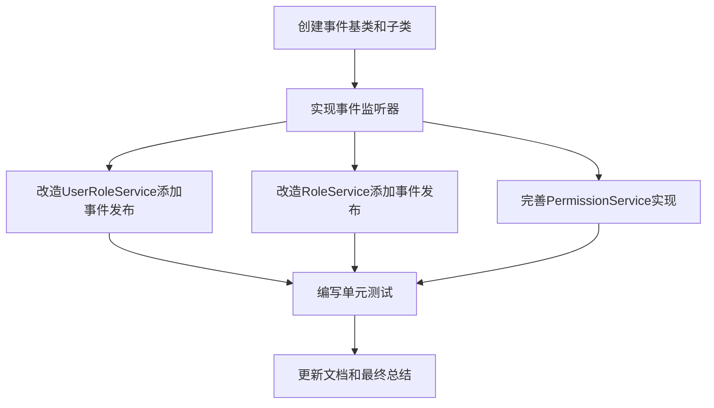

# 权限缓存刷新机制任务拆分文档

## 1. 任务概述

实现权限缓存刷新机制，包括事件设计、事件发布、事件监听和缓存刷新逻辑，确保在权限变更时相关用户的权限缓存能够及时更新。

## 2. 任务依赖图

## 3. 原子任务定义

### 3.1 任务1：创建事件基类和子类

**输入契约**：
- 无前置依赖
- 项目中已有的Spring Boot配置

**输出契约**：
- PermissionChangeEvent.java（基类事件）
- UserRoleChangeEvent.java（用户角色变更事件）
- RolePermissionChangeEvent.java（角色权限变更事件）
- RoleStatusChangeEvent.java（角色状态变更事件）

**实现约束**：
- 遵循Spring ApplicationEvent规范
- 每个事件类包含必要的属性和getter/setter方法
- 包路径：com.mold.digitalization.event

**依赖关系**：
- 无前置依赖
- 后续任务：任务2（实现事件监听器）依赖此任务

### 3.2 任务2：实现事件监听器

**输入契约**：
- 任务1的事件类
- 现有的PermissionCacheService
- 现有的UserRoleService

**输出契约**：
- PermissionCacheEventListener.java（事件监听器类）

**实现约束**：
- 使用@Component注解声明为Spring组件
- 使用@EventListener注解监听相应事件
- 实现缓存刷新逻辑，处理不同类型的权限变更
- 包含异常处理和日志记录
- 包路径：com.mold.digitalization.listener

**依赖关系**：
- 前置任务：任务1（创建事件基类和子类）
- 后续任务：任务3、4、5依赖此任务

### 3.3 任务3：改造UserRoleService添加事件发布

**输入契约**：
- 任务1的UserRoleChangeEvent类
- Spring的ApplicationEventPublisher
- 现有的UserRoleServiceImpl类

**输出契约**：
- 修改后的UserRoleServiceImpl.java

**实现约束**：
- 在assignRoleToUser方法中发布角色分配事件
- 在removeRoleFromUser方法中发布角色移除事件
- 在batchAssignRolesToUser方法中发布批量角色分配事件
- 使用ApplicationEventPublisher发布事件
- 确保事件发布在事务提交后进行

**依赖关系**：
- 前置任务：任务1（创建事件基类和子类）
- 后续任务：任务6（编写单元测试）

### 3.4 任务4：改造RoleService添加事件发布

**输入契约**：
- 任务1的RoleStatusChangeEvent类
- Spring的ApplicationEventPublisher
- 现有的RoleServiceImpl类

**输出契约**：
- 修改后的RoleServiceImpl.java

**实现约束**：
- 在updateRoleStatus方法中发布角色状态变更事件
- 使用ApplicationEventPublisher发布事件
- 确保事件发布在事务提交后进行

**依赖关系**：
- 前置任务：任务1（创建事件基类和子类）
- 后续任务：任务6（编写单元测试）

### 3.5 任务5：完善PermissionService实现

**输入契约**：
- 任务1的RolePermissionChangeEvent类
- Spring的ApplicationEventPublisher
- 现有的PermissionServiceImpl类
- PermissionMapper接口中的方法

**输出契约**：
- 完善后的PermissionServiceImpl.java

**实现约束**：
- 实现getPermissionsByUserId方法
- 实现getPermissionsByRoleId方法
- 实现assignPermissionsToRole方法并发布角色权限变更事件
- 使用ApplicationEventPublisher发布事件
- 确保事件发布在事务提交后进行

**依赖关系**：
- 前置任务：任务1（创建事件基类和子类）
- 后续任务：任务6（编写单元测试）

### 3.6 任务6：编写单元测试

**输入契约**：
- 任务1-5的实现代码
- JUnit和Mockito框架

**输出契约**：
- PermissionCacheEventListenerTest.java
- 修改后的UserRoleServiceImplTest.java（如果存在）
- 修改后的RoleServiceImplTest.java（如果存在）
- 新增PermissionServiceImplTest.java

**实现约束**：
- 测试事件发布逻辑
- 测试事件监听逻辑
- 测试缓存刷新逻辑
- 测试异常处理机制
- 测试边界情况
- 包路径：src/test/java/com/mold/digitalization/

**依赖关系**：
- 前置任务：任务3、4、5（服务类的实现）
- 后续任务：任务7（更新文档和最终总结）

### 3.7 任务7：更新文档和最终总结

**输入契约**：
- 任务1-6的实现成果
- 现有的TODO文档

**输出契约**：
- 更新TODO_权限管理模块.md中的任务状态
- 创建FINAL_权限缓存刷新机制实现总结.md

**实现约束**：
- 记录已完成的工作和实现细节
- 确认所有任务已完成
- 提供使用说明和注意事项
- 包路径：docs/权限管理模块/

**依赖关系**：
- 前置任务：任务6（编写单元测试）
- 无后续任务

## 4. 验收标准

### 4.1 功能验收
1. 用户角色变更时，相应用户的权限缓存自动刷新
2. 角色权限变更时，拥有该角色的所有用户权限缓存自动刷新
3. 角色状态变更时，拥有该角色的所有用户权限缓存自动刷新
4. 手动刷新接口工作正常

### 4.2 代码质量
1. 代码符合项目现有规范
2. 包含必要的注释和文档
3. 测试覆盖率达到80%以上
4. 无编译错误和警告

### 4.3 文档质量
1. 文档内容完整准确
2. 与实际实现一致
3. 包含足够的使用说明和示例