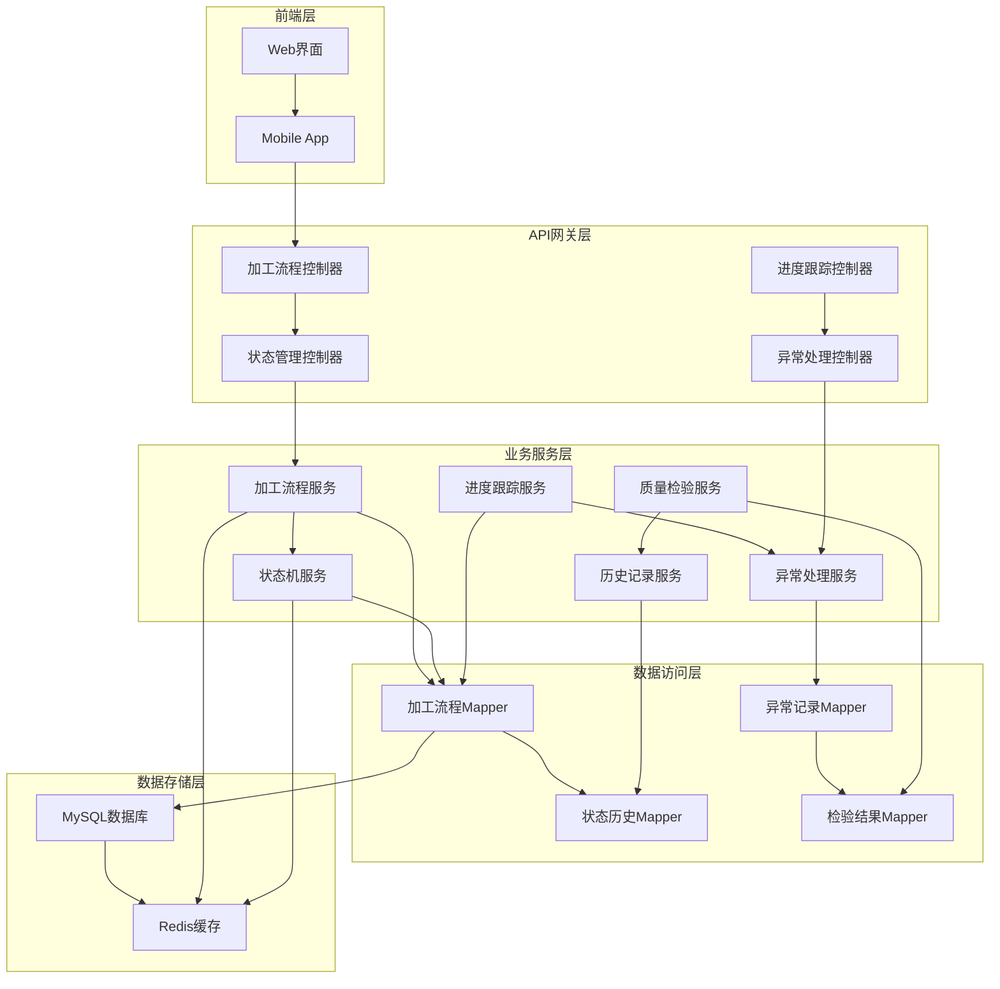
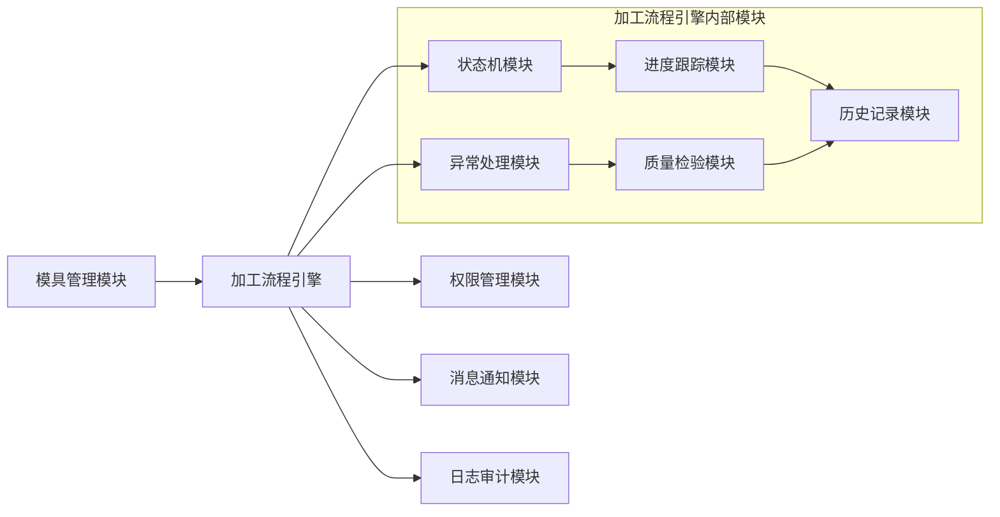
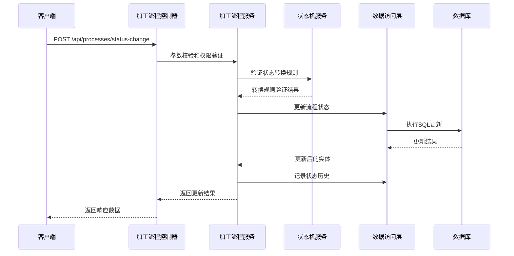

# DESIGN_模具加工流程引擎

## 1. 整体架构图



## 2. 分层设计

### 2.1 控制器层 (Controller Layer)
**职责**：接收HTTP请求，参数校验，响应格式化

**核心控制器：**
- `MoldProcessController`：加工流程管理
- `MoldStatusController`：状态流转控制
- `ProcessProgressController`：进度跟踪
- `ProcessExceptionController`：异常处理

### 2.2 业务服务层 (Service Layer)
**职责**：业务逻辑处理，事务管理，服务编排

**核心服务：**
- `MoldProcessService`：加工流程核心业务
- `ProcessStateMachineService`：状态机管理
- `ProgressTrackingService`：进度跟踪逻辑
- `ExceptionHandlingService`：异常处理流程
- `QualityInspectionService`：质量检验服务

### 2.3 数据访问层 (Mapper Layer)
**职责**：数据持久化，数据库操作封装

**核心Mapper：**
- `MoldProcessMapper`：加工流程数据访问
- `ProcessStatusHistoryMapper`：状态历史记录
- `ProcessExceptionMapper`：异常记录访问
- `InspectionResultMapper`：检验结果访问

### 2.4 实体模型层 (Entity Layer)
**职责**：数据模型定义，业务对象封装

**核心实体：**
- `MoldProcess`：加工流程主实体
- `ProcessStatusHistory`：状态历史记录
- `ProcessException`：加工异常记录
- `InspectionResult`：质量检验结果

## 3. 核心组件设计

### 3.1 状态机组件 (State Machine Component)
```java
public class ProcessStateMachine {
    // 状态定义
    public enum ProcessStatus {
        NEW, DESIGNING, MATERIAL_PREPARING, 
        ROUGH_PROCESSING, FINE_PROCESSING, 
        INSPECTING, COMPLETED, EXCEPTION
    }
    
    // 状态转换规则
    private Map<ProcessStatus, Set<ProcessStatus>> transitionRules;
    
    // 状态转换验证
    public boolean canTransition(ProcessStatus from, ProcessStatus to);
    
    // 执行状态转换
    public void transition(MoldProcess process, ProcessStatus newStatus);
}
```

### 3.2 进度跟踪组件 (Progress Tracking Component)
```java
public class ProgressTracker {
    // 工序定义
    private List<ProcessStep> steps;
    
    // 进度计算
    public double calculateProgress(MoldProcess process);
    
    // 当前工序识别
    public ProcessStep getCurrentStep(MoldProcess process);
    
    // 预计完成时间计算
    public LocalDateTime estimateCompletionTime(MoldProcess process);
}
```

### 3.3 异常处理组件 (Exception Handling Component)
```java
public class ExceptionHandler {
    // 异常分类
    public enum ExceptionType {
        MATERIAL_DEFECT, EQUIPMENT_FAILURE, 
        OPERATION_ERROR, QUALITY_ISSUE
    }
    
    // 异常记录
    public void recordException(MoldProcess process, ExceptionType type, String description);
    
    // 异常处理流程
    public void handleException(ProcessException exception);
    
    // 状态回滚
    public void rollbackStatus(MoldProcess process);
}
```

## 4. 模块依赖关系图



## 5. 接口契约定义

### 5.1 加工流程管理接口
```java
public interface MoldProcessService {
    // 创建加工流程
    MoldProcess createProcess(MoldProcessCreateRequest request);
    
    // 更新加工流程
    MoldProcess updateProcess(Long processId, MoldProcessUpdateRequest request);
    
    // 获取加工流程详情
    MoldProcess getProcessDetail(Long processId);
    
    // 查询加工流程列表
    Page<MoldProcess> queryProcesses(MoldProcessQueryRequest request);
}
```

### 5.2 状态流转接口
```java
public interface ProcessStateMachineService {
    // 状态转换
    MoldProcess changeStatus(Long processId, ProcessStatusChangeRequest request);
    
    // 获取可转换状态
    List<ProcessStatus> getAvailableStatuses(Long processId);
    
    // 状态历史查询
    List<ProcessStatusHistory> getStatusHistory(Long processId);
}
```

### 5.3 进度跟踪接口
```java
public interface ProgressTrackingService {
    // 获取加工进度
    ProcessProgress getProgress(Long processId);
    
    // 更新工序进度
    void updateStepProgress(Long processId, StepProgressUpdateRequest request);
    
    // 获取预计完成时间
    LocalDateTime getEstimatedCompletionTime(Long processId);
}
```

## 6. 数据流向图



## 7. 异常处理策略

### 7.1 业务异常分类
- **参数验证异常**：请求参数不符合规范
- **状态转换异常**：不符合状态流转规则
- **权限异常**：用户无操作权限
- **数据一致性异常**：并发操作导致数据不一致

### 7.2 异常处理机制
```java
@RestControllerAdvice
public class ProcessExceptionHandler {
    
    @ExceptionHandler(StateTransitionException.class)
    public ResponseEntity<ApiResponse> handleStateTransitionException(
        StateTransitionException e) {
        return ResponseEntity.badRequest()
            .body(ApiResponse.error("状态转换失败: " + e.getMessage()));
    }
    
    @ExceptionHandler(ProcessNotFoundException.class)
    public ResponseEntity<ApiResponse> handleProcessNotFoundException(
        ProcessNotFoundException e) {
        return ResponseEntity.status(HttpStatus.NOT_FOUND)
            .body(ApiResponse.error("加工流程不存在"));
    }
}
```

### 7.3 事务管理策略
```java
@Service
@Transactional
public class MoldProcessServiceImpl implements MoldProcessService {
    
    @Transactional(rollbackFor = Exception.class)
    public MoldProcess changeStatus(Long processId, ProcessStatusChangeRequest request) {
        // 状态转换逻辑，确保数据一致性
    }
}
```

## 8. 缓存策略设计

### 8.1 缓存使用场景
- **流程状态缓存**：减少数据库查询压力
- **工序配置缓存**：预加载工序配置信息
- **进度信息缓存**：缓存实时进度数据

### 8.2 缓存配置
```java
@Configuration
@EnableCaching
public class CacheConfig {
    
    @Bean
    public CacheManager cacheManager(RedisConnectionFactory factory) {
        RedisCacheConfiguration config = RedisCacheConfiguration.defaultCacheConfig()
            .entryTtl(Duration.ofMinutes(30))
            .serializeKeysWith(RedisSerializationContext.SerializationPair
                .fromSerializer(new StringRedisSerializer()))
            .serializeValuesWith(RedisSerializationContext.SerializationPair
                .fromSerializer(new GenericJackson2JsonRedisSerializer()));
        
        return RedisCacheManager.builder(factory)
            .cacheDefaults(config)
            .build();
    }
}
```

## 9. 安全设计考虑

### 9.1 权限控制
- 基于角色的操作权限控制
- 数据访问权限隔离
- 操作日志记录和审计

### 9.2 数据安全
- 敏感数据加密存储
- 数据传输加密
- 防止SQL注入和XSS攻击

## 10. 性能优化策略

### 10.1 数据库优化
- 合理设计索引
- 分页查询优化
- 避免N+1查询问题

### 10.2 服务优化
- 异步处理耗时操作
- 批量操作优化
- 连接池配置优化

---

**设计状态**：✅ 架构设计完成  
**下一步**：进入Atomize阶段，拆分原子化任务