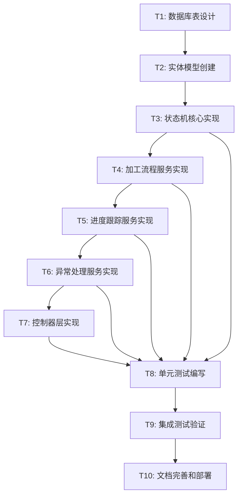

# TASK_模具加工流程引擎

## 1. 任务依赖图

## 2. 原子化任务拆分

### 任务T1: 数据库表设计
**任务ID**: T1  
**优先级**: 高  
**预估复杂度**: 中等

**输入契约：**
- 前置依赖：无
- 输入数据：ALIGNMENT和DESIGN文档中的业务需求
- 环境依赖：MySQL数据库环境

**输出契约：**
- 输出数据：完整的SQL建表脚本
- 交付物：`docs/模具加工流程引擎/sql/process_tables.sql`
- 验收标准：SQL脚本语法正确，表结构符合设计规范

**实现约束：**
- 技术栈：MySQL 5.7+
- 接口规范：遵循项目数据库命名规范
- 质量要求：包含索引设计、外键约束、注释说明

**依赖关系：**
- 后置任务：T2（实体模型创建）
- 并行任务：无

---

### 任务T2: 实体模型创建
**任务ID**: T2  
**优先级**: 高  
**预估复杂度**: 中等

**输入契约：**
- 前置依赖：T1（数据库表设计）
- 输入数据：数据库表结构定义
- 环境依赖：Java开发环境，MyBatis Plus框架

**输出契约：**
- 输出数据：完整的实体类代码
- 交付物：4个核心实体类文件
- 验收标准：实体类编译通过，字段映射正确

**实现约束：**
- 技术栈：Java 8+，Lombok，MyBatis Plus
- 接口规范：遵循项目实体类编码规范
- 质量要求：包含完整注解、Getter/Setter方法

**依赖关系：**
- 后置任务：T3（状态机核心实现）
- 并行任务：无

**具体实体：**
- `MoldProcess`：加工流程主实体
- `ProcessStatusHistory`：状态历史记录
- `ProcessException`：加工异常记录
- `InspectionResult`：质量检验结果

---

### 任务T3: 状态机核心实现
**任务ID**: T3  
**优先级**: 高  
**预估复杂度**: 高

**输入契约：**
- 前置依赖：T2（实体模型创建）
- 输入数据：实体类定义，状态流转规则
- 环境依赖：Spring Boot框架环境

**输出契约：**
- 输出数据：状态机服务实现代码
- 交付物：`ProcessStateMachineService`及相关组件
- 验收标准：状态转换逻辑正确，异常处理完善

**实现约束：**
- 技术栈：Spring Boot 2.7，自定义状态机
- 接口规范：遵循项目服务层编码规范
- 质量要求：线程安全，事务管理完善

**依赖关系：**
- 后置任务：T4（加工流程服务实现）
- 并行任务：无

---

### 任务T4: 加工流程服务实现
**任务ID**: T4  
**优先级**: 高  
**预估复杂度**: 高

**输入契约：**
- 前置依赖：T3（状态机核心实现）
- 输入数据：状态机服务，实体模型
- 环境依赖：Spring Boot框架环境

**输出契约：**
- 输出数据：加工流程服务实现代码
- 交付物：`MoldProcessService`及相关组件
- 验收标准：业务流程完整，API接口可用

**实现约束：**
- 技术栈：Spring Boot 2.7，MyBatis Plus
- 接口规范：遵循项目服务层编码规范
- 质量要求：事务管理，异常处理，日志记录

**依赖关系：**
- 后置任务：T5（进度跟踪服务实现）
- 并行任务：无

---

### 任务T5: 进度跟踪服务实现
**任务ID**: T5  
**优先级**: 中  
**预估复杂度**: 中等

**输入契约：**
- 前置依赖：T4（加工流程服务实现）
- 输入数据：加工流程服务，实体模型
- 环境依赖：Spring Boot框架环境

**输出契约：**
- 输出数据：进度跟踪服务实现代码
- 交付物：`ProgressTrackingService`及相关组件
- 验收标准：进度计算准确，实时更新有效

**实现约束：**
- 技术栈：Spring Boot 2.7，Redis缓存
- 接口规范：遵循项目服务层编码规范
- 质量要求：缓存策略合理，性能优化

**依赖关系：**
- 后置任务：T6（异常处理服务实现）
- 并行任务：无

---

### 任务T6: 异常处理服务实现
**任务ID**: T6  
**优先级**: 中  
**预估复杂度**: 中等

**输入契约：**
- 前置依赖：T5（进度跟踪服务实现）
- 输入数据：进度跟踪服务，实体模型
- 环境依赖：Spring Boot框架环境

**输出契约：**
- 输出数据：异常处理服务实现代码
- 交付物：`ExceptionHandlingService`及相关组件
- 验收标准：异常分类合理，处理流程完整

**实现约束：**
- 技术栈：Spring Boot 2.7，统一异常处理
- 接口规范：遵循项目服务层编码规范
- 质量要求：异常记录完整，状态回滚可靠

**依赖关系：**
- 后置任务：T7（控制器层实现）
- 并行任务：无

---

### 任务T7: 控制器层实现
**任务ID**: T7  
**优先级**: 中  
**预估复杂度**: 中等

**输入契约：**
- 前置依赖：T6（异常处理服务实现）
- 输入数据：所有业务服务实现
- 环境依赖：Spring Boot框架环境

**输出契约：**
- 输出数据：控制器层实现代码
- 交付物：4个核心控制器类
- 验收标准：RESTful API接口完整可用

**实现约束：**
- 技术栈：Spring Boot 2.7，Swagger文档
- 接口规范：遵循项目控制器层编码规范
- 质量要求：参数校验，权限控制，响应格式统一

**依赖关系：**
- 后置任务：T8（单元测试编写）
- 并行任务：无

**具体控制器：**
- `MoldProcessController`：加工流程管理
- `ProcessStatusController`：状态流转控制
- `ProcessProgressController`：进度跟踪
- `ProcessExceptionController`：异常处理

---

### 任务T8: 单元测试编写
**任务ID**: T8  
**优先级**: 中  
**预估复杂度**: 高

**输入契约：**
- 前置依赖：T3-T7（所有服务层和控制器层实现）
- 输入数据：所有业务代码实现
- 环境依赖：JUnit，Mockito测试框架

**输出契约：**
- 输出数据：完整的单元测试代码
- 交付物：所有核心类的单元测试
- 验收标准：测试覆盖率>80%，所有测试通过

**实现约束：**
- 技术栈：JUnit 5，Mockito，Spring Boot Test
- 接口规范：遵循项目测试编码规范
- 质量要求：边界条件覆盖，异常场景测试

**依赖关系：**
- 后置任务：T9（集成测试验证）
- 并行任务：无

---

### 任务T9: 集成测试验证
**任务ID**: T9  
**优先级**: 中  
**预估复杂度**: 中等

**输入契约：**
- 前置依赖：T8（单元测试编写）
- 输入数据：所有代码和单元测试
- 环境依赖：完整的测试环境

**输出契约：**
- 输出数据：集成测试报告
- 交付物：端到端集成测试用例
- 验收标准：所有集成测试通过，业务流程完整

**实现约束：**
- 技术栈：Spring Boot Test，TestContainers
- 接口规范：遵循项目集成测试规范
- 质量要求：端到端流程验证，数据一致性检查

**依赖关系：**
- 后置任务：T10（文档完善和部署）
- 并行任务：无

---

### 任务T10: 文档完善和部署
**任务ID**: T10  
**优先级**: 低  
**预估复杂度**: 低

**输入契约：**
- 前置依赖：T9（集成测试验证）
- 输入数据：所有功能实现和测试结果
- 环境依赖：文档编写环境

**输出契约：**
- 输出数据：完整的项目文档
- 交付物：API文档，部署文档，用户手册
- 验收标准：文档完整准确，部署流程清晰

**实现约束：**
- 技术栈：Markdown，Swagger
- 接口规范：遵循项目文档规范
- 质量要求：文档与实际代码一致

**依赖关系：**
- 后置任务：无
- 并行任务：无

## 3. 实施计划

### 第一阶段：基础架构（T1-T2）
- 目标：完成数据库设计和实体模型
- 时间预估：1-2天
- 关键交付：数据库脚本，实体类代码

### 第二阶段：核心业务（T3-T6）
- 目标：实现所有业务服务
- 时间预估：3-4天
- 关键交付：状态机服务，流程服务，进度跟踪，异常处理

### 第三阶段：接口层（T7）
- 目标：完成控制器层实现
- 时间预估：1天
- 关键交付：RESTful API接口

### 第四阶段：质量保证（T8-T9）
- 目标：完成测试覆盖
- 时间预估：2天
- 关键交付：单元测试，集成测试

### 第五阶段：部署交付（T10）
- 目标：完善文档和部署
- 时间预估：0.5天
- 关键交付：完整文档，部署指南

## 4. 风险评估和缓解措施

### 技术风险
- **状态机复杂度**：通过模块化设计和充分测试缓解
- **数据一致性**：使用事务管理和乐观锁机制
- **性能问题**：通过缓存和索引优化缓解

### 业务风险
- **需求变更**：保持架构灵活性，支持扩展
- **集成问题**：提前定义清晰的接口契约

## 5. 验收标准汇总

### 功能验收
- [ ] 模具加工状态机正常工作
- [ ] 加工进度跟踪准确
- [ ] 异常处理机制有效
- [ ] 质量检验流程完整
- [ ] API接口符合规范

### 技术验收
- [ ] 代码符合编码规范
- [ ] 单元测试覆盖率>80%
- [ ] 集成测试全部通过
- [ ] 性能指标达标
- [ ] 安全控制完善

---

**任务拆分状态**：✅ 原子化任务拆分完成  
**下一步**：进入Approve阶段，进行任务审批