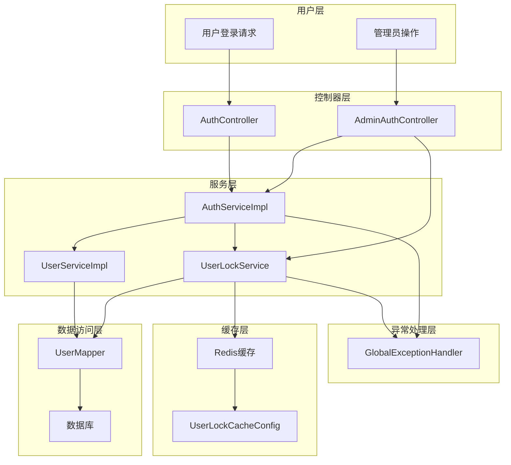
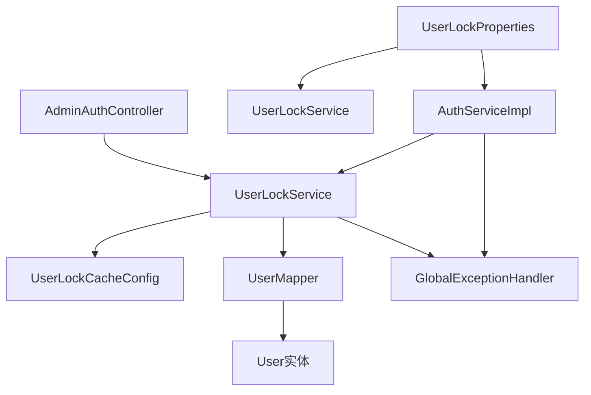
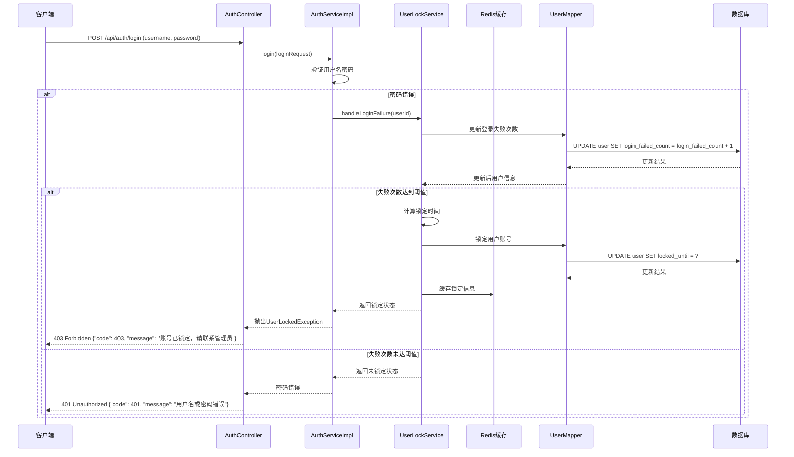
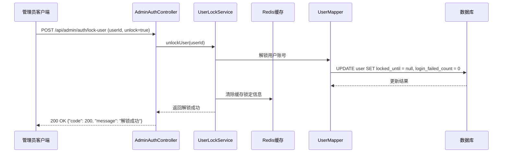

# 用户锁定机制设计文档

## 1. 整体架构图



## 2. 分层设计和核心组件

### 2.1 分层架构
- **控制器层**：处理HTTP请求，提供API接口
- **服务层**：实现业务逻辑，包括锁定、解锁、登录失败处理
- **缓存层**：使用Redis缓存热点数据
- **数据访问层**：与数据库交互
- **异常处理层**：统一处理异常

### 2.2 核心组件

#### 2.2.1 AuthServiceImpl
- 主要职责：处理用户认证、登录失败处理、锁定状态检查
- 关键方法：
  - `login()`: 用户登录，包含锁定状态检查
  - `checkUserLockStatus()`: 检查用户锁定状态
  - `handleLoginFailure()`: 处理登录失败，增加失败次数并锁定用户
  - `unlockUser()`: 解锁用户账号

#### 2.2.2 UserLockService
- 主要职责：封装用户锁定相关的业务逻辑
- 关键方法：
  - `lockUser()`: 锁定用户
  - `unlockUser()`: 解锁用户
  - `isUserLocked()`: 检查用户是否被锁定
  - `resetLoginFailedCount()`: 重置登录失败次数

#### 2.2.3 UserLockCacheConfig
- 主要职责：配置Redis缓存参数
- 关键属性：
  - 缓存键前缀
  - 缓存过期时间
  - 缓存容量限制

#### 2.2.4 UserLockProperties
- 主要职责：管理锁定相关配置参数
- 关键属性：
  - 最大登录失败次数
  - 锁定时长（分钟）

#### 2.2.5 UserLockedException
- 主要职责：表示用户被锁定的异常
- 关键信息：锁定时间、失败次数

## 3. 模块依赖关系图



## 4. 接口契约定义

### 4.1 AuthService接口

```java
/**
 * 认证服务接口
 */
public interface AuthService {
    // 现有方法略
    
    /**
     * 解锁用户账号
     * @param userId 用户ID
     * @return 是否成功
     */
    boolean unlockUser(Long userId);
    
    /**
     * 锁定用户账号
     * @param userId 用户ID
     * @param minutes 锁定分钟数
     * @return 是否成功
     */
    boolean lockUser(Long userId, Integer minutes);
}
```

### 4.2 UserLockService接口

```java
/**
 * 用户锁定服务接口
 */
public interface UserLockService {
    
    /**
     * 锁定用户
     * @param userId 用户ID
     * @param minutes 锁定分钟数
     * @return 是否成功
     */
    boolean lockUser(Long userId, Integer minutes);
    
    /**
     * 解锁用户
     * @param userId 用户ID
     * @return 是否成功
     */
    boolean unlockUser(Long userId);
    
    /**
     * 检查用户是否被锁定
     * @param userId 用户ID
     * @return 是否被锁定
     */
    boolean isUserLocked(Long userId);
    
    /**
     * 获取用户锁定信息
     * @param userId 用户ID
     * @return 锁定信息，包含锁定时间和失败次数
     */
    UserLockInfo getUserLockInfo(Long userId);
    
    /**
     * 处理登录失败
     * @param userId 用户ID
     * @return 处理结果，包含是否被锁定
     */
    LoginFailureResult handleLoginFailure(Long userId);
    
    /**
     * 重置登录失败次数
     * @param userId 用户ID
     */
    void resetLoginFailedCount(Long userId);
}
```

### 4.3 AdminAuthController接口

```java
/**
 * 管理员认证控制器
 */
@RestController
@RequestMapping("/api/admin/auth")
public class AdminAuthController {
    // 现有方法略
    
    /**
     * 锁定/解锁用户账号
     * @param request 锁定/解锁请求参数
     * @return 操作结果
     */
    @PostMapping("/lock-user")
    public Result lockUser(@RequestBody UserLockRequest request);
}
```

## 5. 数据流向图

### 5.1 登录失败锁定流程



### 5.2 管理员解锁用户流程



## 6. 异常处理策略

### 6.1 异常类型

#### 6.1.1 UserLockedException
- **触发条件**：用户账号被锁定时尝试登录
- **错误码**：403
- **错误消息**："账号已锁定，锁定时间：{lockedUntil}"

#### 6.1.2 UserNotFoundException
- **触发条件**：要锁定/解锁的用户不存在
- **错误码**：404
- **错误消息**："用户不存在"

#### 6.1.3 AccessDeniedException
- **触发条件**：普通用户尝试锁定/解锁其他用户
- **错误码**：403
- **错误消息**："无权限执行此操作"

### 6.2 全局异常处理器

```java
@RestControllerAdvice
public class GlobalExceptionHandler {
    
    // 现有方法略
    
    /**
     * 处理用户锁定异常
     * @param ex 用户锁定异常
     * @return 错误响应
     */
    @ExceptionHandler(UserLockedException.class)
    public Result handleUserLockedException(UserLockedException ex) {
        return Result.fail(HttpStatus.FORBIDDEN.value(), ex.getMessage());
    }
}
```

## 7. 数据库设计

### 7.1 User表锁定相关字段

| 字段名 | 数据类型 | 长度 | 允许空 | 描述 |
| :--- | :--- | :--- | :--- | :--- |
| login_failed_count | INT | 11 | 否 | 登录失败次数 |
| locked_until | DATETIME | - | 是 | 锁定时间 |
| status | INT | 11 | 否 | 用户状态：0-禁用，1-启用 |

### 7.2 锁定相关SQL操作

#### 7.2.1 更新登录失败次数
```sql
UPDATE user SET login_failed_count = login_failed_count + 1 WHERE id = ?
```

#### 7.2.2 锁定用户
```sql
UPDATE user SET locked_until = ?, login_failed_count = ? WHERE id = ?
```

#### 7.2.3 解锁用户
```sql
UPDATE user SET locked_until = null, login_failed_count = 0 WHERE id = ?
```

#### 7.2.4 检查用户锁定状态
```sql
SELECT id, locked_until, login_failed_count FROM user WHERE id = ?
```

## 8. 缓存设计

### 8.1 缓存键设计

| 缓存键 | 类型 | 描述 | 过期时间 |
| :--- | :--- | :--- | :--- |
| `user:lock:{userId}` | Hash | 用户锁定信息 | 锁定时长+30分钟 |
| `user:login:failed:{userId}` | String | 登录失败次数临时缓存 | 10分钟 |

### 8.2 缓存内容

#### 8.2.1 用户锁定信息缓存
```
user:lock:123 {
  "locked_until": "2023-07-15T10:30:00",
  "failed_count": 5,
  "locked_by": "SYSTEM"
}
```

## 9. 配置参数

| 配置项 | 类型 | 默认值 | 描述 |
| :--- | :--- | :--- | :--- |
| `user.lock.max-failed-attempts` | Integer | 5 | 最大登录失败次数 |
| `user.lock.duration-minutes` | Integer | 30 | 锁定时长（分钟） |
| `user.lock.cache.enabled` | Boolean | true | 是否启用缓存 |
| `user.lock.cache.expire-minutes` | Integer | 60 | 缓存过期时间（分钟） |

## 10. 安全考虑

1. **防止暴力破解**：通过锁定机制有效防止暴力破解攻击
2. **审计日志**：记录所有锁定/解锁操作，便于安全审计
3. **权限控制**：只有管理员可以解锁用户
4. **信息泄露防护**：错误信息不泄露敏感数据
5. **缓存安全**：Redis缓存中的锁定信息设置合理的过期时间