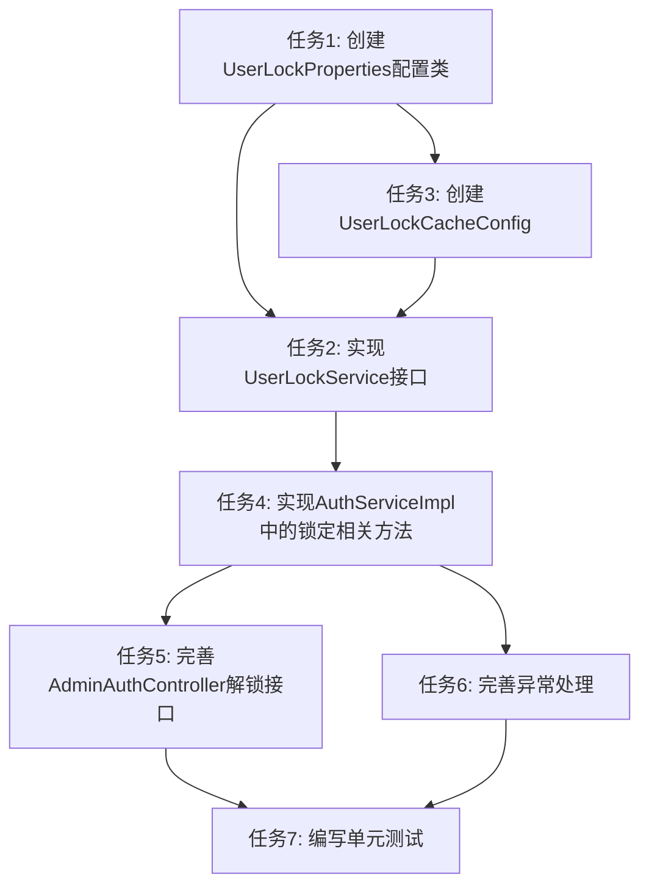

# 用户锁定机制任务拆分文档

## 任务依赖图

## 任务详情

### 任务1: 创建UserLockProperties配置类

**输入契约：**
- 无

**输出契约：**
- 创建`com.mold.digitalization.config.UserLockProperties`类
- 在application.properties中添加相关配置项

**实现约束：**
- 使用Spring Boot的`@ConfigurationProperties`注解
- 配置项名称前缀为`user.lock`
- 包含以下配置属性：
  - maxFailedAttempts: 最大登录失败次数（默认5次）
  - durationMinutes: 锁定时长（默认30分钟）
  - cache.enabled: 是否启用缓存（默认true）
  - cache.expireMinutes: 缓存过期时间（默认60分钟）

**依赖关系：**
- 无

### 任务2: 实现UserLockService接口

**输入契约：**
- 任务1完成的UserLockProperties配置类
- 任务3完成的UserLockCacheConfig缓存配置

**输出契约：**
- 创建`com.mold.digitalization.service.UserLockService`接口
- 实现`com.mold.digitalization.service.impl.UserLockServiceImpl`类
- 相关的数据传输对象（UserLockInfo, LoginFailureResult）

**实现约束：**
- 接口方法包括：lockUser, unlockUser, isUserLocked, getUserLockInfo, handleLoginFailure, resetLoginFailedCount
- 实现类使用@Service注解
- 注入UserMapper和UserLockProperties
- 注入RedisTemplate用于缓存操作
- 实现锁定、解锁、登录失败处理逻辑

**依赖关系：**
- 依赖任务1（UserLockProperties）
- 依赖任务3（UserLockCacheConfig）
- 被任务4依赖

### 任务3: 创建UserLockCacheConfig

**输入契约：**
- 任务1完成的UserLockProperties配置类

**输出契约：**
- 创建`com.mold.digitalization.config.UserLockCacheConfig`类
- 配置Redis缓存相关参数

**实现约束：**
- 使用Spring Cache的@Configuration注解
- 定义缓存键前缀
- 配置缓存过期策略
- 提供缓存操作的辅助方法

**依赖关系：**
- 依赖任务1（UserLockProperties）
- 被任务2依赖

### 任务4: 实现AuthServiceImpl中的锁定相关方法

**输入契约：**
- 任务2完成的UserLockService

**输出契约：**
- 完善`com.mold.digitalization.service.impl.AuthServiceImpl`类
- 实现lockUser方法
- 完善login方法中的锁定状态检查
- 完善unlockUser方法

**实现约束：**
- 注入UserLockService
- login方法中添加锁定状态检查
- 在密码验证失败时调用handleLoginFailure方法
- 实现lockUser方法，调用UserLockService的对应方法
- 实现unlockUser方法，调用UserLockService的对应方法

**依赖关系：**
- 依赖任务2（UserLockService）
- 被任务5、任务6依赖

### 任务5: 完善AdminAuthController解锁接口

**输入契约：**
- 任务4完成的AuthServiceImpl

**输出契约：**
- 完善`com.mold.digitalization.controller.AdminAuthController`中的lock-user接口
- 添加权限控制
- 完善参数校验
- 添加操作日志记录

**实现约束：**
- 确保接口使用正确的请求映射
- 添加@PreAuthorize注解进行权限控制
- 使用@RequestBody接收请求参数
- 添加@Validated注解进行参数校验
- 记录操作日志

**依赖关系：**
- 依赖任务4（AuthServiceImpl）
- 被任务7依赖

### 任务6: 完善异常处理

**输入契约：**
- 任务4完成的AuthServiceImpl

**输出契约：**
- 创建`com.mold.digitalization.exception.UserLockedException`异常类
- 完善`com.mold.digitalization.handler.GlobalExceptionHandler`中的异常处理方法

**实现约束：**
- UserLockedException继承RuntimeException
- 包含锁定时间、失败次数等信息
- GlobalExceptionHandler中添加handleUserLockedException方法
- 返回适当的错误码和错误消息

**依赖关系：**
- 依赖任务4（AuthServiceImpl）
- 被任务7依赖

### 任务7: 编写单元测试

**输入契约：**
- 任务4、5、6完成的实现

**输出契约：**
- 创建`com.mold.digitalization.service.impl.UserLockServiceImplTest`测试类
- 创建`com.mold.digitalization.service.impl.AuthServiceImplLockTest`测试类

**实现约束：**
- 使用JUnit 5
- 使用Mockito进行依赖注入
- 测试场景包括：
  - 用户锁定功能
  - 用户解锁功能
  - 登录失败次数累计
  - 锁定状态检查
  - 异常处理
- 确保测试覆盖率达到80%以上

**依赖关系：**
- 依赖任务4、5、6

## 任务交付标准

### 功能完整性
1. 用户登录失败5次后自动锁定30分钟
2. 锁定用户无法登录，返回明确的错误信息
3. 管理员可以手动锁定/解锁用户
4. 锁定状态正确保存在数据库中
5. 锁定信息缓存在Redis中以提高性能

### 代码质量
1. 代码符合Spring Boot最佳实践
2. 方法和类有清晰的注释
3. 使用Lombok简化代码
4. 参数校验完善
5. 异常处理合理

### 测试覆盖
1. 每个主要功能都有对应的单元测试
2. 测试覆盖正常流程和边界情况
3. Mock外部依赖

### 文档完善
1. API文档完整
2. 代码注释清晰
3. 配置项有说明

## 验收标准
1. 所有任务完成并通过代码审查
2. 所有单元测试通过
3. 系统能够正确处理登录失败锁定
4. 管理员能够成功锁定/解锁用户
5. 接口响应符合RESTful规范
6. 异常处理合理，返回明确的错误信息