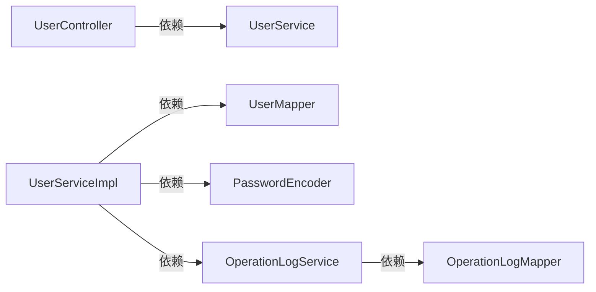
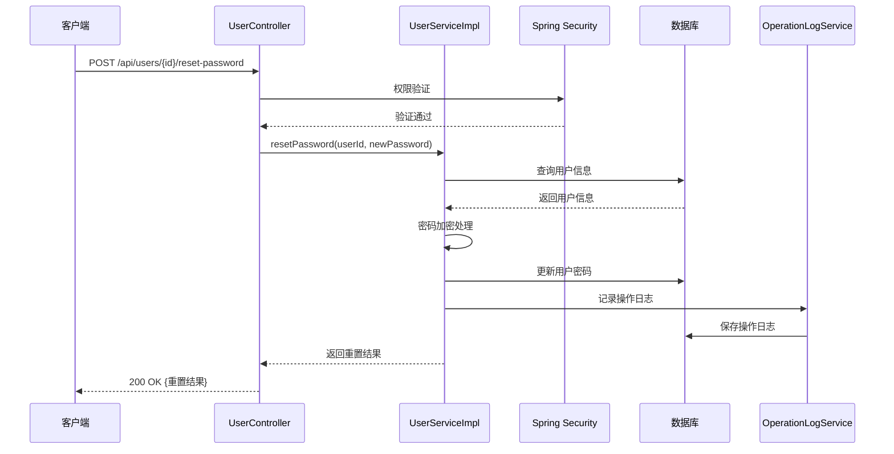

# 管理员密码重置功能设计文档

## 1. 整体架构图

```mermaid
graph TD
    A[客户端] -->|POST /api/users/{id}/reset-password| B[UserController]
    B -->|权限验证| C[Spring Security]
    C -->|ADMIN角色| D[UserServiceImpl]
    D -->|查询用户| E[UserMapper]
    E --> F[数据库]
    D -->|密码加密| G[PasswordEncoder]
    D -->|更新密码| H[UserMapper]
    H --> F
    D -->|记录日志| I[OperationLogService]
    I -->|保存日志| J[OperationLogMapper]
    J --> F
    D -->|返回结果| B
    B -->|ResetPasswordResult| A
```

## 2. 分层设计

### 2.1 控制器层 (Controller)
- **UserController**: 处理HTTP请求，进行权限验证，返回标准化响应
  - `resetUserPassword`方法：接收重置请求，调用服务层进行业务处理

### 2.2 服务层 (Service)
- **UserServiceImpl**: 实现核心业务逻辑
  - `resetPassword`方法：执行密码重置，包括用户检查、密码加密、记录日志
  - `recordPasswordResetLog`方法：记录密码重置操作日志

### 2.3 数据访问层 (DAO/Mapper)
- **UserMapper**: 处理用户数据CRUD操作
- **OperationLogMapper**: 处理操作日志数据CRUD操作

### 2.4 数据传输对象 (DTO)
- **PasswordResetRequest**: 请求DTO，包含可选的自定义密码
- **ResetPasswordResult**: 响应DTO，包含重置结果信息

### 2.5 实体层 (Entity)
- **User**: 用户实体类
- **OperationLog**: 操作日志实体类

## 3. 模块依赖关系



## 4. 接口契约定义

### 4.1 密码重置接口
- **URL**: `POST /api/users/{id}/reset-password`
- **方法**: POST
- **权限**: ADMIN角色
- **请求路径参数**:
  - `id`: 用户ID (Long)
- **请求体**:
  ```json
  {
    "newPassword": "string" // 可选，不提供则使用默认密码
  }
  ```
- **成功响应**:
  ```json
  {
    "userId": 123,
    "resetTime": "2023-07-01T10:00:00Z",
    "defaultPassword": true
  }
  ```
- **失败响应**:
  ```json
  {
    "code": 404,
    "message": "用户不存在"
  }
  ```

## 5. 数据流向图



## 6. 异常处理策略

### 6.1 业务异常
- 用户不存在：返回404 NOT FOUND
- 权限不足：返回403 FORBIDDEN
- 参数校验失败：返回400 BAD REQUEST

### 6.2 系统异常
- 数据库操作失败：返回500 INTERNAL SERVER ERROR
- 日志记录失败：记录警告日志，但不影响主流程

### 6.3 事务处理
- 密码重置操作使用@Transactional注解
- 传播行为：REQUIRED
- 回滚条件：RuntimeException

## 7. 安全考虑

- 使用Spring Security进行严格的权限控制
- 密码使用PasswordEncoder加密存储
- 标记为敏感操作，记录详细的操作日志
- 支持密码复杂度校验（待实现）