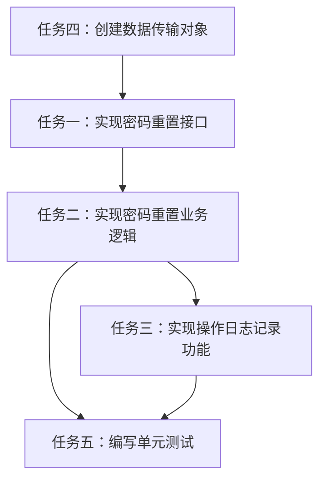

# 管理员密码重置功能任务拆分文档

## 1. 子任务拆分

### 1.1 任务一：实现密码重置接口（Controller层）
- **输入契约**：
  - 前置依赖：UserController类已存在
  - 输入数据：用户ID、可选的新密码
  - 环境依赖：Spring Security配置完成
- **输出契约**：
  - 输出数据：ResetPasswordResult
  - 交付物：UserController中新增resetUserPassword方法
  - 验收标准：接口可以正确接收请求并返回标准响应
- **实现约束**：
  - 使用RESTful风格
  - 添加@PreAuthorize("hasRole('ADMIN')")权限控制
  - 使用标准的响应格式
- **依赖关系**：
  - 前置任务：无
  - 后置任务：任务二

### 1.2 任务二：实现密码重置业务逻辑（Service层）
- **输入契约**：
  - 前置依赖：UserServiceImpl类已存在
  - 输入数据：用户ID、新密码
  - 环境依赖：PasswordEncoder配置完成
- **输出契约**：
  - 输出数据：ResetPasswordResult
  - 交付物：UserServiceImpl中实现resetPassword方法
  - 验收标准：密码正确加密并更新，返回正确的结果
- **实现约束**：
  - 使用@Transactional保证事务一致性
  - 当新密码为空时，使用 PasswordUtil 按规则动态生成一次性默认密码（8–20位，仅字母数字，需同时包含字母与数字），并通过 ResetPasswordResult.defaultPasswordValue 在本次响应中返回给管理员；日志中仅记录“已生成默认密码”，不打印明文
  - 密码长度校验8-20个字符
- **依赖关系**：
  - 前置任务：任务一
  - 后置任务：任务三

### 1.3 任务三：实现操作日志记录功能
- **输入契约**：
  - 前置依赖：OperationLogService类已存在
  - 输入数据：操作用户信息、目标用户、IP地址等
  - 环境依赖：OperationLog表已创建
- **输出契约**：
  - 输出数据：无
  - 交付物：UserServiceImpl中实现recordPasswordResetLog方法
  - 验收标准：操作日志正确记录到数据库
- **实现约束**：
  - 标记为敏感操作
  - 记录详细的上下文信息
  - 操作类型为"密码重置"
- **依赖关系**：
  - 前置任务：任务二
  - 后置任务：任务四

### 1.4 任务四：创建数据传输对象（DTO）
- **输入契约**：
  - 前置依赖：无
  - 输入数据：无
  - 环境依赖：无
- **输出契约**：
  - 输出数据：无
  - 交付物：PasswordResetRequest和ResetPasswordResult类
  - 验收标准：DTO类包含所有必要字段和校验注解
- **实现约束**：
  - 使用Lombok简化代码
  - 添加适当的字段校验注解
  - 字段命名遵循驼峰命名法
- **依赖关系**：
  - 前置任务：无
  - 后置任务：任务一

### 1.5 任务五：编写单元测试
- **输入契约**：
  - 前置依赖：UserServiceImplTest类已存在
  - 输入数据：测试用例数据
  - 环境依赖：测试框架配置完成
- **输出契约**：
  - 输出数据：测试结果
  - 交付物：UserServiceImplTest中新增测试方法
  - 验收标准：测试覆盖率达到90%以上
- **实现约束**：
  - 覆盖正常流程
  - 覆盖异常情况
  - 覆盖边界条件
- **依赖关系**：
  - 前置任务：任务一、任务二、任务三
  - 后置任务：无

## 2. 任务依赖关系图

## 3. 实现约束说明

### 3.1 技术栈约束
- 使用Spring Boot 2.7
- 使用Spring Security
- 使用MyBatis Plus
- 使用Lombok简化代码

### 3.2 接口规范约束
- RESTful风格API
- 统一的响应格式
- 标准的HTTP状态码

### 3.3 质量要求约束
- 代码符合Java编码规范
- 测试覆盖率≥90%
- 无SonarQube严重警告

## 4. 验收标准

### 4.1 功能验收
- 管理员可以成功重置用户密码
- 密码重置后数据库中密码已加密存储
- 操作日志正确记录
- 权限控制有效

### 4.2 性能验收
- 密码重置操作响应时间<500ms
- 系统支持并发密码重置操作

### 4.3 安全验收
- 密码使用安全的加密算法
- 无权限用户无法执行密码重置
- 敏感操作有详细日志记录
