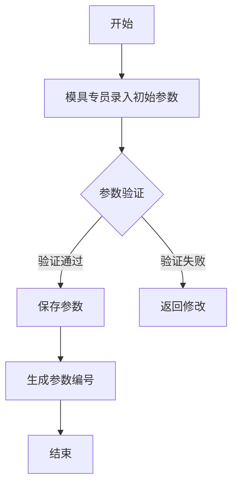
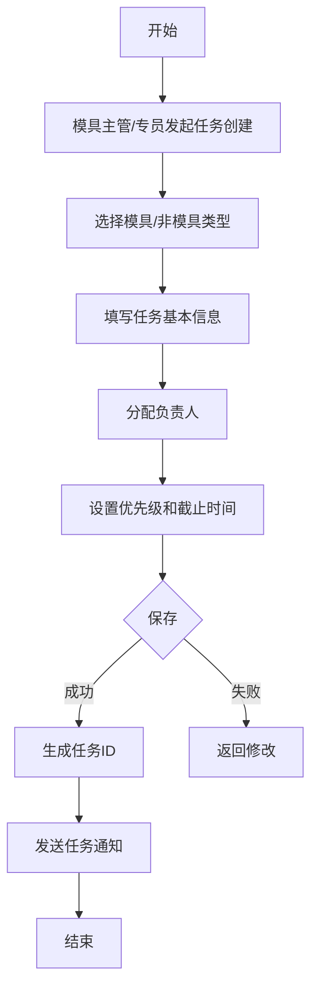
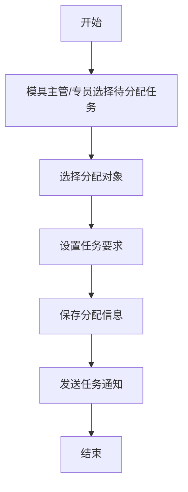
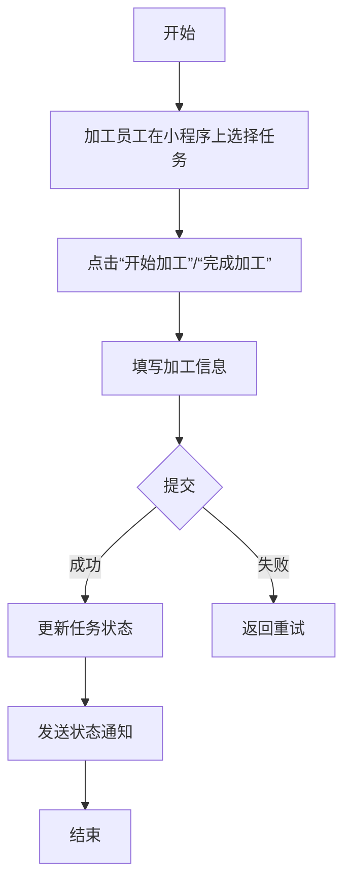
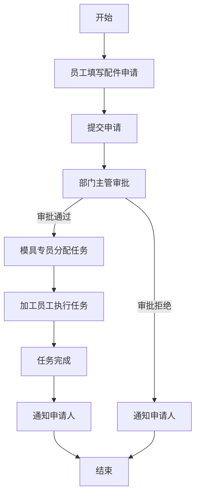
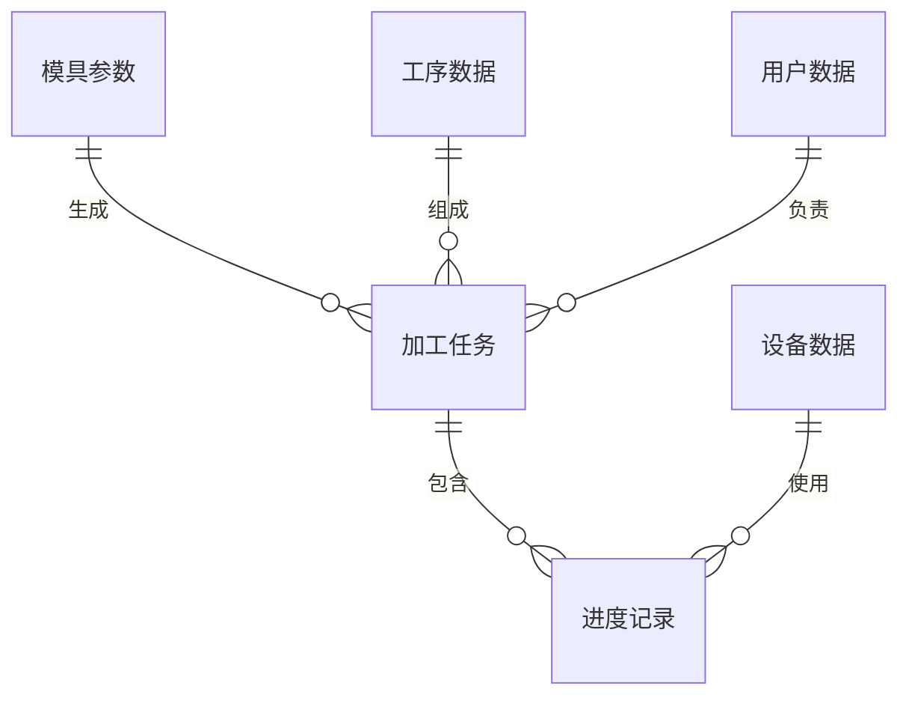

# 加工管理模块业务需求文档

## 1. 模块概述

### 1.1 核心目标
管理模具加工和非模具加工（分模具配件申请和其他工件申请）的全流程，实现加工过程的可视化、标准化和高效化。

### 1.2 功能范围
- 模具初始参数管理
- 任务管理（创建、分配、执行、监控）
- 工序路线设置
- 各工序加工前预设置
- 调度管理
- 进度跟踪与更新
- 异常处理
- 统计分析

### 1.3 优先级
高

### 1.4 系统定位
作为蜂窝陶瓷模具管理系统的核心模块，与其他模块（模库管理、调模管理、耗材及备品管理等）紧密集成。

## 2. 角色与权限

### 2.1 角色列表

| 角色名称 | 职责描述 | 权限列表 |
|---------|---------|----------|
| 系统管理员 | 系统配置、用户管理、权限设置 | 所有功能权限 |
| 模具主管 | 任务分配、进度监控、审批非模具工件加工申请 | 创建/编辑/删除任务、查看所有任务、审批申请 |
| 模具专员 | 建立模具初始参数、工序路线设置、各工序加工前预设置、非模具加工任务分配 | 编辑模具参数、设置工序路线、分配非模具任务 |
| 模具加工员工 | 执行加工任务（模具和非模具）、通过微信小程序更新进度、槽宽检测 | 查看分配的任务、更新任务进度、提交加工结果 |
| 成型员工 | 模具配件申请、查看申请进度 | 提交配件申请、查看申请状态 |
| 成型主任 | 审批成型员工申请的模具配件申请单 | 审批成型配件申请 |
| 调模员工 | 模具配件申请、查看申请进度 | 提交配件申请、查看申请状态 |
| 调模组长 | 审批调模员工申请的模具配件申请单 | 审批调模配件申请 |
| 其他人员 | 非模具工件加工申请 | 提交非模具加工申请、查看申请状态 |

### 2.2 权限矩阵

| 功能模块 | 系统管理员 | 模具主管 | 模具专员 | 模具加工员工 | 成型员工 | 成型主任 | 调模员工 | 调模组长 | 其他人员 |
|---------|-----------|---------|---------|-------------|---------|---------|---------|---------|---------|
| 模具初始参数管理 | 所有 | 查看 | 编辑 | 查看 | - | - | - | - | - |
| 任务管理 | 所有 | 所有 | 分配 | 执行 | - | - | - | - | - |
| 工序路线设置 | 所有 | 查看 | 编辑 | 查看 | - | - | - | - | - |
| 工序预设置 | 所有 | 查看 | 编辑 | 查看 | - | - | - | - | - |
| 调度管理 | 所有 | 编辑 | 编辑 | 查看 | - | - | - | - | - |
| 配件申请 | 所有 | 查看 | 查看 | - | 提交 | 审批 | 提交 | 审批 | - |
| 非模具加工申请 | 所有 | 审批 | 分配 | - | - | - | - | - | 提交 |
| 进度跟踪 | 所有 | 所有 | 所有 | 编辑 | 查看 | 查看 | 查看 | 查看 | 查看 |
| 统计分析 | 所有 | 查看 | 查看 | - | - | - | - | - | - |

## 3. 业务场景

### 3.1 标准场景

#### 场景1：新模具加工流程
- **触发条件**：点击创建模具初始参数
- **流程**：参数录入（已含负责人）→ 工序路线设置→各工序加工前预设置→任务创建 → 各工序执行  → 完成
- **预期结果**：模具加工工序进度实时状态更新

#### 场景2：备料工序加工
- **触发条件**：模具任务创建完成
- **流程**：负责人微信小程序上接收到任务提示 → 选择设备（默认磨床）→点击开始加工→完成后点击加工完成
- **预期结果**：备料工序加工完成，状态更新

#### 场景3：进泥孔加工工序
- **触发条件**：根据工序路线安排下一道工序进泥孔加工
- **流程**：负责人微信小程序上接收到任务提示 → 选择设备（深孔钻1-6）→点击开始加工→出现预设值深度值及多段速H/F,负责人输入单孔时间(秒)、自动显示下次磨刀倒计时（单孔时间*孔数）状态为钻孔中→倒计时结束→微信提醒磨刀（所有当班模具加工员工）→磨刀后点击启动→出现预设值深度值及多段速H/F,负责人输入单孔时间(秒)→自动显示下次磨刀倒计时（单孔时间*孔数）→倒计时结束→微信提醒磨刀（所有当班模具加工员工）→……→直至所有预设值完成→完成加工
- **预期结果**：进泥孔加工进度更新，状态更新

#### 场景4：委外热处理
- **触发条件**：根据工序路线安排下一道工序为委外热处理
- **流程**：负责人微信小程序上接收到任务提示：“ 请清洗模具油渍准备委外热处理” →清洗完成后，点击清洗完成→模具专员收到提示→根据预设置（加硬热处理或去应力热处理）、预设天数→模具专员更新状态为委外热处理中→回厂后，模具专员更新状态为热处理已完成
- **预期结果**：节点进度更新，状态更新

#### 场景5：外形加工工序
- **触发条件**：根据工序路线安排下一道工序为外形加工工序
- **流程**：负责人微信小程序上接收到任务提示 → 选择设备（快丝、中丝、精雕机）→点击开始加工→完成后点击加工完成
- **预期结果**：外形加工工序完成，状态更新

#### 场景6：导流槽加工——切槽机
- **触发条件**：根据工序路线安排下一道工序为导料槽加工，且设备预设值为切槽机
- **流程**:负责人微信小程序上接收到任务提示→点击开始加工→出现层预设值，加工深度、刀数、首刀深度，状态为切槽中→每层加工完成后，负责人点击下一层→出现下一层预设值，加工深度、刀数、首刀深度→……→直至所有预设值完成→加工完成
- **预期结果**：切槽加工进度更新，状态更新

#### 场景7：导料槽加工——中丝
- **触发条件**：根据工序路线安排下一道工序为导料槽加工，且设备预设值为中丝
- **流程**:负责人微信小程序上接收到任务提示→点击开始加工，预设天数，状态为割槽中→完成后点击加工完成
- **预期结果**：割槽加工进度更新，状态更新

#### 场景8：导料槽加工——电火花放电
- **触发条件**：根据工序路线安排下一道工序为导料槽加工，且设备预设值为电火花成型放电机
- **流程**：负责人微信小程序上接收到任务提示→点击开始加工，预设天数，状态为导料槽放电中→完成后点击加工完成
- **预期结果**：导料槽放电加工进度更新，状态更新

#### 场景9：模具配件加工——成型员工
- **触发条件**：成型员工填写模具配件加工申请单
- **流程**：成型员工填写模具配件加工申请单→成型主任审批→模具专员排工序分配任务→模具加工员工接收到任务→执行加工任务→完成加工任务→成型员工收到完成提示通知
- **预期结果**：任务进度更新，状态更新

#### 场景10：模具配件加工——调模员工
- **触发条件**：调模员工填写模具配件加工申请单
- **流程**：调模员工填写模具配件加工申请单→调模组长审批→模具专员排工序分配任务→模具加工员工接收到任务→执行加工任务→完成加工任务→调模员工收到完成提示通知
- **预期结果**：任务进度更新，状态更新

#### 场景11：其他工件加工
- **触发条件**：填写其他工件加工申请单
- **流程**：填写其他工件加工申请单→模具主任审批→模具专员排工序分配任务→模具加工员工接收到任务→执行加工任务→完成加工任务→写单人收到完成提示通知
- **预期结果**：任务进度更新，状态更新

### 3.2 异常场景

#### 场景12：设备故障处理
- **触发条件**：加工过程中设备故障
- **流程**：加工员工在小程序上点击“设备故障”→选择故障类型→填写故障描述→提交→模具主管收到通知→安排维修→维修完成后更新设备状态→任务恢复执行
- **预期结果**：故障信息及时传达，任务状态正确更新

#### 场景13：加工延期处理
- **触发条件**：任务预计无法按时完成
- **流程**：加工员工在小程序上点击“延期申请”→填写延期原因和预计完成时间→提交→模具主管审批→审批通过后更新任务时间→通知相关人员
- **预期结果**：延期信息及时传达，任务计划调整

#### 场景14：质量问题处理
- **触发条件**：加工质量不符合要求
- **流程**：检验人员填写质量问题报告→提交→模具主管审批→审批通过后生成返工任务→分配给加工员工→返工完成后重新检验→检验通过后任务完成
- **预期结果**：质量问题得到及时处理，返工流程规范化

## 4. 业务流程

### 4.1 模具初始参数录入流程

### 4.2 加工任务创建流程

### 4.3 任务分配流程

### 4.4 进度更新流程

### 4.5 配件申请审批流程

## 5. 数据需求

### 5.1 核心数据实体

#### 5.1.1 模具初始参数

| 字段名称 | 数据类型 | 是否必填 | 约束条件 | 来源 | 描述 |
|---------|---------|----------|----------|------|------|
| 申请编号 | 字符串 | 是 | 唯一 | 系统生成 | 模具初始参数申请的唯一标识 |
| 成品类别 | 字符串 | 是 | 下拉选择 | 成品列表 | 成品的类别 |
| 模号 | 字符串 | 是 | 唯一 | 手动输入 | 模具的唯一标识 |
| 成品规格 | 字符串 | 是 | 下拉/手动 | 成品列表 | 成品的规格参数 |
| 模具钢材 | 字符串 | 是 | 下拉选择 | 耗材及备品列表 | 模具使用的钢材类型 |
| HRC | 数值 | 是 | 范围限制 | 手动输入 | 模具硬度 |
| 结构 | 字符串 | 是 | 下拉选择 | 系统配置 | 模具结构类型（斜边模、直压模、收边模） |
| 总收缩(%) | 数值 | 是 | 范围限制 | 手动输入 | 模具总收缩率 |
| 模芯尺寸 | 字符串 | 是 | 格式验证 | 手动输入 | 模芯的尺寸信息 |
| 外形 | 字符串 | 是 | 格式验证 | 手动输入 | 模具外形尺寸 |
| 定位孔距 | 字符串 | 是 | 格式验证 | 手动输入 | 定位孔的间距 |
| 进泥孔径 | 数值 | 是 | 范围限制 | 手动输入 | 进泥孔的直径 |
| 孔数 | 数值 | 是 | 范围限制 | 手动输入 | 进泥孔的数量 |
| 孔深 | 数值 | 是 | 范围限制 | 手动输入 | 进泥孔的深度 |
| 间孔或全孔 | 字符串 | 是 | 下拉选择 | 系统配置 | 孔的排列方式 |
| 槽宽 | 数值 | 是 | 范围限制 | 手动输入 | 导流槽宽度 |
| 槽深 | 数值 | 是 | 范围限制 | 手动输入 | 导流槽深度 |
| 切入量 | 数值 | 是 | 范围限制 | 手动输入 | 切入量参数 |
| 中心距 | 数值 | 是 | 范围限制 | 手动输入 | 中心距参数 |
| 供泥比 | 数值 | 是 | 范围限制 | 手动输入 | 供泥比参数 |
| 模芯台阶 | 字符串 | 否 | 格式验证 | 手动输入 | 模芯台阶信息 |
| 负责人 | 字符串 | 是 | 下拉选择 | 用户列表 | 模具加工负责人 |
| 备注 | 文本 | 否 | 无 | 手动输入 | 其他备注信息 |
| 创建时间 | 日期时间 | 是 | 系统生成 | 系统 | 记录创建时间 |
| 更新时间 | 日期时间 | 是 | 系统生成 | 系统 | 记录更新时间 |

#### 5.1.2 加工任务

| 字段名称 | 数据类型 | 是否必填 | 约束条件 | 来源 | 描述 |
|---------|---------|----------|----------|------|------|
| 任务ID | 字符串 | 是 | 唯一 | 系统生成 | 任务的唯一标识 |
| 任务类型 | 字符串 | 是 | 枚举 | 系统配置 | 模具加工/非模具加工 |
| 模具编号 | 字符串 | 否 | 关联模具参数 | 模具参数表 | 关联的模具编号 |
| 产品名称 | 字符串 | 是 | 无 | 手动输入 | 加工产品的名称 |
| 当前工序 | 字符串 | 是 | 关联工序表 | 工序表 | 当前执行的工序 |
| 负责人 | 字符串 | 是 | 关联用户表 | 用户表 | 任务负责人 |
| 优先级 | 字符串 | 是 | 枚举 | 系统配置 | 任务优先级（高/中/低） |
| 计划开始时间 | 日期时间 | 是 | 无 | 手动输入 | 计划开始时间 |
| 计划结束时间 | 日期时间 | 是 | 大于开始时间 | 手动输入 | 计划结束时间 |
| 实际开始时间 | 日期时间 | 否 | 无 | 系统记录 | 实际开始时间 |
| 实际结束时间 | 日期时间 | 否 | 无 | 系统记录 | 实际结束时间 |
| 状态 | 字符串 | 是 | 枚举 | 系统配置 | 任务状态（待分配/进行中/暂停/延期/完成/取消） |
| 备注 | 文本 | 否 | 无 | 手动输入 | 任务备注 |
| 创建人 | 字符串 | 是 | 关联用户表 | 用户表 | 任务创建人 |
| 创建时间 | 日期时间 | 是 | 系统生成 | 系统 | 任务创建时间 |
| 更新时间 | 日期时间 | 是 | 系统生成 | 系统 | 任务更新时间 |

#### 5.1.3 工序数据

| 字段名称 | 数据类型 | 是否必填 | 约束条件 | 来源 | 描述 |
|---------|---------|----------|----------|------|------|
| 工序ID | 字符串 | 是 | 唯一 | 系统生成 | 工序的唯一标识 |
| 工序名称 | 字符串 | 是 | 唯一 | 手动输入 | 工序的名称 |
| 工序类型 | 字符串 | 是 | 枚举 | 系统配置 | 工序类型（备料/进泥孔/热处理等） |
| 设备类型 | 字符串 | 是 | 枚举 | 系统配置 | 适用的设备类型 |
| 标准工时 | 数值 | 是 | 大于0 | 手动输入 | 标准加工时间 |
| 前置工序 | 字符串 | 否 | 关联工序表 | 工序表 | 前置工序ID |
| 备注 | 文本 | 否 | 无 | 手动输入 | 工序备注 |

#### 5.1.4 进度记录

| 字段名称 | 数据类型 | 是否必填 | 约束条件 | 来源 | 描述 |
|---------|---------|----------|----------|------|------|
| 记录ID | 字符串 | 是 | 唯一 | 系统生成 | 进度记录的唯一标识 |
| 任务ID | 字符串 | 是 | 关联任务表 | 任务表 | 关联的任务ID |
| 工序 | 字符串 | 是 | 关联工序表 | 工序表 | 当前记录的工序 |
| 操作类型 | 字符串 | 是 | 枚举 | 系统配置 | 操作类型（开始/完成/暂停/恢复） |
| 设备ID | 字符串 | 否 | 关联设备表 | 设备表 | 使用的设备ID |
| 操作时间 | 日期时间 | 是 | 系统生成 | 系统 | 操作执行时间 |
| 操作人 | 字符串 | 是 | 关联用户表 | 用户表 | 操作执行人 |
| 加工参数 | 文本 | 否 | 无 | 手动输入 | 加工过程中的参数 |
| 质量检查结果 | 字符串 | 否 | 枚举 | 系统配置 | 质量检查结果（合格/不合格） |
| 备注 | 文本 | 否 | 无 | 手动输入 | 进度备注 |

### 5.2 数据关系

## 6. 功能需求

### 6.1 模具初始参数管理

#### 6.1.1 参数录入
- 支持手动录入模具初始参数
- 支持从Excel导入模具初始参数
- 提供参数模板选择
- 实时参数验证

#### 6.1.2 参数查询
- 支持按多种条件查询（模号、成品类别、负责人等）
- 支持模糊查询
- 支持导出查询结果

#### 6.1.3 参数编辑
- 支持修改现有参数
- 记录参数修改历史
- 支持版本管理

### 6.2 任务管理

#### 6.2.1 任务创建
- 支持创建模具加工任务和非模具加工任务
- 支持批量创建任务
- 自动生成任务编号

#### 6.2.2 任务分配
- 支持手动分配任务
- 支持基于规则的自动分配
- 支持任务抢单模式

#### 6.2.3 任务监控
- 实时显示任务进度
- 支持甘特图视图
- 支持任务状态筛选

#### 6.2.4 任务调整
- 支持修改任务优先级
- 支持调整任务截止时间
- 支持重新分配任务

### 6.3 工序管理

#### 6.3.1 工序路线设置
- 支持可视化配置工序顺序
- 支持保存工序路线模板
- 支持复制现有工序路线

#### 6.3.2 工序预设置
- 为每个工序设置预设参数
- 支持设备选择和参数配置
- 支持保存预设模板

### 6.4 调度管理

#### 6.4.1 资源分配
- 设备资源分配
- 人力资源分配

#### 6.4.2 冲突检测
- 检测资源冲突
- 提供冲突解决建议

#### 6.4.3 调度优化
- 基于优先级和截止时间优化调度
- 支持手动调整调度计划

### 6.5 进度管理

#### 6.5.1 进度更新
- 支持微信小程序更新进度
- 支持PC端更新进度
- 支持批量更新进度

#### 6.5.2 进度查询
- 支持按任务、人员、时间查询进度
- 支持导出进度记录

#### 6.5.3 进度预警
- 任务延期预警
- 工序超时预警

### 6.6 异常管理

#### 6.6.1 异常上报
- 支持多种异常类型上报
- 支持上传图片和视频
- 实时通知相关人员

#### 6.6.2 异常处理
- 异常审批流程
- 异常解决跟踪
- 异常统计分析

### 6.7 统计分析

#### 6.7.1 任务统计
- 任务完成率统计
- 任务延期率统计
- 任务类型分布

#### 6.7.2 人员效率统计
- 人均完成任务数
- 人均工时统计
- 人员负载分析

#### 6.7.3 设备利用率统计
- 设备运行时间统计
- 设备空闲时间统计
- 设备故障率统计

## 7. 性能需求

### 7.1 并发需求
- 支持100+并发用户同时操作
- 支持50+用户同时更新进度

### 7.2 响应时间需求
- 任务列表加载时间 < 2秒
- 进度更新响应时间 < 1秒
- 报表生成时间 < 3秒

### 7.3 可靠性需求
- 系统可用性 ≥ 99.5%
- 数据可靠性 ≥ 99.999%
- 支持7×24小时不间断运行

### 7.4 扩展性需求
- 支持未来功能扩展
- 支持数据量增长（5年内支持10万+任务数据）

## 8. 安全需求

### 8.1 数据安全
- 敏感数据加密存储
- 数据传输加密（HTTPS）
- 定期数据备份（每日全量备份，每小时增量备份）
- 数据恢复机制

### 8.2 访问安全
- 基于角色的访问控制
- 登录认证（用户名/密码 + 验证码）
- 会话超时管理（30分钟无操作自动登出）
- 操作日志记录

### 8.3 审计需求
- 所有关键操作记录审计日志
- 日志包含操作人、操作时间、操作内容、IP地址
- 日志保留期限 ≥ 1年

## 9. 移动端需求

### 9.1 微信小程序功能

#### 9.1.1 任务管理
- 查看分配的任务
- 开始/完成任务
- 查看任务详情

#### 9.1.2 进度更新
- 实时更新加工进度
- 填写加工参数
- 上传加工照片

#### 9.1.3 异常上报
- 上报设备故障
- 申请任务延期
- 反馈质量问题

#### 9.1.4 通知中心
- 接收任务通知
- 接收审批通知
- 接收预警通知

#### 9.1.5 个人中心
- 查看个人任务统计
- 修改密码
- 设置通知偏好

### 9.2 移动端技术要求
- 响应式设计，适配不同屏幕尺寸
- 支持离线操作，网络恢复后自动同步
- 支持微信登录
- 支持推送通知

## 10. 集成需求

### 10.1 内部系统集成

#### 10.1.1 模库管理模块
- 从模库管理模块获取模具基本信息
- 向模库管理模块推送加工完成的模具信息

#### 10.1.2 调模管理模块
- 接收调模需求，生成加工任务
- 向调模管理模块推送加工完成信息

#### 10.1.3 耗材及备品管理模块
- 从耗材及备品管理模块获取材料信息
- 向耗材及备品管理模块推送材料使用信息

### 10.2 外部系统集成

#### 10.2.1 ERP系统
- 接收ERP系统的生产计划
- 向ERP系统推送生产进度

#### 10.2.2 MES系统
- 与MES系统进行数据同步
- 接收MES系统的设备状态信息

## 11. UI/UX设计需求

### 11.1 设计原则
- 简洁明了，易于操作
- 信息层次清晰，重点突出
- 响应式设计，适配不同设备
- 统一的设计风格

### 11.2 界面元素
- 使用直观的图标和颜色
- 提供清晰的操作指引
- 支持拖拽操作
- 提供快捷键支持

### 11.3 用户体验
- 减少操作步骤
- 提供实时反馈
- 支持批量操作
- 提供数据可视化

## 12. 培训与支持需求

### 12.1 培训计划
- 针对不同角色提供定制化培训
- 提供操作手册和视频教程
- 组织线上/线下培训课程

### 12.2 技术支持
- 提供7×24小时技术支持
- 建立问题反馈渠道
- 定期系统维护和升级

## 13. 实施计划

### 13.1 阶段划分

| 阶段 | 时间 | 主要工作 |
|------|------|----------|
| 需求确认 | 1周 | 确认需求，制定详细计划 |
| 系统设计 | 2周 | 架构设计，数据库设计，UI设计 |
| 开发实现 | 8周 | 核心功能开发，移动端开发，集成开发 |
| 测试验证 | 2周 | 单元测试，集成测试，用户验收测试 |
| 上线部署 | 1周 | 系统部署，数据迁移，用户培训 |
| 运维支持 | 持续 | 系统维护，问题修复，功能优化 |

### 13.2 里程碑

| 里程碑 | 完成标志 |
|--------|----------|
| 需求文档完成 | 需求文档评审通过 |
| 系统设计完成 | 设计文档评审通过 |
| 核心功能完成 | 核心功能开发完成，通过单元测试 |
| 系统测试完成 | 系统通过集成测试和用户验收测试 |
| 系统上线 | 系统正式投入使用 |

## 14. 验收标准

### 14.1 功能验收
- 所有功能需求实现并通过测试
- 符合业务流程要求
- 数据流转正确

### 14.2 性能验收
- 响应时间符合要求
- 并发用户支持符合要求
- 系统稳定运行7×24小时无故障

### 14.3 安全验收
- 数据安全措施到位
- 访问控制有效
- 审计日志完整

### 14.4 用户验收
- 用户操作流畅
- 界面友好易用
- 满足业务需求

## 15. 风险评估

| 风险类型 | 风险描述 | 风险等级 | 应对措施 |
|---------|---------|----------|----------|
| 需求变更 | 需求在开发过程中发生变更 | 高 | 建立需求变更管理流程，严格控制变更范围 |
| 技术风险 | 新技术应用可能遇到问题 | 中 | 提前进行技术调研和原型验证 |
| 数据迁移 | 历史数据迁移可能出现问题 | 中 | 制定详细的数据迁移计划，进行充分测试 |
| 用户接受度 | 用户可能不适应新系统 | 中 | 提供充分的培训和支持，建立反馈机制 |
| 集成风险 | 与其他系统集成可能出现问题 | 高 | 提前定义集成接口，进行充分的集成测试 |

## 16. 附录

### 16.1 术语定义

| 术语 | 解释 |
|------|------|
| 模具加工 | 制造蜂窝陶瓷模具的过程 |
| 非模具加工 | 制造模具配件或其他工件的过程 |
| 工序 | 加工过程中的一个步骤，如备料、进泥孔加工等 |
| 工序路线 | 加工过程中各工序的执行顺序 |
| 预设参数 | 每个工序加工前预先设置的参数 |

### 16.2 参考文档

- 《蜂窝陶瓷模具管理系统需求文档》
- 《模具加工工艺规范》
- 《企业ERP系统接口文档》

### 16.3 联系方式

| 角色 | 姓名 | 联系方式 |
|------|------|----------|
| 项目负责人 | XXX | XXX-XXXXXXX |
| 业务联系人 | XXX | XXX-XXXXXXX |
| 技术负责人 | XXX | XXX-XXXXXXX |
