# 加工管理模块任务拆分

## 1. 任务拆分原则

- **原子性**：每个任务尽可能小，便于独立完成和测试
- **高内聚**：每个任务专注于一个具体功能点
- **低耦合**：任务之间依赖关系清晰，减少相互影响
- **可测试性**：每个任务都有明确的验收标准，便于验证
- **优先级**：根据业务重要性和依赖关系设置合理的优先级

## 2. 任务列表

### 2.1 前端任务

#### 2.1.1 模具初始参数管理

| 任务ID | 任务名称 | 优先级 | 依赖任务 | 输入 | 输出 | 验收标准 |
|-------|---------|--------|----------|------|------|----------|
| FT-001 | 模具参数录入页面开发 | 高 | 无 | 设计文档、数据结构 | 录入页面组件 | 页面能正常渲染，支持参数录入 |
| FT-002 | 模具参数验证功能开发 | 高 | FT-001 | 验证规则 | 验证组件 | 能实时验证参数合法性，显示错误提示 |
| FT-003 | 模具参数模板功能开发 | 中 | FT-001 | 模板设计 | 模板组件 | 支持保存和使用参数模板 |
| FT-004 | 模具参数查询页面开发 | 高 | 无 | 设计文档、数据结构 | 查询页面组件 | 支持多种条件查询，显示结果列表 |
| FT-005 | 模具参数详情页面开发 | 高 | FT-004 | 设计文档、数据结构 | 详情页面组件 | 能显示参数详细信息 |
| FT-006 | 模具参数编辑功能开发 | 高 | FT-005 | 设计文档、数据结构 | 编辑功能 | 支持修改参数，记录版本 |
| FT-007 | 模具参数Excel导入导出功能开发 | 中 | FT-001, FT-004 | 设计文档 | 导入导出功能 | 支持从Excel导入参数，导出参数到Excel |

#### 2.1.2 任务管理

| 任务ID | 任务名称 | 优先级 | 依赖任务 | 输入 | 输出 | 验收标准 |
|-------|---------|--------|----------|------|------|----------|
| FT-008 | 任务创建页面开发 | 高 | 无 | 设计文档、数据结构 | 创建页面组件 | 支持创建模具和非模具任务 |
| FT-009 | 任务分配功能开发 | 高 | FT-008 | 设计文档 | 分配功能 | 支持手动和自动分配任务 |
| FT-010 | 任务监控页面开发 | 高 | 无 | 设计文档、数据结构 | 监控页面组件 | 实时显示任务进度，支持甘特图视图 |
| FT-011 | 任务列表页面开发 | 高 | 无 | 设计文档、数据结构 | 列表页面组件 | 显示任务列表，支持筛选和排序 |
| FT-012 | 任务调整功能开发 | 中 | FT-011 | 设计文档 | 调整功能 | 支持修改任务优先级和重新分配 |
| FT-013 | 批量任务处理功能开发 | 中 | FT-008, FT-011 | 设计文档 | 批量处理功能 | 支持批量创建和批量更新任务 |

#### 2.1.3 工序管理

| 任务ID | 任务名称 | 优先级 | 依赖任务 | 输入 | 输出 | 验收标准 |
|-------|---------|--------|----------|------|------|----------|
| FT-014 | 工序路线设计页面开发 | 高 | 无 | 设计文档、数据结构 | 设计页面组件 | 支持可视化配置工序顺序 |
| FT-015 | 工序路线模板功能开发 | 中 | FT-014 | 设计文档 | 模板功能 | 支持保存和使用工序路线模板 |
| FT-016 | 工序预设置页面开发 | 高 | 无 | 设计文档、数据结构 | 预设置页面组件 | 支持为工序设置预设参数 |
| FT-017 | 设备选择功能开发 | 中 | FT-016 | 设计文档 | 设备选择功能 | 支持为工序选择设备 |

#### 2.1.4 进度管理

| 任务ID | 任务名称 | 优先级 | 依赖任务 | 输入 | 输出 | 验收标准 |
|-------|---------|--------|----------|------|------|----------|
| FT-018 | 进度更新功能开发 | 高 | 无 | 设计文档、数据结构 | 更新功能 | 支持移动端和PC端更新进度 |
| FT-019 | 进度查询页面开发 | 高 | 无 | 设计文档、数据结构 | 查询页面组件 | 支持按任务、人员、时间查询进度 |
| FT-020 | 进度预警功能开发 | 中 | FT-019 | 设计文档 | 预警功能 | 自动预警延期和超时任务 |
| FT-021 | 进度详情页面开发 | 中 | FT-019 | 设计文档、数据结构 | 详情页面组件 | 能显示进度详细信息 |

#### 2.1.5 异常管理

| 任务ID | 任务名称 | 优先级 | 依赖任务 | 输入 | 输出 | 验收标准 |
|-------|---------|--------|----------|------|------|----------|
| FT-022 | 异常上报功能开发 | 高 | 无 | 设计文档、数据结构 | 上报功能 | 支持多种异常类型上报，上传图片 |
| FT-023 | 异常查询页面开发 | 高 | 无 | 设计文档、数据结构 | 查询页面组件 | 支持查询异常列表 |
| FT-024 | 异常处理功能开发 | 高 | FT-023 | 设计文档 | 处理功能 | 支持审批和跟踪异常处理过程 |
| FT-025 | 异常统计功能开发 | 中 | FT-023 | 设计文档 | 统计功能 | 支持异常类型分布和处理时效分析 |

#### 2.1.6 统计分析

| 任务ID | 任务名称 | 优先级 | 依赖任务 | 输入 | 输出 | 验收标准 |
|-------|---------|--------|----------|------|------|----------|
| FT-026 | 任务统计功能开发 | 中 | 无 | 设计文档 | 统计功能 | 支持任务完成率、延期率统计 |
| FT-027 | 人员效率统计功能开发 | 中 | 无 | 设计文档 | 统计功能 | 支持人均完成任务数、工时统计 |
| FT-028 | 设备利用率统计功能开发 | 中 | 无 | 设计文档 | 统计功能 | 支持设备运行时间、空闲时间统计 |
| FT-029 | 报表生成功能开发 | 中 | FT-026, FT-027, FT-028 | 设计文档 | 报表功能 | 支持生成各种统计报表 |

### 2.2 后端任务

#### 2.2.1 模具初始参数管理

| 任务ID | 任务名称 | 优先级 | 依赖任务 | 输入 | 输出 | 验收标准 |
|-------|---------|--------|----------|------|------|----------|
| BT-001 | 模具参数实体类和Mapper开发 | 高 | 无 | 数据结构 | 实体类、Mapper接口和XML | 定义清晰的数据结构和SQL映射 |
| BT-002 | 模具参数Service层开发 | 高 | BT-001 | 业务逻辑 | Service接口和实现 | 实现参数的增删改查、验证、模板管理等功能 |
| BT-003 | 模具参数Controller层开发 | 高 | BT-002 | API设计 | Controller接口 | 提供RESTful API，处理HTTP请求 |
| BT-004 | 模具参数版本管理功能开发 | 中 | BT-002 | 业务逻辑 | 版本管理功能 | 记录参数修改历史，支持版本回滚 |
| BT-005 | 模具参数Excel导入导出服务开发 | 中 | BT-002 | 业务逻辑 | 导入导出服务 | 实现Excel文件的解析和生成 |

#### 2.2.2 任务管理

| 任务ID | 任务名称 | 优先级 | 依赖任务 | 输入 | 输出 | 验收标准 |
|-------|---------|--------|----------|------|------|----------|
| BT-006 | 任务实体类和Mapper开发 | 高 | 无 | 数据结构 | 实体类、Mapper接口和XML | 定义清晰的数据结构和SQL映射 |
| BT-007 | 任务Service层开发 | 高 | BT-006 | 业务逻辑 | Service接口和实现 | 实现任务的创建、分配、监控、调整等功能 |
| BT-008 | 任务Controller层开发 | 高 | BT-007 | API设计 | Controller接口 | 提供RESTful API，处理HTTP请求 |
| BT-009 | 任务自动分配算法开发 | 中 | BT-007 | 业务逻辑 | 分配算法 | 实现基于规则的自动分配逻辑 |
| BT-010 | 批量任务处理服务开发 | 中 | BT-007 | 业务逻辑 | 批量处理服务 | 实现批量创建和更新任务的功能 |

#### 2.2.3 工序管理

| 任务ID | 任务名称 | 优先级 | 依赖任务 | 输入 | 输出 | 验收标准 |
|-------|---------|--------|----------|------|------|----------|
| BT-011 | 工序实体类和Mapper开发 | 高 | 无 | 数据结构 | 实体类、Mapper接口和XML | 定义清晰的数据结构和SQL映射 |
| BT-012 | 工序Service层开发 | 高 | BT-011 | 业务逻辑 | Service接口和实现 | 实现工序的增删改查、路线设计、预设置等功能 |
| BT-013 | 工序Controller层开发 | 高 | BT-012 | API设计 | Controller接口 | 提供RESTful API，处理HTTP请求 |
| BT-014 | 工序路线可视化服务开发 | 中 | BT-012 | 业务逻辑 | 可视化服务 | 实现工序路线的序列化和反序列化 |

#### 2.2.4 进度管理

| 任务ID | 任务名称 | 优先级 | 依赖任务 | 输入 | 输出 | 验收标准 |
|-------|---------|--------|----------|------|------|----------|
| BT-015 | 进度记录实体类和Mapper开发 | 高 | 无 | 数据结构 | 实体类、Mapper接口和XML | 定义清晰的数据结构和SQL映射 |
| BT-016 | 进度Service层开发 | 高 | BT-015 | 业务逻辑 | Service接口和实现 | 实现进度的更新、查询、预警等功能 |
| BT-017 | 进度Controller层开发 | 高 | BT-016 | API设计 | Controller接口 | 提供RESTful API，处理HTTP请求 |
| BT-018 | 进度预警服务开发 | 中 | BT-016 | 业务逻辑 | 预警服务 | 实现延期和超时任务的自动检测和通知 |

#### 2.2.5 异常管理

| 任务ID | 任务名称 | 优先级 | 依赖任务 | 输入 | 输出 | 验收标准 |
|-------|---------|--------|----------|------|------|----------|
| BT-019 | 异常实体类和Mapper开发 | 高 | 无 | 数据结构 | 实体类、Mapper接口和XML | 定义清晰的数据结构和SQL映射 |
| BT-020 | 异常Service层开发 | 高 | BT-019 | 业务逻辑 | Service接口和实现 | 实现异常的上报、查询、处理等功能 |
| BT-021 | 异常Controller层开发 | 高 | BT-020 | API设计 | Controller接口 | 提供RESTful API，处理HTTP请求 |
| BT-022 | 异常统计服务开发 | 中 | BT-020 | 业务逻辑 | 统计服务 | 实现异常类型分布和处理时效的统计分析 |

#### 2.2.6 统计分析

| 任务ID | 任务名称 | 优先级 | 依赖任务 | 输入 | 输出 | 验收标准 |
|-------|---------|--------|----------|------|------|----------|
| BT-023 | 统计Service层开发 | 中 | BT-007, BT-016 | 业务逻辑 | Service接口和实现 | 实现任务统计、人员效率统计、设备利用率统计等功能 |
| BT-024 | 统计Controller层开发 | 中 | BT-023 | API设计 | Controller接口 | 提供RESTful API，处理HTTP请求 |
| BT-025 | 报表生成服务开发 | 中 | BT-023 | 业务逻辑 | 报表服务 | 实现各种统计报表的生成 |

### 2.3 移动端任务

| 任务ID | 任务名称 | 优先级 | 依赖任务 | 输入 | 输出 | 验收标准 |
|-------|---------|--------|----------|------|------|----------|
| MT-001 | 微信小程序登录功能开发 | 高 | 无 | 设计文档 | 登录功能 | 支持微信登录，获取用户信息 |
| MT-002 | 任务列表页面开发 | 高 | MT-001 | 设计文档 | 列表页面 | 显示分配的任务，支持筛选 |
| MT-003 | 任务详情页面开发 | 高 | MT-002 | 设计文档 | 详情页面 | 显示任务详细信息 |
| MT-004 | 进度更新功能开发 | 高 | MT-002 | 设计文档 | 更新功能 | 支持开始/完成加工，填写加工参数 |
| MT-005 | 图片上传功能开发 | 中 | MT-004 | 设计文档 | 上传功能 | 支持上传加工照片 |
| MT-006 | 异常上报功能开发 | 高 | MT-001 | 设计文档 | 上报功能 | 支持多种异常类型上报 |
| MT-007 | 通知中心开发 | 中 | MT-001 | 设计文档 | 通知功能 | 接收任务通知、审批通知、预警通知 |
| MT-008 | 个人中心开发 | 中 | MT-001 | 设计文档 | 个人中心 | 查看个人任务统计，修改密码 |

## 3. 任务依赖图

```mermaid
graph TD
    FT-001 --> FT-002
    FT-001 --> FT-003
    FT-001 --> FT-007
    FT-004 --> FT-005
    FT-005 --> FT-006
    FT-004 --> FT-007
    FT-008 --> FT-009
    FT-008 --> FT-013
    FT-010 --> FT-011
    FT-011 --> FT-012
    FT-011 --> FT-013
    FT-014 --> FT-015
    FT-016 --> FT-017
    FT-019 --> FT-020
    FT-019 --> FT-021
    FT-022 --> FT-023
    FT-023 --> FT-024
    FT-023 --> FT-025
    FT-026 --> FT-029
    FT-027 --> FT-029
    FT-028 --> FT-029
    
    BT-001 --> BT-002
    BT-002 --> BT-003
    BT-002 --> BT-004
    BT-002 --> BT-005
    BT-006 --> BT-007
    BT-007 --> BT-008
    BT-007 --> BT-009
    BT-007 --> BT-010
    BT-011 --> BT-012
    BT-012 --> BT-013
    BT-012 --> BT-014
    BT-015 --> BT-016
    BT-016 --> BT-017
    BT-016 --> BT-018
    BT-019 --> BT-020
    BT-020 --> BT-021
    BT-020 --> BT-022
    BT-007 --> BT-023
    BT-016 --> BT-023
    BT-023 --> BT-024
    BT-023 --> BT-025
    
    MT-001 --> MT-002
    MT-002 --> MT-003
    MT-002 --> MT-004
    MT-004 --> MT-005
    MT-001 --> MT-006
    MT-001 --> MT-007
    MT-001 --> MT-008
```

## 4. 任务优先级说明

### 4.1 高优先级任务

- 核心功能，直接影响业务流程
- 用户高频使用的功能
- 其他任务的依赖

### 4.2 中优先级任务

- 辅助功能，提升用户体验
- 非核心但重要的功能
- 有明确需求但不是紧急需求

## 5. 任务验收标准

### 5.1 功能验收

- 功能实现符合设计文档要求
- 功能能够正常运行，无错误
- 功能满足业务需求

### 5.2 代码验收

- 代码符合编码规范
- 代码结构清晰，易于维护
- 包含必要的注释和文档
- 通过单元测试

### 5.3 性能验收

- 页面加载时间符合要求
- 响应时间符合要求
- 支持并发用户数符合要求

### 5.4 安全验收

- 数据传输加密
- 权限控制有效
- 输入验证完善
- 防止常见安全漏洞

## 6. 资源需求

### 6.1 人力资源

| 角色 | 数量 | 职责 |
|------|------|------|
| 前端开发工程师 | 2 | 负责前端页面和功能开发 |
| 后端开发工程师 | 2 | 负责后端服务和API开发 |
| 移动端开发工程师 | 1 | 负责微信小程序开发 |
| 测试工程师 | 1 | 负责功能测试和性能测试 |
| UI/UX设计师 | 1 | 负责界面设计和用户体验 |
| 产品经理 | 1 | 负责需求管理和进度跟踪 |

### 6.2 设备资源

- 开发环境：个人电脑，配置满足开发需求
- 测试环境：服务器，模拟生产环境配置
- 生产环境：高可用服务器集群

### 6.3 工具资源

- 开发工具：VS Code, IntelliJ IDEA, 微信开发者工具
- 版本控制：Git
- 项目管理：Jira, Confluence
- 测试工具：Postman, JMeter
- CI/CD：Jenkins, Docker

## 7. 风险管理

### 7.1 需求变更风险

- **风险描述**：需求在开发过程中可能发生变更，影响进度和质量
- **应对措施**：建立需求变更管理流程，严格控制变更范围，评估变更影响

### 7.2 技术风险

- **风险描述**：新技术应用可能遇到问题，影响开发进度
- **应对措施**：提前进行技术调研和原型验证，选择成熟稳定的技术栈

### 7.3 依赖风险

- **风险描述**：任务之间依赖关系复杂，可能导致连锁延误
- **应对措施**：合理设置任务优先级，并行开发不相关任务，定期监控进度

### 7.4 质量风险

- **风险描述**：开发时间紧张，可能影响代码质量
- **应对措施**：建立质量保证机制，执行代码审查，编写单元测试，进行自动化测试

### 7.5 上线风险

- **风险描述**：系统上线可能遇到问题，影响业务运行
- **应对措施**：制定详细的上线计划，进行充分的测试，准备回滚方案

## 8. 项目进度计划

### 8.1 时间线

| 阶段 | 时间 | 主要工作 |
|------|------|----------|
| 需求确认 | 第1周 | 确认需求，制定详细计划 |
| 系统设计 | 第2-3周 | 架构设计，数据库设计，UI设计 |
| 前端开发 | 第4-11周 | 核心功能开发，页面开发，组件开发 |
| 后端开发 | 第4-11周 | 核心功能开发，API开发，服务开发 |
| 移动端开发 | 第6-10周 | 微信小程序开发，功能实现 |
| 测试验证 | 第12-13周 | 单元测试，集成测试，用户验收测试 |
| 上线准备 | 第14周 | 系统部署，数据迁移，用户培训 |
| 上线运行 | 第15周 | 系统正式上线，监控和支持 |

### 8.2 里程碑

| 里程碑 | 完成时间 | 完成标志 |
|--------|----------|----------|
| 需求文档完成 | 第1周末 | 需求文档评审通过 |
| 系统设计完成 | 第3周末 | 设计文档评审通过 |
| 前端核心功能完成 | 第10周末 | 前端核心功能开发完成，通过单元测试 |
| 后端核心功能完成 | 第10周末 | 后端核心功能开发完成，通过单元测试 |
| 移动端功能完成 | 第10周末 | 移动端功能开发完成，通过测试 |
| 系统测试完成 | 第13周末 | 系统通过集成测试和用户验收测试 |
| 系统上线 | 第15周末 | 系统正式投入使用 |

## 9. 沟通与协作

- **每日站会**：15分钟，同步进度，讨论问题
- **周例会**：每周一次，总结上周工作，计划下周工作
- **需求评审会**：需求变更时召开，评估变更影响
- **设计评审会**：设计完成后召开，评审设计方案
- **代码审查**：定期进行代码审查，确保代码质量
- **项目管理工具**：使用Jira管理任务，Confluence管理文档
- **沟通工具**：使用企业微信进行日常沟通

## 10. 交付物

- **需求文档**：详细的业务需求描述
- **设计文档**：系统架构设计，数据库设计，接口设计
- **代码**：前端代码，后端代码，移动端代码
- **测试报告**：单元测试报告，集成测试报告，用户验收测试报告
- **部署文档**：系统部署步骤，配置说明
- **操作手册**：用户操作指南，管理员操作指南
- **培训材料**：培训课件，视频教程

## 11. 总结

本任务拆分文档将加工管理模块的开发工作拆分为80个具体任务，涵盖了前端、后端和移动端的所有功能点。每个任务都有明确的输入、输出和验收标准，便于独立完成和测试。任务之间的依赖关系清晰，优先级设置合理，有助于项目的有序推进。

通过本任务拆分，项目团队可以明确各自的工作内容和责任，制定详细的进度计划，监控项目进展，确保项目按时、高质量完成。同时，文档中还包含了风险管理、资源需求、沟通协作等内容，为项目的顺利实施提供了全面的支持。