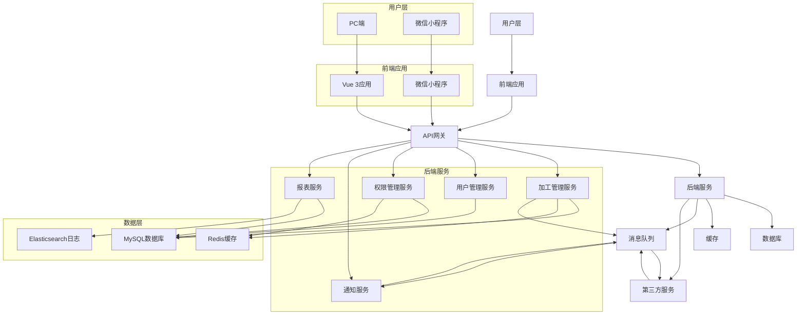
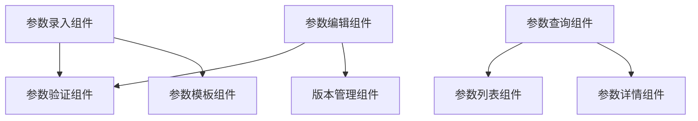
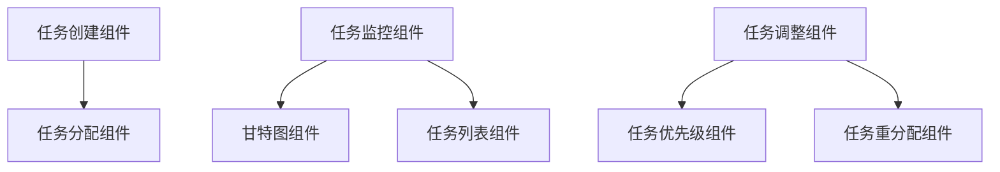
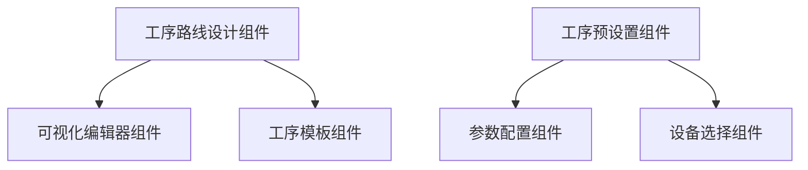
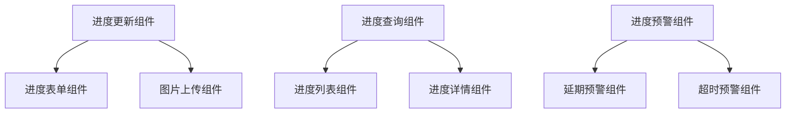
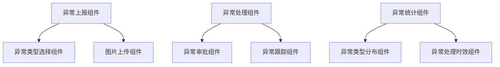
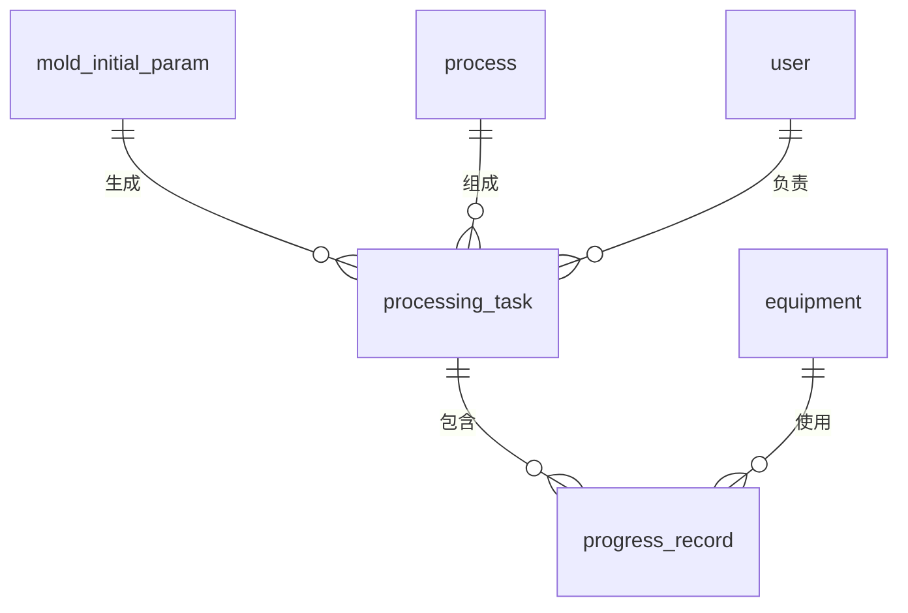
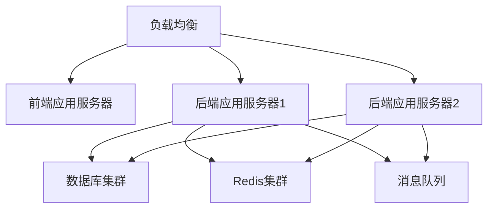
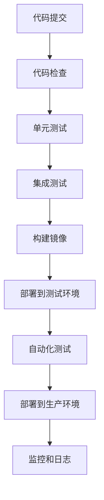

# 加工管理模块系统设计

## 1. 架构概述

### 1.1 设计原则

- **分层架构**：清晰的分层设计，便于维护和扩展
- **模块化设计**：功能模块化，高内聚低耦合
- **前后端分离**：前端负责展示和交互，后端负责业务逻辑和数据处理
- **可扩展性**：支持未来功能扩展和业务变化
- **安全性**：从设计层面考虑安全因素
- **性能优化**：优化系统性能，提高响应速度

### 1.2 系统架构图

## 2. 系统分层设计

### 2.1 用户层

- **PC端**：面向模具主管、模具专员等角色，提供完整的管理功能
- **微信小程序**：面向加工员工、成型员工等角色，提供任务查看、进度更新、异常上报等功能

### 2.2 前端应用

- **技术栈**：Vue 3 + TypeScript + Element Plus + Vite
- **核心功能**：
  - 模具初始参数管理
  - 任务管理
  - 工序管理
  - 调度管理
  - 进度管理
  - 统计分析

### 2.3 后端服务

#### 2.3.1 加工管理服务

- **核心功能**：
  - 模具初始参数管理
  - 任务管理
  - 工序管理
  - 调度管理
  - 进度管理
  - 异常管理

#### 2.3.2 用户管理服务

- **核心功能**：
  - 用户信息管理
  - 用户角色管理
  - 用户权限管理

#### 2.3.3 权限管理服务

- **核心功能**：
  - 权限定义
  - 权限分配
  - 权限验证

#### 2.3.4 通知服务

- **核心功能**：
  - 消息通知
  - 微信模板消息
  - 邮件通知

#### 2.3.5 报表服务

- **核心功能**：
  - 报表生成
  - 数据分析
  - 数据可视化

### 2.4 数据层

- **MySQL数据库**：存储业务数据
- **Redis缓存**：缓存热点数据，提高性能
- **Elasticsearch**：存储日志数据，支持日志查询和分析

### 2.5 外部服务

- **微信API**：用于微信小程序登录和消息推送
- **ERP系统**：数据集成
- **MES系统**：设备数据集成

## 3. 核心组件设计

### 3.1 模具初始参数管理组件

#### 3.1.1 组件结构

#### 3.1.2 核心功能

- 参数录入：支持手动录入和Excel导入
- 参数验证：实时验证参数合法性
- 参数模板：支持保存和使用模板
- 参数查询：支持多种条件查询
- 参数编辑：支持修改和版本管理

### 3.2 任务管理组件

#### 3.2.1 组件结构

#### 3.2.2 核心功能

- 任务创建：支持批量创建和模板创建
- 任务分配：支持手动分配和自动分配
- 任务监控：实时监控任务进度
- 任务调整：支持调整优先级和重新分配

### 3.3 工序管理组件

#### 3.3.1 组件结构

#### 3.3.2 核心功能

- 工序路线设计：可视化配置工序顺序
- 工序模板：支持保存和使用模板
- 工序预设置：为每个工序设置预设参数
- 设备选择：支持为工序选择设备

### 3.4 进度管理组件

#### 3.4.1 组件结构

#### 3.4.2 核心功能

- 进度更新：支持移动端和PC端更新
- 进度查询：支持按任务、人员、时间查询
- 进度预警：自动预警延期和超时任务

### 3.5 异常管理组件

#### 3.5.1 组件结构

#### 3.5.2 核心功能

- 异常上报：支持多种异常类型上报
- 异常处理：包含审批和跟踪流程
- 异常统计：分析异常类型和处理时效

## 4. 数据库设计

### 4.1 核心数据表

#### 4.1.1 模具初始参数表（mold_initial_param）

| 字段名称 | 数据类型 | 约束条件 | 描述 |
|---------|---------|----------|------|
| id | bigint | PRIMARY KEY, AUTO_INCREMENT | 主键ID |
| apply_no | varchar(50) | UNIQUE | 申请编号 |
| product_category | varchar(50) | NOT NULL | 成品类别 |
| mold_no | varchar(50) | UNIQUE | 模号 |
| product_spec | varchar(100) | NOT NULL | 成品规格 |
| mold_steel | varchar(50) | NOT NULL | 模具钢材 |
| hrc | decimal(3,1) | NOT NULL | 硬度 |
| structure | varchar(20) | NOT NULL | 结构 |
| total_shrinkage | decimal(4,2) | NOT NULL | 总收缩率 |
| core_size | varchar(100) | NOT NULL | 模芯尺寸 |
| appearance | varchar(100) | NOT NULL | 外形 |
| positioning_hole_distance | varchar(100) | NOT NULL | 定位孔距 |
| inlet_hole_diameter | decimal(5,2) | NOT NULL | 进泥孔径 |
| hole_count | int | NOT NULL | 孔数 |
| hole_depth | decimal(5,2) | NOT NULL | 孔深 |
| hole_type | varchar(20) | NOT NULL | 间孔或全孔 |
| slot_width | decimal(4,2) | NOT NULL | 槽宽 |
| slot_depth | decimal(4,2) | NOT NULL | 槽深 |
| cut_in_amount | decimal(4,2) | NOT NULL | 切入量 |
| center_distance | decimal(5,2) | NOT NULL | 中心距 |
| mud_ratio | decimal(4,2) | NOT NULL | 供泥比 |
| core_step | varchar(100) | | 模芯台阶 |
| responsible_person | varchar(50) | NOT NULL | 负责人 |
| remark | text | | 备注 |
| created_by | varchar(50) | NOT NULL | 创建人 |
| created_at | datetime | NOT NULL | 创建时间 |
| updated_by | varchar(50) | | 更新人 |
| updated_at | datetime | | 更新时间 |
| version | int | DEFAULT 1 | 版本号 |

#### 4.1.2 加工任务表（processing_task）

| 字段名称 | 数据类型 | 约束条件 | 描述 |
|---------|---------|----------|------|
| id | bigint | PRIMARY KEY, AUTO_INCREMENT | 主键ID |
| task_no | varchar(50) | UNIQUE | 任务编号 |
| task_type | varchar(20) | NOT NULL | 任务类型 |
| mold_id | bigint | FOREIGN KEY | 关联模具ID |
| product_name | varchar(100) | NOT NULL | 产品名称 |
| current_process | varchar(50) | NOT NULL | 当前工序 |
| responsible_person | varchar(50) | NOT NULL | 负责人 |
| priority | varchar(10) | NOT NULL | 优先级 |
| plan_start_time | datetime | NOT NULL | 计划开始时间 |
| plan_end_time | datetime | NOT NULL | 计划结束时间 |
| actual_start_time | datetime | | 实际开始时间 |
| actual_end_time | datetime | | 实际结束时间 |
| status | varchar(20) | NOT NULL | 状态 |
| remark | text | | 备注 |
| created_by | varchar(50) | NOT NULL | 创建人 |
| created_at | datetime | NOT NULL | 创建时间 |
| updated_by | varchar(50) | | 更新人 |
| updated_at | datetime | | 更新时间 |

#### 4.1.3 工序表（process）

| 字段名称 | 数据类型 | 约束条件 | 描述 |
|---------|---------|----------|------|
| id | bigint | PRIMARY KEY, AUTO_INCREMENT | 主键ID |
| process_code | varchar(20) | UNIQUE | 工序编码 |
| process_name | varchar(50) | NOT NULL | 工序名称 |
| process_type | varchar(20) | NOT NULL | 工序类型 |
| equipment_type | varchar(50) | NOT NULL | 设备类型 |
| standard_time | decimal(5,2) | NOT NULL | 标准工时 |
| pre_process_id | bigint | FOREIGN KEY | 前置工序ID |
| remark | text | | 备注 |
| created_at | datetime | NOT NULL | 创建时间 |
| updated_at | datetime | | 更新时间 |

#### 4.1.4 进度记录表（progress_record）

| 字段名称 | 数据类型 | 约束条件 | 描述 |
|---------|---------|----------|------|
| id | bigint | PRIMARY KEY, AUTO_INCREMENT | 主键ID |
| task_id | bigint | FOREIGN KEY | 关联任务ID |
| process_id | bigint | FOREIGN KEY | 关联工序ID |
| operation_type | varchar(20) | NOT NULL | 操作类型 |
| equipment_id | bigint | FOREIGN KEY | 设备ID |
| operation_time | datetime | NOT NULL | 操作时间 |
| operator | varchar(50) | NOT NULL | 操作人 |
| processing_params | text | | 加工参数 |
| quality_check_result | varchar(20) | | 质量检查结果 |
| remark | text | | 备注 |
| created_at | datetime | NOT NULL | 创建时间 |

### 4.2 数据库关系图

## 5. 接口设计

### 5.1 模具初始参数接口

| 接口名称 | 请求方法 | 接口路径 | 功能描述 |
|---------|---------|----------|----------|
| 创建模具参数 | POST | /api/mold-params | 创建模具初始参数 |
| 查询模具参数 | GET | /api/mold-params | 查询模具参数列表 |
| 获取模具参数详情 | GET | /api/mold-params/{id} | 获取模具参数详情 |
| 更新模具参数 | PUT | /api/mold-params/{id} | 更新模具参数 |
| 删除模具参数 | DELETE | /api/mold-params/{id} | 删除模具参数 |
| 导入模具参数 | POST | /api/mold-params/import | 从Excel导入模具参数 |
| 导出模具参数 | GET | /api/mold-params/export | 导出模具参数 |

### 5.2 加工任务接口

| 接口名称 | 请求方法 | 接口路径 | 功能描述 |
|---------|---------|----------|----------|
| 创建加工任务 | POST | /api/tasks | 创建加工任务 |
| 查询加工任务 | GET | /api/tasks | 查询加工任务列表 |
| 获取任务详情 | GET | /api/tasks/{id} | 获取任务详情 |
| 更新任务状态 | PUT | /api/tasks/{id}/status | 更新任务状态 |
| 分配任务 | PUT | /api/tasks/{id}/assign | 分配任务 |
| 调整任务 | PUT | /api/tasks/{id}/adjust | 调整任务 |
| 批量创建任务 | POST | /api/tasks/batch | 批量创建任务 |

### 5.3 进度管理接口

| 接口名称 | 请求方法 | 接口路径 | 功能描述 |
|---------|---------|----------|----------|
| 更新进度 | POST | /api/progress | 更新加工进度 |
| 查询进度 | GET | /api/progress | 查询进度列表 |
| 获取进度详情 | GET | /api/progress/{id} | 获取进度详情 |
| 批量更新进度 | POST | /api/progress/batch | 批量更新进度 |
| 导出进度记录 | GET | /api/progress/export | 导出进度记录 |

### 5.4 异常管理接口

| 接口名称 | 请求方法 | 接口路径 | 功能描述 |
|---------|---------|----------|----------|
| 上报异常 | POST | /api/exceptions | 上报异常 |
| 查询异常 | GET | /api/exceptions | 查询异常列表 |
| 处理异常 | PUT | /api/exceptions/{id}/handle | 处理异常 |
| 获取异常详情 | GET | /api/exceptions/{id} | 获取异常详情 |

## 6. 技术栈选型

### 6.1 前端技术栈

| 技术 | 版本 | 用途 |
|------|------|------|
| Vue | 3.4.x | 前端框架 |
| TypeScript | 5.4.x | 类型安全 |
| Element Plus | 2.8.x | UI组件库 |
| Vite | 5.4.x | 构建工具 |
| Pinia | 2.1.x | 状态管理 |
| Vue Router | 4.3.x | 路由管理 |
| Axios | 1.7.x | HTTP客户端 |

### 6.2 后端技术栈

| 技术 | 版本 | 用途 |
|------|------|------|
| Spring Boot | 2.7.x | 后端框架 |
| Java | 17 | 开发语言 |
| MyBatis-Plus | 3.5.x | ORM框架 |
| MySQL | 8.0.x | 关系型数据库 |
| Redis | 7.0.x | 缓存 |
| RabbitMQ | 3.12.x | 消息队列 |
| JWT | 0.11.x | 身份认证 |
| Knife4j | 3.0.x | API文档 |

### 6.3 移动端技术栈

| 技术 | 版本 | 用途 |
|------|------|------|
| 微信小程序 | 基础库 3.0+ | 移动端应用 |
| WXML | - | 页面结构 |
| WXSS | - | 页面样式 |
| JavaScript | ES6+ | 开发语言 |
| WePY/mpvue | - | 可选框架 |

## 7. 性能优化设计

### 7.1 前端性能优化

- **懒加载**：组件和路由懒加载
- **缓存策略**：合理使用缓存减少请求
- **虚拟列表**：大数据量列表使用虚拟滚动
- **图片优化**：图片压缩和懒加载
- **代码分割**：按功能模块分割代码

### 7.2 后端性能优化

- **缓存设计**：热点数据缓存
- **数据库优化**：索引优化、查询优化
- **异步处理**：耗时操作异步处理
- **负载均衡**：多实例部署和负载均衡
- **数据库连接池**：合理配置连接池

### 7.3 数据库性能优化

- **索引设计**：为常用查询字段创建索引
- **分库分表**：未来数据量大时考虑分库分表
- **读写分离**：读写操作分离
- **定期优化**：定期优化数据库表

## 8. 安全设计

### 8.1 前端安全

- **XSS防护**：输入验证和输出编码
- **CSRF防护**：使用CSRF令牌
- **数据加密**：敏感数据加密存储
- **安全头部**：设置安全相关HTTP头部

### 8.2 后端安全

- **身份认证**：JWT认证
- **权限控制**：基于角色的访问控制
- **输入验证**：请求参数验证
- **SQL注入防护**：使用参数化查询
- **API限流**：防止API滥用
- **安全日志**：记录安全相关日志

### 8.3 数据安全

- **数据加密**：敏感数据加密存储和传输
- **数据备份**：定期数据备份
- **数据恢复**：制定数据恢复计划
- **数据脱敏**：敏感数据脱敏显示

## 9. 部署设计

### 9.1 部署架构

### 9.2 部署环境

| 环境 | 用途 | 配置 |
|------|------|------|
| 开发环境 | 开发和测试 | 单服务器部署 |
| 测试环境 | 系统测试 | 多服务器部署，模拟生产环境 |
| 生产环境 | 正式运行 | 高可用部署，多实例负载均衡 |

### 9.3 CI/CD流程

## 10. 监控与日志设计

### 10.1 监控设计

- **系统监控**：CPU、内存、磁盘、网络等
- **应用监控**：请求量、响应时间、错误率等
- **业务监控**：任务完成率、加工进度等
- **告警机制**：异常情况自动告警

### 10.2 日志设计

- **日志级别**：DEBUG、INFO、WARN、ERROR
- **日志格式**：结构化日志，便于分析
- **日志存储**：Elasticsearch存储，支持全文检索
- **日志分析**：使用Kibana进行日志分析
- **日志保留**：根据需求设置保留期限

## 11. 扩展性设计

### 11.1 功能扩展性

- **模块化设计**：功能模块化，便于扩展
- **插件机制**：支持插件扩展
- **API设计**：RESTful API，便于集成

### 11.2 数据扩展性

- **数据库设计**：预留扩展字段
- **分库分表**：支持未来数据量增长
- **数据迁移**：支持数据迁移和转换

### 11.3 技术扩展性

- **技术选型**：选择成熟、活跃的技术栈
- **架构设计**：支持技术栈升级
- **文档齐全**：完善的技术文档

## 12. 总结

本设计文档详细描述了加工管理模块的系统架构、分层设计、核心组件、数据库设计、接口设计、技术栈选型、性能优化、安全设计、部署设计、监控与日志设计以及扩展性设计。该设计遵循了分层架构、模块化设计、前后端分离等原则，确保了系统的可维护性、可扩展性和安全性。

系统采用了Vue 3 + Spring Boot + MySQL + Redis + RabbitMQ等成熟技术栈，能够满足加工管理模块的业务需求和性能要求。同时，系统设计考虑了未来的扩展需求，能够支持业务的持续发展。

通过本设计，加工管理模块将实现模具初始参数管理、任务管理、工序管理、调度管理、进度管理和异常管理等核心功能，为用户提供高效、便捷的加工管理解决方案。