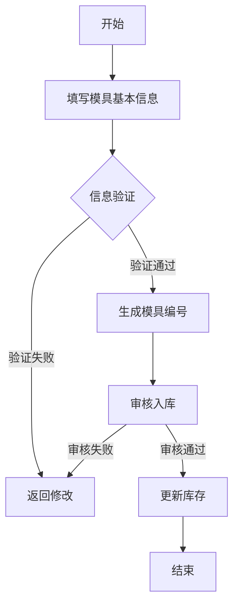
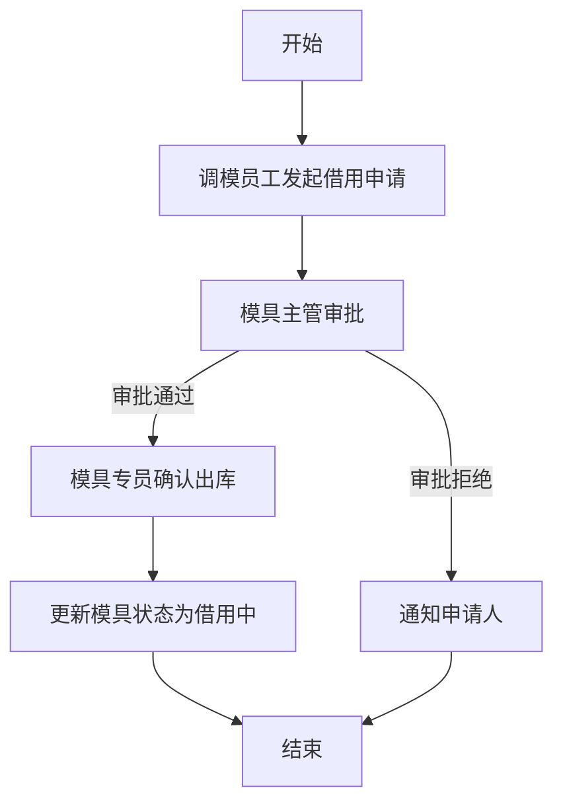
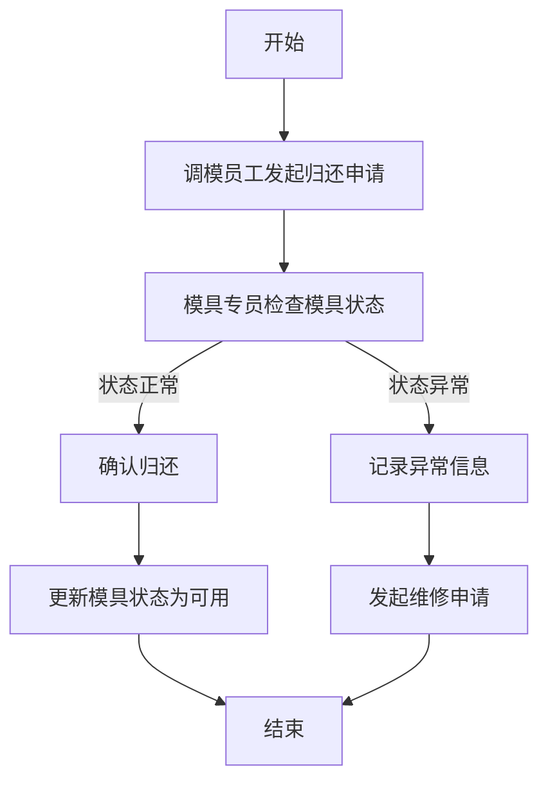
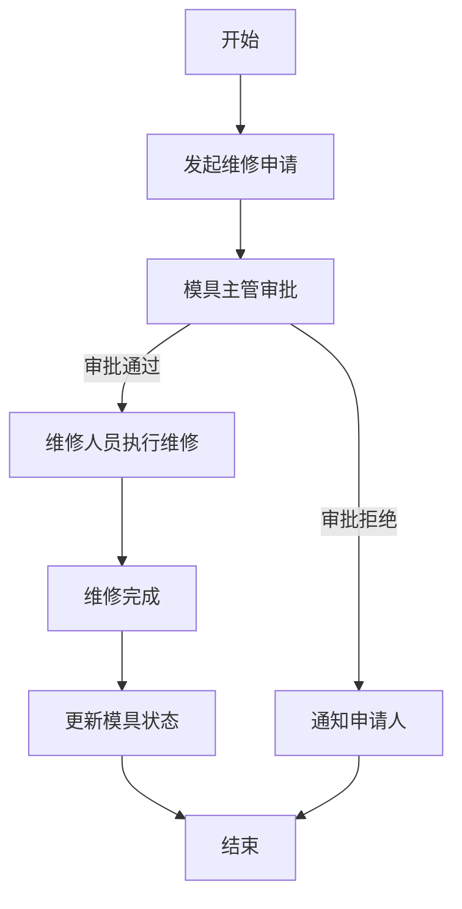
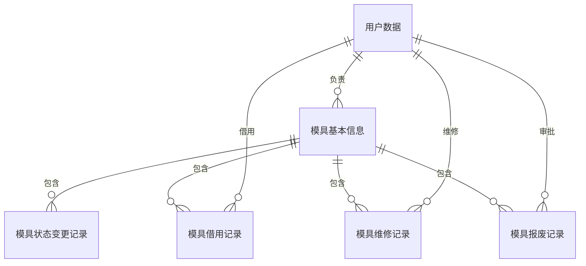

# 模库管理模块业务需求文档模版

## 1. 模块概述

### 1.1 核心目标
[描述模库管理模块的核心目标，例如：管理模具的全生命周期，实现模具信息的可视化、标准化和高效化管理，包括模具的基本信息、状态跟踪、库存管理等。]

### 1.2 功能范围
- [功能点1，例如：模具基本信息管理]
- [功能点2，例如：模具状态跟踪]
- [功能点3，例如：模具库存管理]
- [功能点4，例如：模具借用/归还管理]
- [功能点5，例如：模具维修管理]
- [功能点6，例如：模具报废管理]
- [功能点7，例如：模具统计分析]

### 1.3 优先级
[高/中/低]

### 1.4 系统定位
[描述模库管理模块在整个系统中的定位，例如：作为蜂窝陶瓷模具管理系统的基础模块，与加工管理、调模管理、耗材及备品管理等模块紧密集成，为其他模块提供模具基础数据支持。]

## 2. 角色与权限

### 2.1 角色列表

| 角色名称 | 职责描述 | 权限列表 |
|---------|---------|----------|
| 系统管理员 | 系统配置、用户管理、权限设置 | 所有功能权限 |
| 模具主管 | 模具管理、状态监控、审批管理 | 查看/编辑所有模具信息、审批维修/报废申请 |
| 模具专员 | 模具信息维护、状态更新、库存管理 | 编辑模具信息、更新模具状态、管理库存 |
| 调模员工 | 模具借用/归还、状态查看 | 借用/归还模具、查看模具状态 |
| 成型员工 | 模具状态查看 | 查看模具状态 |
| 维修人员 | 模具维修、状态更新 | 维修模具、更新维修状态 |

### 2.2 权限矩阵

| 功能模块 | 系统管理员 | 模具主管 | 模具专员 | 调模员工 | 成型员工 | 维修人员 |
|---------|-----------|---------|---------|---------|---------|---------|
| 模具基本信息管理 | 所有 | 查看/编辑 | 查看/编辑 | 查看 | 查看 | 查看 |
| 模具状态管理 | 所有 | 查看/更新 | 查看/更新 | 查看/更新 | 查看 | 查看/更新 |
| 模具库存管理 | 所有 | 查看/管理 | 查看/管理 | 查看 | 查看 | 查看 |
| 模具借用/归还 | 所有 | 查看/审批 | 查看/管理 | 申请/归还 | 查看 | 查看 |
| 模具维修管理 | 所有 | 查看/审批 | 查看/发起 | 查看 | 查看 | 执行/更新 |
| 模具报废管理 | 所有 | 查看/审批 | 查看/发起 | 查看 | 查看 | 查看 |
| 模具统计分析 | 所有 | 查看 | 查看 | 查看 | 查看 | 查看 |

## 3. 业务场景

### 3.1 标准场景

#### 场景1：模具入库
- **触发条件**：[描述触发条件，例如：新模具加工完成]
- **流程**：[描述详细流程，例如：模具专员填写模具基本信息 → 系统生成模具编号 → 审核通过 → 模具入库 → 更新库存]
- **预期结果**：[描述预期结果，例如：模具成功入库，库存更新]

#### 场景2：模具借用
- **触发条件**：[描述触发条件，例如：调模员工需要使用模具]
- **流程**：[描述详细流程，例如：调模员工发起借用申请 → 模具主管审批 → 审批通过 → 模具出库 → 更新状态为借用中]
- **预期结果**：[描述预期结果，例如：模具成功借出，状态更新]

#### 场景3：模具归还
- **触发条件**：[描述触发条件，例如：调模员工使用完毕]
- **流程**：[描述详细流程，例如：调模员工发起归还申请 → 模具专员检查模具状态 → 确认归还 → 模具入库 → 更新状态为可用]
- **预期结果**：[描述预期结果，例如：模具成功归还，状态更新]

#### 场景4：模具维修
- **触发条件**：[描述触发条件，例如：模具出现故障]
- **流程**：[描述详细流程，例如：使用人员报告故障 → 模具专员发起维修申请 → 模具主管审批 → 维修人员执行维修 → 维修完成 → 更新状态为可用]
- **预期结果**：[描述预期结果，例如：模具维修完成，状态更新]

#### 场景5：模具报废
- **触发条件**：[描述触发条件，例如：模具无法维修或达到使用寿命]
- **流程**：[描述详细流程，例如：模具专员发起报废申请 → 模具主管审批 → 审批通过 → 模具报废 → 从库存中移除]
- **预期结果**：[描述预期结果，例如：模具成功报废，库存更新]

### 3.2 异常场景

#### 场景6：模具丢失
- **触发条件**：[描述触发条件，例如：模具借用后无法找到]
- **流程**：[描述详细流程，例如：使用人员报告丢失 → 模具主管确认 → 记录丢失信息 → 报警处理 → 更新状态为丢失]
- **预期结果**：[描述预期结果，例如：丢失信息记录，状态更新]

#### 场景7：模具超期未还
- **触发条件**：[描述触发条件，例如：模具借用超过规定期限]
- **流程**：[描述详细流程，例如：系统自动提醒 → 模具专员跟进 → 使用人员说明原因 → 模具主管处理 → 延长借用期限或强制归还]
- **预期结果**：[描述预期结果，例如：超期问题得到处理，状态更新]

## 4. 业务流程

### 4.1 模具入库流程

### 4.2 模具借用流程

### 4.3 模具归还流程

### 4.4 模具维修流程

## 5. 数据需求

### 5.1 核心数据实体

#### 5.1.1 模具基本信息

| 字段名称 | 数据类型 | 是否必填 | 约束条件 | 来源 | 描述 |
|---------|---------|----------|----------|------|------|
| 模具ID | 字符串/数字 | 是 | 唯一 | 系统生成 | 模具的唯一标识 |
| 模号 | 字符串 | 是 | 唯一 | 手动输入/系统生成 | 模具的编号 |
| 模具名称 | 字符串 | 是 | 无 | 手动输入 | 模具的名称 |
| 成品类别 | 字符串 | 是 | 下拉选择 | 成品列表 | 适用的成品类别 |
| 成品规格 | 字符串 | 是 | 下拉/手动 | 成品列表 | 适用的成品规格 |
| 模具钢材 | 字符串 | 是 | 下拉选择 | 耗材及备品列表 | 模具使用的钢材类型 |
| 硬度 | 数值 | 是 | 范围限制 | 手动输入 | 模具硬度(HRC) |
| 结构类型 | 字符串 | 是 | 下拉选择 | 系统配置 | 模具结构类型（斜边模、直压模、收边模等） |
| 总收缩率(%) | 数值 | 是 | 范围限制 | 手动输入 | 模具总收缩率 |
| 模芯尺寸 | 字符串 | 是 | 格式验证 | 手动输入 | 模芯的尺寸信息 |
| 外形尺寸 | 字符串 | 是 | 格式验证 | 手动输入 | 模具外形尺寸 |
| 定位孔距 | 字符串 | 是 | 格式验证 | 手动输入 | 定位孔的间距 |
| 进泥孔径 | 数值 | 是 | 范围限制 | 手动输入 | 进泥孔的直径 |
| 孔数 | 数值 | 是 | 范围限制 | 手动输入 | 进泥孔的数量 |
| 孔深 | 数值 | 是 | 范围限制 | 手动输入 | 进泥孔的深度 |
| 孔类型 | 字符串 | 是 | 下拉选择 | 系统配置 | 间孔或全孔 |
| 槽宽 | 数值 | 是 | 范围限制 | 手动输入 | 导流槽宽度 |
| 槽深 | 数值 | 是 | 范围限制 | 手动输入 | 导流槽深度 |
| 切入量 | 数值 | 是 | 范围限制 | 手动输入 | 切入量参数 |
| 中心距 | 数值 | 是 | 范围限制 | 手动输入 | 中心距参数 |
| 供泥比 | 数值 | 是 | 范围限制 | 手动输入 | 供泥比参数 |
| 模芯台阶 | 字符串 | 否 | 格式验证 | 手动输入 | 模芯台阶信息 |
| 制造日期 | 日期 | 是 | 无 | 手动输入 | 模具制造日期 |
| 投入使用日期 | 日期 | 否 | 无 | 手动输入 | 模具投入使用日期 |
| 预计使用寿命 | 数值 | 是 | 大于0 | 手动输入 | 预计使用寿命（次数/年） |
| 实际使用次数 | 数值 | 否 | 大于等于0 | 系统记录 | 实际使用次数 |
| 当前状态 | 字符串 | 是 | 枚举 | 系统配置 | 模具当前状态（可用/借用中/维修中/报废/丢失等） |
| 存放位置 | 字符串 | 是 | 下拉选择 | 系统配置 | 模具存放位置 |
| 负责人 | 字符串 | 是 | 下拉选择 | 用户列表 | 模具负责人 |
| 备注 | 文本 | 否 | 无 | 手动输入 | 其他备注信息 |
| 创建时间 | 日期时间 | 是 | 系统生成 | 系统 | 记录创建时间 |
| 更新时间 | 日期时间 | 是 | 系统生成 | 系统 | 记录更新时间 |

#### 5.1.2 模具状态变更记录

| 字段名称 | 数据类型 | 是否必填 | 约束条件 | 来源 | 描述 |
|---------|---------|----------|----------|------|------|
| 记录ID | 字符串/数字 | 是 | 唯一 | 系统生成 | 状态变更记录的唯一标识 |
| 模具ID | 字符串/数字 | 是 | 关联模具表 | 模具表 | 关联的模具ID |
| 变更前状态 | 字符串 | 是 | 枚举 | 系统配置 | 变更前的模具状态 |
| 变更后状态 | 字符串 | 是 | 枚举 | 系统配置 | 变更后的模具状态 |
| 变更原因 | 字符串 | 是 | 文本输入 | 手动输入 | 状态变更的原因 |
| 变更人 | 字符串 | 是 | 关联用户表 | 用户表 | 执行状态变更的人员 |
| 变更时间 | 日期时间 | 是 | 系统生成 | 系统 | 状态变更的时间 |
| 备注 | 文本 | 否 | 无 | 手动输入 | 其他备注信息 |

#### 5.1.3 模具借用记录

| 字段名称 | 数据类型 | 是否必填 | 约束条件 | 来源 | 描述 |
|---------|---------|----------|----------|------|------|
| 记录ID | 字符串/数字 | 是 | 唯一 | 系统生成 | 借用记录的唯一标识 |
| 模具ID | 字符串/数字 | 是 | 关联模具表 | 模具表 | 关联的模具ID |
| 借用人员 | 字符串 | 是 | 关联用户表 | 用户表 | 借用模具的人员 |
| 借用部门 | 字符串 | 是 | 下拉选择 | 系统配置 | 借用人员所属部门 |
| 借用用途 | 字符串 | 是 | 文本输入 | 手动输入 | 借用模具的用途 |
| 计划归还时间 | 日期 | 是 | 大于借用时间 | 手动输入 | 计划归还时间 |
| 实际归还时间 | 日期 | 否 | 大于借用时间 | 手动输入 | 实际归还时间 |
| 借用状态 | 字符串 | 是 | 枚举 | 系统配置 | 借用状态（已申请/已审批/已借出/已归还/超期未还等） |
| 审批人员 | 字符串 | 否 | 关联用户表 | 用户表 | 审批借用申请的人员 |
| 审批时间 | 日期时间 | 否 | 系统生成 | 系统 | 审批时间 |
| 备注 | 文本 | 否 | 无 | 手动输入 | 其他备注信息 |
| 创建时间 | 日期时间 | 是 | 系统生成 | 系统 | 记录创建时间 |
| 更新时间 | 日期时间 | 是 | 系统生成 | 系统 | 记录更新时间 |

#### 5.1.4 模具维修记录

| 字段名称 | 数据类型 | 是否必填 | 约束条件 | 来源 | 描述 |
|---------|---------|----------|----------|------|------|
| 记录ID | 字符串/数字 | 是 | 唯一 | 系统生成 | 维修记录的唯一标识 |
| 模具ID | 字符串/数字 | 是 | 关联模具表 | 模具表 | 关联的模具ID |
| 维修类型 | 字符串 | 是 | 下拉选择 | 系统配置 | 维修类型（日常维护/故障维修/大修等） |
| 故障描述 | 文本 | 是 | 无 | 手动输入 | 故障详细描述 |
| 维修内容 | 文本 | 是 | 无 | 手动输入 | 维修详细内容 |
| 维修人员 | 字符串 | 是 | 关联用户表 | 用户表 | 执行维修的人员 |
| 维修开始时间 | 日期时间 | 是 | 无 | 手动输入 | 维修开始时间 |
| 维修结束时间 | 日期时间 | 否 | 大于开始时间 | 手动输入 | 维修结束时间 |
| 维修状态 | 字符串 | 是 | 枚举 | 系统配置 | 维修状态（已申请/已审批/维修中/已完成/已取消等） |
| 维修费用 | 数值 | 否 | 大于等于0 | 手动输入 | 维修费用 |
| 审批人员 | 字符串 | 否 | 关联用户表 | 用户表 | 审批维修申请的人员 |
| 审批时间 | 日期时间 | 否 | 系统生成 | 系统 | 审批时间 |
| 备注 | 文本 | 否 | 无 | 手动输入 | 其他备注信息 |
| 创建时间 | 日期时间 | 是 | 系统生成 | 系统 | 记录创建时间 |
| 更新时间 | 日期时间 | 是 | 系统生成 | 系统 | 记录更新时间 |

#### 5.1.5 模具报废记录

| 字段名称 | 数据类型 | 是否必填 | 约束条件 | 来源 | 描述 |
|---------|---------|----------|----------|------|------|
| 记录ID | 字符串/数字 | 是 | 唯一 | 系统生成 | 报废记录的唯一标识 |
| 模具ID | 字符串/数字 | 是 | 关联模具表 | 模具表 | 关联的模具ID |
| 报废原因 | 文本 | 是 | 无 | 手动输入 | 报废的详细原因 |
| 报废类型 | 字符串 | 是 | 下拉选择 | 系统配置 | 报废类型（正常报废/异常报废等） |
| 报废时间 | 日期 | 是 | 无 | 手动输入 | 报废时间 |
| 报废价值 | 数值 | 否 | 大于等于0 | 手动输入 | 报废时的残余价值 |
| 审批人员 | 字符串 | 是 | 关联用户表 | 用户表 | 审批报废申请的人员 |
| 审批时间 | 日期时间 | 是 | 系统生成 | 系统 | 审批时间 |
| 备注 | 文本 | 否 | 无 | 手动输入 | 其他备注信息 |
| 创建时间 | 日期时间 | 是 | 系统生成 | 系统 | 记录创建时间 |
| 更新时间 | 日期时间 | 是 | 系统生成 | 系统 | 记录更新时间 |

### 5.2 数据关系

## 6. 功能需求

### 6.1 模具基本信息管理

#### 6.1.1 信息录入
- 支持手动录入模具基本信息
- 支持从Excel导入模具基本信息
- 提供信息模板选择
- 实时信息验证

#### 6.1.2 信息查询
- 支持按多种条件查询（模号、成品类别、状态等）
- 支持模糊查询
- 支持导出查询结果
- 支持打印模具信息卡片

#### 6.1.3 信息编辑
- 支持修改现有模具信息
- 记录信息修改历史
- 支持版本管理

### 6.2 模具状态管理

#### 6.2.1 状态跟踪
- 实时监控模具状态
- 支持状态变更记录查询
- 支持状态变更统计分析

#### 6.2.2 状态更新
- 支持手动更新模具状态
- 支持根据业务流程自动更新状态
- 支持批量更新状态

### 6.3 模具库存管理

#### 6.3.1 库存查询
- 支持实时查询模具库存
- 支持按存放位置查询
- 支持按状态查询库存

#### 6.3.2 库存预警
- 低库存预警
- 积压库存预警
- 即将报废模具预警

### 6.4 模具借用/归还管理

#### 6.4.1 借用申请
- 支持在线发起借用申请
- 支持上传借用相关文件
- 支持查看借用历史

#### 6.4.2 借用审批
- 支持多级审批流程
- 支持审批意见记录
- 支持审批状态查询

#### 6.4.3 归还管理
- 支持在线发起归还申请
- 支持归还状态检查
- 支持归还确认

### 6.5 模具维修管理

#### 6.5.1 维修申请
- 支持在线发起维修申请
- 支持上传维修相关文件
- 支持查看维修历史

#### 6.5.2 维修审批
- 支持多级审批流程
- 支持审批意见记录
- 支持审批状态查询

#### 6.5.3 维修执行
- 支持维修进度更新
- 支持维修费用记录
- 支持维修结果反馈

### 6.6 模具报废管理

#### 6.6.1 报废申请
- 支持在线发起报废申请
- 支持上传报废相关文件
- 支持查看报废历史

#### 6.6.2 报废审批
- 支持多级审批流程
- 支持审批意见记录
- 支持审批状态查询

#### 6.6.3 报废处理
- 支持报废原因分析
- 支持报废价值评估
- 支持报废后续处理记录

### 6.7 模具统计分析

#### 6.7.1 模具数量统计
- 按状态统计模具数量
- 按类别统计模具数量
- 按部门统计模具数量

#### 6.7.2 模具使用统计
- 模具使用率分析
- 模具借用频率分析
- 模具使用周期分析

#### 6.7.3 模具维修统计
- 维修频率分析
- 维修费用统计
- 故障类型统计

#### 6.7.4 模具报废统计
- 报废原因分析
- 报废价值统计
- 报废周期分析

## 7. 性能需求

### 7.1 并发需求
- 支持[X]并发用户同时操作
- 支持[X]用户同时查询模具信息

### 7.2 响应时间需求
- 模具列表加载时间 < [X]秒
- 模具详情加载时间 < [X]秒
- 状态更新响应时间 < [X]秒
- 报表生成时间 < [X]秒

### 7.3 可靠性需求
- 系统可用性 ≥ [X]%
- 数据可靠性 ≥ [X]%
- 支持7×24小时不间断运行

### 7.4 扩展性需求
- 支持未来功能扩展
- 支持数据量增长（[X]年内支持[X]万+模具数据）

## 8. 安全需求

### 8.1 数据安全
- 敏感数据加密存储
- 数据传输加密（HTTPS）
- 定期数据备份（每日全量备份，每小时增量备份）
- 数据恢复机制

### 8.2 访问安全
- 基于角色的访问控制
- 登录认证（用户名/密码 + 验证码）
- 会话超时管理（[X]分钟无操作自动登出）
- 操作日志记录

### 8.3 审计需求
- 所有关键操作记录审计日志
- 日志包含操作人、操作时间、操作内容、IP地址
- 日志保留期限 ≥ [X]年

## 9. 移动端需求

### 9.1 微信小程序功能

#### 9.1.1 模具查询
- 查看模具基本信息
- 查看模具状态
- 查看模具位置

#### 9.1.2 借用/归还申请
- 发起模具借用申请
- 发起模具归还申请
- 查看申请状态

#### 9.1.3 维修申请
- 发起模具维修申请
- 查看维修状态
- 更新维修进度

#### 9.1.4 通知中心
- 接收审批通知
- 接收状态变更通知
- 接收预警通知

#### 9.1.5 个人中心
- 查看个人借用记录
- 查看个人维修记录
- 修改密码

### 9.2 移动端技术要求
- 响应式设计，适配不同屏幕尺寸
- 支持离线操作，网络恢复后自动同步
- 支持微信登录
- 支持推送通知

## 10. 集成需求

### 10.1 内部系统集成

#### 10.1.1 加工管理模块
- 从模库管理模块获取模具基本信息
- 向模库管理模块推送加工完成的模具信息
- 向模库管理模块推送模具状态变更信息

#### 10.1.2 调模管理模块
- 向调模管理模块提供模具基本信息
- 接收调模管理模块的模具状态变更信息

#### 10.1.3 耗材及备品管理模块
- 从耗材及备品管理模块获取材料信息
- 向耗材及备品管理模块推送材料使用信息

### 10.2 外部系统集成

#### 10.2.1 ERP系统
- 接收ERP系统的模具相关数据
- 向ERP系统推送模具库存信息

#### 10.2.2 MES系统
- 与MES系统进行数据同步
- 接收MES系统的设备状态信息

## 11. UI/UX设计需求

### 11.1 设计原则
- 简洁明了，易于操作
- 信息层次清晰，重点突出
- 响应式设计，适配不同设备
- 统一的设计风格

### 11.2 界面元素
- 使用直观的图标和颜色
- 提供清晰的操作指引
- 支持拖拽操作
- 提供快捷键支持

### 11.3 用户体验
- 减少操作步骤
- 提供实时反馈
- 支持批量操作
- 提供数据可视化

## 12. 培训与支持需求

### 12.1 培训计划
- 针对不同角色提供定制化培训
- 提供操作手册和视频教程
- 组织线上/线下培训课程

### 12.2 技术支持
- 提供[X]×[X]小时技术支持
- 建立问题反馈渠道
- 定期系统维护和升级

## 13. 实施计划

### 13.1 阶段划分

| 阶段 | 时间 | 主要工作 |
|------|------|----------|
| 需求确认 | [X]周 | 确认需求，制定详细计划 |
| 系统设计 | [X]周 | 架构设计，数据库设计，UI设计 |
| 开发实现 | [X]周 | 核心功能开发，移动端开发，集成开发 |
| 测试验证 | [X]周 | 单元测试，集成测试，用户验收测试 |
| 上线部署 | [X]周 | 系统部署，数据迁移，用户培训 |
| 运维支持 | 持续 | 系统维护，问题修复，功能优化 |

### 13.2 里程碑

| 里程碑 | 完成标志 |
|--------|----------|
| 需求文档完成 | 需求文档评审通过 |
| 系统设计完成 | 设计文档评审通过 |
| 核心功能完成 | 核心功能开发完成，通过单元测试 |
| 系统测试完成 | 系统通过集成测试和用户验收测试 |
| 系统上线 | 系统正式投入使用 |

## 14. 验收标准

### 14.1 功能验收
- 所有功能需求实现并通过测试
- 符合业务流程要求
- 数据流转正确

### 14.2 性能验收
- 响应时间符合要求
- 并发用户支持符合要求
- 系统稳定运行7×24小时无故障

### 14.3 安全验收
- 数据安全措施到位
- 访问控制有效
- 审计日志完整

### 14.4 用户验收
- 用户操作流畅
- 界面友好易用
- 满足业务需求

## 15. 风险评估

| 风险类型 | 风险描述 | 风险等级 | 应对措施 |
|---------|---------|----------|----------|
| 需求变更 | 需求在开发过程中发生变更 | 高 | 建立需求变更管理流程，严格控制变更范围 |
| 技术风险 | 新技术应用可能遇到问题 | 中 | 提前进行技术调研和原型验证 |
| 数据迁移 | 历史数据迁移可能出现问题 | 中 | 制定详细的数据迁移计划，进行充分测试 |
| 用户接受度 | 用户可能不适应新系统 | 中 | 提供充分的培训和支持，建立反馈机制 |
| 集成风险 | 与其他系统集成可能出现问题 | 高 | 提前定义集成接口，进行充分的集成测试 |

## 16. 附录

### 16.1 术语定义

| 术语 | 解释 |
|------|------|
| 模库 | 模具的集合，包括所有在库和使用中的模具 |
| 模具全生命周期 | 从模具设计、制造、使用、维修到报废的整个过程 |
| 模具状态 | 模具当前的使用情况，如可用、借用中、维修中、报废等 |
| 模具周转率 | 模具在一定时期内的使用次数与总数量的比值 |

### 16.2 参考文档

- [参考文档1，例如：《蜂窝陶瓷模具管理系统需求文档》]
- [参考文档2，例如：《模具管理规范》]
- [参考文档3，例如：《企业ERP系统接口文档》]

### 16.3 联系方式

| 角色 | 姓名 | 联系方式 |
|------|------|----------|
| 项目负责人 | [姓名] | [联系方式] |
| 业务联系人 | [姓名] | [联系方式] |
| 技术负责人 | [姓名] | [联系方式] |
